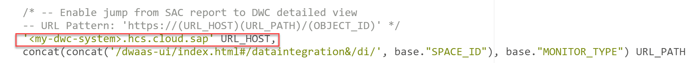

<!-- loio4ab45090c5684ebf8765757a1dfc4e5d -->

# Working with SAP HANA Monitoring Views

You can obtain independent access to the underlying SAP HANA monitoring views that power the *System Monitor* to do additional analysis on them and visualize them in SAP Analytics Cloud.

This topic contains the following sections:

-   [Preparing Monitoring Spaces](working-with-sap-hana-monitoring-views-4ab4509.md#loio4ab45090c5684ebf8765757a1dfc4e5d__section_intro)
-   [Monitoring Views](working-with-sap-hana-monitoring-views-4ab4509.md#loio4ab45090c5684ebf8765757a1dfc4e5d__section_views)
-   [SAP HANA DWC\_GLOBAL Schema Monitoring Views](working-with-sap-hana-monitoring-views-4ab4509.md#loio4ab45090c5684ebf8765757a1dfc4e5d__section_global)
-   [SAP Datasphere Monitoring Views \(Delivered via the Content Network\)](working-with-sap-hana-monitoring-views-4ab4509.md#loio4ab45090c5684ebf8765757a1dfc4e5d__section_cn_views)

<a name="loio4ab45090c5684ebf8765757a1dfc4e5d__section_intro"/>

## Preparing Monitoring Spaces

Monitoring information includes information on all spaces and views and so these views should not be made accessible to all SAP Datasphere users. An administrator can select two spaces dedicated to monitoring information and assign users to these spaces with modeling privileges so they can work with the monitoring views in the *Data Builder*.

> ### Note:  
> The data from these monitoring views is available directly in the *System Monitor* \(see [Monitoring SAP Datasphere](monitoring-sap-datasphere-28910cd.md)\). Working with them independently is optional and allows you to do further analysis that is not supported in the standard monitor.

As the monitoring spaces you choose will provide unfiltered access to monitoring views, be aware that the users assigned to the spaces will be able to see all metadata and object definitions of all spaces.

You can dedicate one or two spaces to monitoring:

-   Choose a space that you want to contain monitoring views.

    > ### Note:  
    > If you have already selected a space for monitoring before version 2021.19, you need to select another space, then select the initial space again so that you can access all the views.

-   *<SAP\_ADMIN\>* space - This space can contain the pre-configured monitoring views provided by SAP via the *Content Network*. First create the space with the space ID *<SAP\_ADMIN\>* and the space name *<Administration \(SAP\)\>*, enable access to it, and import the package from the *Content Network*.

    > ### Note:  
    > Do not create a space with the space ID *<SAP\_ADMIN\>* for another purpose.

<a name="loio4ab45090c5684ebf8765757a1dfc4e5d__section_views"/>

## Monitoring Views

The following monitoring views are available:

-   SAP HANA SYS Schema Monitoring Views - All SAP HANA monitoring views start with M\_. For more information, see [Monitoring Views](https://help.sap.com/viewer/c1d3f60099654ecfb3fe36ac93c121bb/latest/en-US/d3c10d23e8334a35afa8d9bdbc102366.html) in the *SAP HANA Cloud, SAP HANA Database SQL Reference Guide*.

    The views for monitoring expensive statements are `M_EXPENSIVE_STATEMENTS` and `M_EXPENSIVE_STATEMENT_EXECUTION_LOCATION_STATISTICS` \(see [M\_EXPENSIVE\_STATEMENTS](https://help.sap.com/viewer/c1d3f60099654ecfb3fe36ac93c121bb/latest/en-US/20af736e751910148162e2ab1982f035.html) and [M\_EXPENSIVE\_STATEMENT\_EXECUTION\_LOCATION\_STATISTICS](https://help.sap.com/viewer/c1d3f60099654ecfb3fe36ac93c121bb/latest/en-US/80c32e9dc5b742efa254adfe164102dc.html)\).

    The view `M_MULTIDIMENSIONAL_STATEMENT_STATISTICS` and `M_MULTIDIMENSIONAL_STATEMENTS` provide extensive information about MDS queries. For more information, see [M\_MULTIDIMENSIONAL\_STATEMENT\_STATISTICS System View](https://help.sap.com/viewer/c1d3f60099654ecfb3fe36ac93c121bb/latest/en-US/5b04f05f501f4f91aea202f1394cfddc.html) and [M\_MULTIDIMENSIONAL\_STATEMENTS System View](https://help.sap.com/viewer/c1d3f60099654ecfb3fe36ac93c121bb/latest/en-US/4de7e92c6015491aa380bdfe26070aa0.html) in the *SAP HANA Cloud, SAP HANA Database SQL Reference Guide*.

-   SAP HANA `_SYS_STATISTICS` Schema Statistics Service Views \(see [Embedded Statistics Service Views \(\_SYS\_STATISTICS schema\)](https://help.sap.com/viewer/323c57a017234d47a0e7da3e22345822/latest/en-US/d234eedbd29510148efbf332391de7fd.html)\).
-   SAP HANA `_SYS_BI` Schema Tables and Views \(see [BIMC Tables and Views](https://help.sap.com/docs/hana-cloud-database/sap-hana-cloud-sap-hana-analytics-catalog-bimc-views-reference/bimc-tables-and-views) in the *SAP HANA Cloud, SAP HANA Analytics Catalog \(BIMC Views\) Reference*\).
-   SAP HANA `DWC_GLOBAL` Schema Monitoring Views \(see [Working with SAP HANA Monitoring Views](working-with-sap-hana-monitoring-views-4ab4509.md)\).
-   SAP Datasphere Monitoring Views - Delivered via the Content Network in the *<SAP\_ADMIN\>* space \(see [SAP Datasphere Monitoring Views \(Delivered via the Content Network\)](working-with-sap-hana-monitoring-views-4ab4509.md#loio4ab45090c5684ebf8765757a1dfc4e5d__section_cn_views)\).

<a name="loio4ab45090c5684ebf8765757a1dfc4e5d__section_global"/>

## SAP HANA `DWC_GLOBAL` Schema Monitoring Views

The following monitoring views have the suffix `_V_EXT` and are ready to use in the `DWC_GLOBAL` schema:

-   `SPACE_SCHEMAS_V_EXT`:

    <table>
    <tr>
    <th valign="top">

    Column
    
    </th>
    <th valign="top">

    Description
    
    </th>
    </tr>
    <tr>
    <td valign="top">
    
    SPACE\_ID
    
    </td>
    <td valign="top">
    
    Identifier of the SAP Datasphere space. Note that one space can contain several schemas.
    
    </td>
    </tr>
    <tr>
    <td valign="top">
    
    SCHEMA\_NAME
    
    </td>
    <td valign="top">
    
    Name of the schema used to run the task.
    
    </td>
    </tr>
    </table>
    
-   `SPACE_USERS_V_EXT`:

    <table>
    <tr>
    <th valign="top">

    Column
    
    </th>
    <th valign="top">

    Description
    
    </th>
    </tr>
    <tr>
    <td valign="top">
    
    SPACE\_ID
    
    </td>
    <td valign="top">
    
    Identifier of the SAP Datasphere space. Note that one space can contain several users.
    
    </td>
    </tr>
    <tr>
    <td valign="top">
    
    USER\_NAME
    
    </td>
    <td valign="top">
    
    Identifier of the user.
    
    </td>
    </tr>
    <tr>
    <td valign="top">
    
    USER\_TYPE
    
    </td>
    <td valign="top">
    
    Type of user, such as space technical user \(for example database user for open SQL schemas\) or global user.
    
    </td>
    </tr>
    </table>
    
-   `TASK_SCHEDULES_V_EXT`:

    <table>
    <tr>
    <th valign="top">

    Column
    
    </th>
    <th valign="top">

    Description
    
    </th>
    </tr>
    <tr>
    <td valign="top">
    
    SPACE\_ID \(Key\)
    
    </td>
    <td valign="top">
    
    Identifier of the SAP Datasphere space which contains the object with the defined schedule.
    
    </td>
    </tr>
    <tr>
    <td valign="top">
    
    OBJECT\_ID \(Key\)
    
    </td>
    <td valign="top">
    
    Identifier of the SAP Datasphere object for which the schedule is defined.
    
    </td>
    </tr>
    <tr>
    <td valign="top">
    
    APPLICATION\_ID \(Key\)
    
    </td>
    <td valign="top">
    
    Identifier of the type of object.

    For example: PERSIST \(View\), EXECUTE \(Dataflow\), REPLICATE \(Remote Tables\), RUN\_CHAIN \(Task Chain\).
    
    </td>
    </tr>
    <tr>
    <td valign="top">
    
    ACTIVITY \(Key\)
    
    </td>
    <td valign="top">
    
    Identifier of the type of activity applied to the object.

    > ### Note:  
    > For each application, you can have multiple activities \(for example, replicating or deleting data\).

    For example: PERSIST \(View\), EXECUTE \(Dataflow\), REPLICATE \(Remote Tables\), RUN\_CHAIN \(Task Chain\)
    
    </td>
    </tr>
    <tr>
    <td valign="top">
    
    OWNER
    
    </td>
    <td valign="top">
    
    Identifier of the responsible of the schedule, schedule executed on users behalf, consent is checked against \(< DWC User ID \>\).
    
    </td>
    </tr>
    <tr>
    <td valign="top">
    
    CRON
    
    </td>
    <td valign="top">
    
    Defines the recurrence of a schedule in CRON format .

    NULL \(no schedule defined, or a SIMPLE schedule is defined\) For example: "0 \*/1 \* \* \*" for hourly \(see [Schedule a Data Integration Task (with Cron Expression)](https://help.sap.com/viewer/9f36ca35bc6145e4acdef6b4d852d560/DEV_CURRENT/en-US/169ba34e19744362be25a4325de8d10c.html "Schedule data integration tasks such as data replication, data persistence, or data flow runs or task chains runs, by entering directly a cron expression.") :arrow_upper_right:\).
    
    </td>
    </tr>
    <tr>
    <td valign="top">
    
    FREQUENCY
    
    </td>
    <td valign="top">
    
    Defines the recurrence of a schedule in json format \(simple format\).

    NULL \(no schedule defined, or a CRON schedule is defined\) or schedule definition, for example Daily + start date + time + duration \(see [Schedule a Data Integration Task (Simple Schedule)](https://help.sap.com/viewer/9f36ca35bc6145e4acdef6b4d852d560/DEV_CURRENT/en-US/7c11059ed3314e1fb753736b7867512c.html "You can schedule or unschedule data integration tasks such as remote data replication, data persistence, data flow, replication flow, or task chains runs. You may also pause and then later resume the run of scheduled tasks.") :arrow_upper_right:\).
    
    </td>
    </tr>
    <tr>
    <td valign="top">
    
    CHANGED\_BY
    
    </td>
    <td valign="top">
    
    User who last changed the schedule configuration.
    
    </td>
    </tr>
    <tr>
    <td valign="top">
    
    CHANGED\_AT
    
    </td>
    <td valign="top">
    
    Timestamp containing Date and Time, at which the schedule was last changed.
    
    </td>
    </tr>
    </table>
    
-   `TASK_LOGS_V_EXT`:

    <table>
    <tr>
    <th valign="top">

    Column
    
    </th>
    <th valign="top">

    Description
    
    </th>
    </tr>
    <tr>
    <td valign="top">
    
    TASK\_LOG\_ID \(Key\)
    
    </td>
    <td valign="top">
    
    Uniquely identifies an execution of a task.
    
    </td>
    </tr>
    <tr>
    <td valign="top">
    
    SPACE\_ID
    
    </td>
    <td valign="top">
    
    Identifier of the SAP Datasphere space which contains the object with the defined schedule.
    
    </td>
    </tr>
    <tr>
    <td valign="top">
    
    APPLICATION\_ID
    
    </td>
    <td valign="top">
    
    Identifier of the type of object .

    For example: VIEWS, REMOTE\_TABLES, DATA\_FLOWS, TASK\_CHAINS
    
    </td>
    </tr>
    <tr>
    <td valign="top">
    
    OBJECT\_ID
    
    </td>
    <td valign="top">
    
    Identifier of the SAP Datasphere object for which the schedule is defined.
    
    </td>
    </tr>
    <tr>
    <td valign="top">
    
    ACTIVITY
    
    </td>
    <td valign="top">
    
    For each application there could be multiple activities, e.g. replicating or deleting data.

    For example: VIEWS, REMOTE\_TABLES, DATA\_FLOWS, TASK\_CHAINS
    
    </td>
    </tr>
    <tr>
    <td valign="top">
    
    PEAK\_MEMORY
    
    </td>
    <td valign="top">
    
    Captures the highest peak memory consumption \(in bytes\). Not available for all apps. Requires *Enable Expensive Statement Tracing* \(see [Configure Monitoring](configure-monitoring-9cd0691.md)\).

    Gives Null if not available for the application, *Enable Expensive Statement Tracing* not set, or the threshold defined is not reached, 0 or value of the memory consumption.
    
    </td>
    </tr>
    <tr>
    <td valign="top">
    
    PEAK\_CPU
    
    </td>
    <td valign="top">
    
    Total CPU time \(in microseconds\) consumed by the task. Not available for all apps. Requires *Enable Expensive Statement Tracing* \(see [Configure Monitoring](configure-monitoring-9cd0691.md)\).

    Gives Null if not available for the application, *Enable Expensive Statement Tracing* not set, or the threshold defined is not reached, 0 or value of the CPU time consumption.
    
    </td>
    </tr>
    <tr>
    <td valign="top">
    
    RECORDS
    
    </td>
    <td valign="top">
    
    Shows the number of records of the target table after the task has finished running.

    Gives Null \(not applicable or not measured\), 0 or number of records.
    
    </td>
    </tr>
    <tr>
    <td valign="top">
    
    START\_TIME
    
    </td>
    <td valign="top">
    
    Timestamp containing Date and Time, at which the scheduled task was started.
    
    </td>
    </tr>
    <tr>
    <td valign="top">
    
    END\_TIME
    
    </td>
    <td valign="top">
    
    Timestamp containing Date and Time, at which the scheduled task was stopped.
    
    </td>
    </tr>
    <tr>
    <td valign="top">
    
    STATUS
    
    </td>
    <td valign="top">
    
    Reports if this task execution is still running, completed or failed.
    
    </td>
    </tr>
    <tr>
    <td valign="top">
    
    TRIGGERED\_TYPE
    
    </td>
    <td valign="top">
    
    Indicates if task execution was triggered manually \(DIRECT\) or via schedule \(SCHEDULED\).
    
    </td>
    </tr>
    <tr>
    <td valign="top">
    
    APPLICATION\_USER
    
    </td>
    <td valign="top">
    
    The user on whose behalf the schedule was executed \(the owner at this point in time\).
    
    </td>
    </tr>
    <tr>
    <td valign="top">
    
    DURATION
    
    </td>
    <td valign="top">
    
    Duration of the task execution \(also works for ongoing execution\).
    
    </td>
    </tr>
    <tr>
    <td valign="top">
    
    START\_DATE
    
    </td>
    <td valign="top">
    
    Date when the scheduled task was started.
    
    </td>
    </tr>
    </table>
    
-   `TASK_LOG_MESSAGES_V_EXT`:

    <table>
    <tr>
    <th valign="top">

    Column
    
    </th>
    <th valign="top">

    Description
    
    </th>
    </tr>
    <tr>
    <td valign="top">
    
    TASK\_LOG\_ID \(Key\)
    
    </td>
    <td valign="top">
    
    Uniquely identifies an instance of a task.
    
    </td>
    </tr>
    <tr>
    <td valign="top">
    
    MESSAGE\_NO \(Key\)
    
    </td>
    <td valign="top">
    
    Order sequence of all messages belonging to a certain Tasklog ID.
    
    </td>
    </tr>
    <tr>
    <td valign="top">
    
    SEVERITY
    
    </td>
    <td valign="top">
    
    Indicates if the message provides general information \(INFO\) or error information \(ERROR\).
    
    </td>
    </tr>
    <tr>
    <td valign="top">
    
    TEXT
    
    </td>
    <td valign="top">
    
    The message itself.
    
    </td>
    </tr>
    <tr>
    <td valign="top">
    
    DETAILS
    
    </td>
    <td valign="top">
    
    Technical additional information. For example, it can be an error stack or a correlation ID.
    
    </td>
    </tr>
    </table>
    
-   `TASK_LOCKS_V_EXT`:

    <table>
    <tr>
    <th valign="top">

    Column
    
    </th>
    <th valign="top">

    Description
    
    </th>
    </tr>
    <tr>
    <td valign="top">
    
    LOCK\_KEY \(Key\)
    
    </td>
    <td valign="top">
    
    Identifier, flexible field as part of the lock identifier, usually set to WRITE or EXECUTE.
    
    </td>
    </tr>
    <tr>
    <td valign="top">
    
    APPLICATION\_ID \(Key\)
    
    </td>
    <td valign="top">
    
    Identifier of the type of object.
    
    </td>
    </tr>
    <tr>
    <td valign="top">
    
    SPACE\_ID \(Key\)
    
    </td>
    <td valign="top">
    
    Identifier of the SAP Datasphere space which contains the object with the defined schedule.
    
    </td>
    </tr>
    <tr>
    <td valign="top">
    
    OBJECT\_ID \(Key\)
    
    </td>
    <td valign="top">
    
    Identifier of the SAP Datasphere object for which the schedule is defined.
    
    </td>
    </tr>
    <tr>
    <td valign="top">
    
    TASK\_LOG\_ID
    
    </td>
    <td valign="top">
    
    Uniquely identifies the task execution that set the lock.
    
    </td>
    </tr>
    <tr>
    <td valign="top">
    
    CREATION\_TIME
    
    </td>
    <td valign="top">
    
    Indicates when the lock has been set.
    
    </td>
    </tr>
    </table>
    

> ### Note:  
> Cross-space sharing is active for all SAP HANA monitoring views. The row level access of shared views is bound to the space read access privileges of the user who consumes the view.

<a name="loio4ab45090c5684ebf8765757a1dfc4e5d__section_cn_views"/>

## SAP Datasphere Monitoring Views \(Delivered via the Content Network\)

These SAP Datasphere monitoring views help you monitor data integration tasks in a more flexible way. They are built on the `V_EXT` views, and are enriched with further information as preparation for consumption in an SAP Analytics Cloud story.

See the blogs [SAP Datasphere: Data Integration Monitoring – Sample Content for Reporting](https://blogs.sap.com/2021/10/12/sap-data-warehouse-cloud-data-integration-monitoring-sample-content-for-reporting/) \(published in October 2021\) and [SAP Datasphere: Data Integration Monitoring – Running Task Overview](https://blogs.sap.com/2021/11/04/sap-data-warehouse-cloud-data-integration-monitoring-running-task-overview/) \(published in November 2021\).

You must:

-   Create a space with the space ID *<SAP\_ADMIN\>* and the space name *<Administration \(SAP\)\>* and configure it as a monitoring space by enabling the toggle *Enable Access to SAP Monitoring Content Space* \(see [Configure Monitoring](configure-monitoring-9cd0691.md)\).

-   Import the `Technical Content: Task Monitoring`package from the *Content Network* \(see [Importing SAP and Partner Business Content from the Content Network](https://help.sap.com/viewer/9f36ca35bc6145e4acdef6b4d852d560/DEV_CURRENT/en-US/400078d689bf4454b3fc977a4e201c2f.html "Users with the DW Administrator global role (or users with both a scoped DW Space Administrator role and a global role providing the Lifecycle privilege), can use the Semantic Onboarding app to import business content and sample content from SAP and partners published to the Content Network.") :arrow_upper_right:\).

The following views are available:

-   `SAP_TCT_TASK_LOGS_V_R_01`: Monitoring: Task Execution Headers - Exposes:

    -   Task properties, such as duration and execution status \(e.g. failed, completed, ...\).
    -   Various measures for counting tasks \(e.g. failed\).
    -   The schedule description.
    -   Locking status

    Uses the views `TASK_LOCKS_V_EXT`, `TASK_SCHEDULES_V_EXT` and `TASK_LOGS_V_EXT`.

    Best Practice: To enable the navigation between SAP Datasphere and SAP Analytics Cloud, you must change the constant for the url\_host to your SAP Datasphere instance. Open the view in the view editor, and update the URL host: 

-   `SAP_TCT_TASK_SCHEDULE_V_R_01`: Monitoring: Schedule Properties - Exposes the properties of a data integration schedule.

    Uses the view `TASK_SCHEDULES_V_EXT` and adds a row-count to be compatible with OLAP reporting.

-   `SAP_TCT_TASK_MSG_V_R_01`: Monitoring: Task Execution Items - Exposes:

    -   All messages occurring during data integration monitoring.
    -   Error code, header line and first stack line parsed out from detailed message.
    -   An indicator that the task\_id has an error \(facilitate filtering of messages\).

    Uses the views `TASK_LOG_MESSAGES_V_EXT` and `TASK_LOGS_V_EXT`.

    Best Practice: To enable the navigation between SAP Datasphere and SAP Analytics Cloud, you must change the constant for the url\_host to your SAP Datasphere instance. Open the view in the view editor, and update the URL host: 

