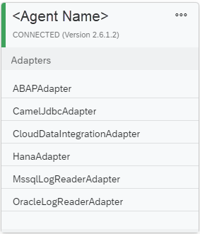

<!-- loioe87952d7c656477cb5558e5c2f44ae9c -->

<link rel="stylesheet" type="text/css" href="../css/sap-icons.css"/>

# Connect and Configure the Data Provisioning Agent

Connect the Data Provisioning Agent to the SAP HANA database of SAP Datasphere. This includes configuring the agent and setting the user credentials in the agent.


## Procedure

1.  In SAP Datasphere, register the Data Provisioning Agent.

    1.  In the side navigation area, click <span class="FPA-icons-V3"></span> \(*System*\) ** \> ** :wrench: \(*Configuration*\) ** \> *Data Integration*.

    2.  In the *On-Premise Agents* section, add a new tile to create a new agent registration in SAP Datasphere.

    3.  In the following dialog, enter a unique name for your new agent registration.

        > ### Note:  
        > The registration name cannot be changed later.

    4.  Select *Create*.

        The *Agent Settings* dialog opens and provides you with information required to configure the Data Provisioning Agent on your local host:

        -   Agent name

        -   HANA server \(host name\)

        -   HANA port

        -   HANA user name for agent messaging

        -   HANA user password for agent messaging


        > ### Note:  
        > Either keep the *Agent Settings* dialog open, or note down the information before closing the dialog.


2.  At the command line, connect the agent to SAP HANA using JDBC. Perform the following steps:

    1.  Navigate to `<DPAgent_root>/bin/`. `<DPAgent_root>` is the Data Provisioning Agent installation root location. By default, on Windows, this is `C:\usr\sap\dataprovagent`, and on Linux it is `/usr/sap/dataprovagent`.

    2.  Start the agent using the following command:

        On Linux: `./ dpagent_servicedaemon.sh start`

        On Windows: `dpagent_servicedaemon_start.bat`

    3.  Start the command-line agent configuration tool using the following command:

        On Linux:

        ```
        <DPAgent_root>/bin/agentcli.sh --configAgent
        ```

        On Windows:

        ```
        <DPAgent_root>/bin/agentcli.bat --configAgent
        ```

    4.  Choose *SAP HANA Connection*.

    5.  Choose *Connect to SAP Datasphere via JDBC*.

    6.  Enter the name of the agent registration \(agent name\).

    7.  Enter `true` to use an encrypted connection over JDBC.

        > ### Tip:  
        > An encrypted connection is always required when connecting to SAP HANA in a cloud-based environment.

    8.  Enter the host name \(HANA server\) and port number \(HANA port\) for the SAP Datasphere instance.

        For example:

        -   Host name: <code><i class="varname">&lt;instance_name&gt;</i>.hanacloud.ondemand.com</code>
        -   Port number: `443`

    9.  If HTTPS traffic from your agent host is routed through a proxy, enter `true` and specify any required proxy information as prompted.

        1.  Enter `true` to specify that the proxy is an HTTP proxy.

        2.  Enter the proxy host and port.

        3.  If you use proxy authentication, enter `true` and provide a proxy user name and password.


    10. Enter the credentials for the HANA user for agent messaging.

        The HANA user for agent messaging is used only for messaging between the agent and SAP Datasphere.

    11. Confirm that you want to save the connection settings you have made by entering `true`.

        > ### Note:  
        > Any existing agent connection settings will be overwritten.

    12. Stop and restart the Data Provisioning Agent.

        On Linux:

        ```
        <DPAgent_root>/bin/agentcli.sh --configAgent
        ```

        On Windows:

        ```
        <DPAgent_root>/bin/agentcli.bat --configAgent
        ```

        1.  To stop the agent, choose *Start or Stop Agent*, and then choose *Stop Agent*.

        2.  Choose *Start Agent* to restart the agent.

        3.  Choose *Agent Status* to check the connection status. If the connection succeeded, you should see ***Agent connected to HANA: Yes***.

            > ### Note:  
            > For agent version 2.7.4 and higher, if in the agent status the message *No connection established yet* is shown, this can be ignored.
            > 
            > Alternatively, in <span class="FPA-icons-V3"></span> \(*System*\) ** \> ** :wrench: \(*Configuration*\) ** \> *Data Integration*** \> *On-Premise Agents* a green bar and status information on the agent tile indicates if the agent is connected.
            > 
            > 
            > 
            > For more information about the agent/SAP HANA connection status in agent version 2.7.4 and higher, see SAP Note [3487646](https://me.sap.com/notes/3487646).

        4.  Choose *Quit* to exit the script.


3.  In SAP Datasphere, if you have kept the *Agent Settings* dialog open, you can now close it.


<a name="loioe87952d7c656477cb5558e5c2f44ae9c__result_ezy_ttg_3tb"/>

## Results

The Data Provisioning Agent is now connected.

If the tile of the registered Data Provisioning Agent doesn’t display the updated connection status, select <span class="SAP-icons-V5"></span>*Refresh Agents*.

**Related Information**  


[Troubleshooting the Data Provisioning Agent \(SAP HANA Smart Data Integration\)](../troubleshooting-the-data-provisioning-agent-sap-hana-smart-data-integration-2d35405.md "If you encounter problems with the Data Provisioning Agent, you can perform various checks and take actions to troubleshoot the problems.")

