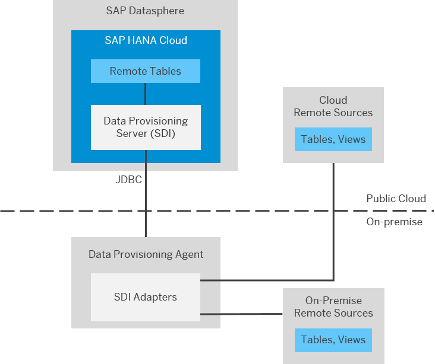

<!-- loiof1a39d1a763e48c8872f45c110a5a4e2 -->

# Preparing Data Provisioning Agent Connectivity

Most connection types supporting remote tables use SAP HANA Smart Data Integration \(SDI\) and its Data Provisioning Agent. Before using the connection, the agent requires an appropriate setup.

<a name="loiof1a39d1a763e48c8872f45c110a5a4e2__context_vwx_512_2sb"/>

## Context

The Data Provisioning Agent is a lightweight component running outside the SAP Datasphere environment. It hosts data provisioning adapters for connectivity to remote sources, enabling data federation and replication scenarios. The Data Provisioning Agent acts as a gateway to SAP Datasphere providing secure connectivity between the database of your SAP Datasphere tenant and the adapter-based remote sources. The Data Provisioning Agent is managed by the Data Provisioning Server. It is required for all connections with SAP HANA smart data integration.

Through the Data Provisioning Agent, the preinstalled data provisioning adapters communicate with the Data Provisioning Server for connectivity, metadata browsing, and data access. The Data Provisioning Agent connects to SAP Datasphere using JDBC. It needs to be installed on a local host in your network and needs to be configured for use with SAP Datasphere.

> ### Note:  
> A given Data Provisioning Agent can only connected to one SAP Datasphere tenant \(see SAP Note [2445282](https://me.sap.com/notes/2445282)\).

For an overview of connection types that require a Data Provisioning Agent setup, see [Preparing Connectivity for Connections](preparing-connectivity-for-connections-bffbd58.md).

> ### Note:  
> See also the guide [Best Practices and Sizing Guide for Smart Data Integration \(When used in SAP Datasphere\)](https://www.sap.com/documents/2022/06/008491bc-317e-0010-bca6-c68f7e60039b.html) \(published June 10, 2022\) for information to consider when creating and using connections that are based on SDI and Data Provisioning Agent.

## Procedure

To prepare connectivity via Data Provisioning Agent, perform the following steps:

1.  Download and install the latest Data Provisioning Agent version on a host in your local network.

    > ### Note:  
    > -   We recommend to always use the latest released version of the Data Provisioning Agent. For information on supported and available versions for the Data Provisioning Agent, see the [SAP HANA Smart Data Integration Product Availability Matrix \(PAM\)](https://support.sap.com/content/dam/launchpad/en_us/pam/pam-essentials/TIP/PAM_HANA_SDI_2_0.pdf).
    > 
    > -   Make sure that all agents that you want to connect to SAP Datasphere have the same latest version.

    For more information, see [Install the Data Provisioning Agent](install-the-data-provisioning-agent-8f61850.md).

2.  Add the external IPv4 address of the server on which your Data Provisioning Agent is running to the IP allowlist in SAP Datasphere. When using a proxy, the proxy's address needs to be included in IP allowlist as well.

    > ### Note:  
    > For security reasons, all external connections to your SAP Datasphere instance are blocked by default. By adding external IPv4 addresses or address ranges to the allowlist you can manage external client connections.

    For more information, see [Manage IP Allowlist](manage-ip-allowlist-a3c2145.md).

3.  Connect the Data Provisioning Agent to SAP Datasphere.

    This includes configuring the agent and setting the user credentials in the agent.

    For more information, see [Connect and Configure the Data Provisioning Agent](connect-and-configure-the-data-provisioning-agent-e87952d.md).

4.  Register the adapters with SAP Datasphere.

    > ### Note:  
    > For third-party adapters, you need to download and install any necessary JDBC libraries before registering the adapters.

    For more information, see [Register Adapters with SAP Datasphere](register-adapters-with-sap-datasphere-085fc49.md).

<a name="loiof1a39d1a763e48c8872f45c110a5a4e2__result_cmq_2zg_3tb"/>

## Results

The registered adapters are available for creating connections to the supported remote sources and enabling these connections for creating views and accessing or replicating data via remote tables.

