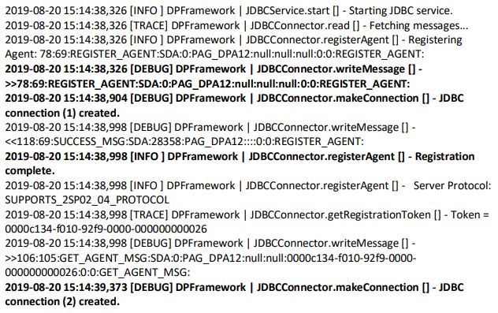
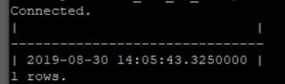
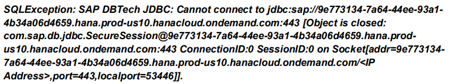
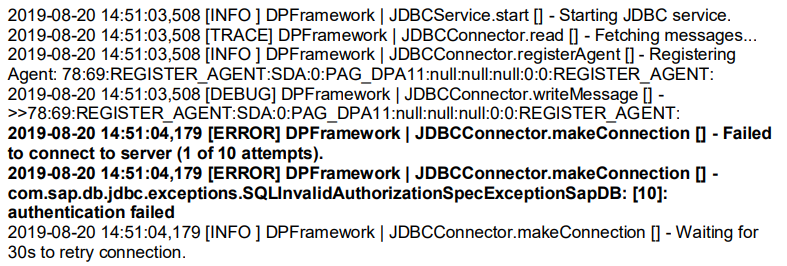
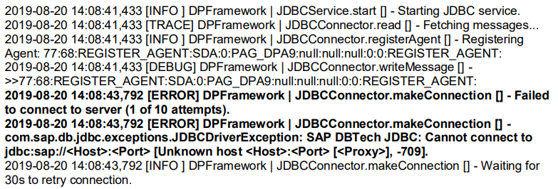
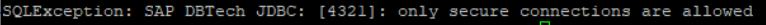

<!-- loio2d354053fa84499191794f68de8b752f -->

<link rel="stylesheet" type="text/css" href="css/sap-icons.css"/>

# Troubleshooting the Data Provisioning Agent \(SAP HANA Smart Data Integration\)

If you encounter problems with the Data Provisioning Agent, you can perform various checks and take actions to troubleshoot the problems.

The following sections provide information about checks, logs, and actions that you can take to troubleshoot problems with the Data Provisionning Agent:

-   [Initial Checks](troubleshooting-the-data-provisioning-agent-sap-hana-smart-data-integration-2d35405.md#loio2d354053fa84499191794f68de8b752f__section_initial_checks)
-   [Configuration Checks](troubleshooting-the-data-provisioning-agent-sap-hana-smart-data-integration-2d35405.md#loio2d354053fa84499191794f68de8b752f__section_configuration_checks)
-   [Logs and Traces](troubleshooting-the-data-provisioning-agent-sap-hana-smart-data-integration-2d35405.md#loio2d354053fa84499191794f68de8b752f__section_logs_traces)
-   [Performance](troubleshooting-the-data-provisioning-agent-sap-hana-smart-data-integration-2d35405.md#loio2d354053fa84499191794f68de8b752f__section_performance)
-   [Validating the Connection from the Server the Agent is Running to SAP Datasphere](troubleshooting-the-data-provisioning-agent-sap-hana-smart-data-integration-2d35405.md#loio2d354053fa84499191794f68de8b752f__section_validation)
-   [Troubleshooting Connection Issues](troubleshooting-the-data-provisioning-agent-sap-hana-smart-data-integration-2d35405.md#loio2d354053fa84499191794f68de8b752f__section_troubleshooting)
-   [Reviewing Data Provisioning Agent Logs](troubleshooting-the-data-provisioning-agent-sap-hana-smart-data-integration-2d35405.md#loio2d354053fa84499191794f68de8b752f__section_review_logs)
-   [SAP Notes](troubleshooting-the-data-provisioning-agent-sap-hana-smart-data-integration-2d35405.md#loio2d354053fa84499191794f68de8b752f__section_sap_notes)
-   [Support Information](troubleshooting-the-data-provisioning-agent-sap-hana-smart-data-integration-2d35405.md#loio2d354053fa84499191794f68de8b752f__section_support)

> ### Note:  
> In the following sections, filepaths and screenshots are based on a Linux-based installation of the agent. If you have installed the agent on a Microsoft Windows server, the slashes "/” must be replaced by backslashes “\\”.


<a name="loio2d354053fa84499191794f68de8b752f__section_initial_checks"/>

## Initial Checks

A Data Provisioning Agent administrator can perform the following checks:

-   **Firewall**

    For a successful connection, make sure that outbound connections from the Data Provisioning Agent to the target host and port, which is provided in the Data Provisioning Agent registration information in SAP Datasphere, are not blocked by your firewall.

-   **Agent version**

    Make sure to always use the latest released version of the Data Provisioning Agent. For information on supported and available versions for the Data Provisioning Agent, see the [SAP HANA Smart Data Integration Product Availability Matrix \(PAM\)](https://support.sap.com/content/dam/launchpad/en_us/pam/pam-essentials/TIP/PAM_HANA_SDI_2_0.pdf).

    Make sure that all agents that you want to connect to SAP Datasphere have the same latest version.

-   **Java Installation** 

    Check whether a Java installation is available by running the command `java -version`. If you receive a response like ***java: command not found***, use the Java installation which is part of the agent installation. The Java executable can be found in folder <code><i class="varname">&lt;DPAgent_root&gt;</i>/sapjvm/bin</code>.


<a name="loio2d354053fa84499191794f68de8b752f__section_configuration_checks"/>

## Configuration Checks

The agent configuration is stored in the <code><i class="varname">&lt;DPAgent_root&gt;</i>/dpagentconfig.ini</code> file in the agent installation root location \(<code><i class="varname">&lt;DPAgent_root&gt;</i></code>\). A Data Provisioning Agent administrator can double-check for the correct values \(please do not maintain the parameters directly in the configuration file; the values are set with the command-line agent configuration tool\):


<table>
<tr>
<th valign="top">

dpagentconfig.ini file

</th>
<th valign="top">

Agent Settings in SAP Datasphere

</th>
</tr>
<tr>
<td valign="top">

agent.name=*<Agent Name\>* 

</td>
<td valign="top">

*Agent Name* \(the name defined by the user who registered the agent in SAP Datasphere; the name is case sensitive\)

</td>
</tr>
<tr>
<td valign="top">

hana.port=*<HANA Port\>* 

</td>
<td valign="top">

*HANA Port* 

</td>
</tr>
<tr>
<td valign="top">

hana.onCloud=false

</td>
<td valign="top">

n/a

</td>
</tr>
<tr>
<td valign="top">

hana.useSSL=true

</td>
<td valign="top">

*HANA Use SSL* 

</td>
</tr>
<tr>
<td valign="top">

hana.server=*<HANA Server\>* 

</td>
<td valign="top">

*HANA Server* 

</td>
</tr>
<tr>
<td valign="top">

jdbc.enabled=true

</td>
<td valign="top">

*HANA via JDBC* 

</td>
</tr>
<tr>
<td valign="top">

jdbc.host=*<HANA Server\>* 

</td>
<td valign="top">

*HANA Server* 

</td>
</tr>
<tr>
<td valign="top">

jdbc.port=*<HANA Port\>* 

</td>
<td valign="top">

*HANA Port* 

</td>
</tr>
<tr>
<td valign="top">

jdbc.encrypt=true

</td>
<td valign="top">

n/a

</td>
</tr>
</table>

If you use a proxy server in your landscape, additionally check for the following parameters:


<table>
<tr>
<th valign="top">

dpagentconfig.ini file

</th>
</tr>
<tr>
<td valign="top">

proxyType=http

</td>
</tr>
<tr>
<td valign="top">

jdbc.useProxy=true

</td>
</tr>
<tr>
<td valign="top">

jdbc.proxyHost=*<your proxy host\>* 

</td>
</tr>
<tr>
<td valign="top">

jdbc.proxyPort=*<your proxy port\>* 

</td>
</tr>
<tr>
<td valign="top">

jdbc.proxyHttp=true \(true in case of http proxy, false in case of SOCKS proxy\)

</td>
</tr>
<tr>
<td valign="top">

\[if proxy authentication is required\] jdbc.useProxyAuth=true

</td>
</tr>
<tr>
<td valign="top">

\[if proxy authentication is required\] jdbc.proxyUsername=*<your proxy user name\>* 

</td>
</tr>
<tr>
<td valign="top">

\[if proxy authentication is required\] jdbc.proxyPassword=*<your proxy password\>* 

</td>
</tr>
</table>

For more information, see [Agent Configuration Parameters](https://help.sap.com/docs/HANA_SMART_DATA_INTEGRATION/7952ef28a6914997abc01745fef1b607/56abe3ed05244e7fbf2ddea1818fab1f.html?locale=en-US&version=latest) in the *SAP HANA Smart Data Integration and SAP HANA Smart Data Quality* documentation.


<a name="loio2d354053fa84499191794f68de8b752f__section_logs_traces"/>

## Logs and Traces

To troubleshoot connection issues, a Data Provisioning Agent administrator can enable logging and JDBC tracing for the Data Provisioning Agent.

-   **Agent Logs**

    Change the logging level to INFO \(default\), ALL, DEBUG, or TRACE according to your needs. For more informatiaon, see SAP Note [2496051](https://me.sap.com/notes/2496051) - *How to change "Logging Level" \(Trace level\) of a Data Provisioning Agent - SAP HANA Smart Data Integration*.

    The parameters for the logging level in the <code><i class="varname">&lt;DPAgent_root&gt;</i>/dpagentconfig.ini</code> file are:

    -   framework.log.level

    -   service.log.level


    > ### Note:  
    > Changing the level to DEBUG or ALL will generate a large amount of data. We therefore recommend to change the logging level to these values only for a short period of time while you are actively debugging and change it to a lower information level after you have finished debugging.

    See also SAP Note [2461391](https://me.sap.com/notes/2461391) - *Where to find Data Provisioning Agent Log Files*

-   **JDBC Trace**

    For information about activating JDBC tracing, see [Trace a JDBC Connection](https://help.sap.com/docs/HANA_SERVICE_CF/1efad1691c1f496b8b580064a6536c2d/f2bbb7fb4e1247f29e325f8b29226d16.html?locale=en-US) in the *SAP HANA Service for SAP BTP in AWS and Google Cloud Regions* documentation.

    To set the trace level, execute the JDBC driver \*.jar file from the <code><i class="varname">&lt;DPAgent_root&gt;</i>/plugins</code> directory.


<a name="loio2d354053fa84499191794f68de8b752f__section_performance"/>

## Performance

If you experience performance issues when replicating data via the Data Provisioning Agent, a Data Provisioning Agent administrator can consider increasing the agent memory as described in SAP Note [2737656](https://me.sap.com/notes/2737656) - *How to increase DP Agent memory*.

For general memory sizing recommendations for SAP HANA Smart Data Integration, see

-   [Data Provisioning Agent - Best Practices and Sizing Guide](https://help.sap.com/docs/HANA_SMART_DATA_INTEGRATION/bf2f0282053648f8a1ef873e65ded81a/eae32342b3b643639210675dbf4b06b6.html?locale=en-US&version=latest) in the *SAP HANA Smart Data Integration and SAP HANA Smart Data Quality* documentation.

-   SAP Note [2688382](https://me.sap.com/notes/2688382) - *SAP HANA Smart Data Integration Memory Sizing Guideline*


<a name="loio2d354053fa84499191794f68de8b752f__section_validation"/>

## Validating the Connection from the Server the Agent is Running to SAP Datasphere

Ensure that your Data Provisioning Agent is connected to SAP HANA.


### In SAP Datasphere

In <span class="FPA-icons-V3"></span> \(*System*\) ** \> ** :wrench: \(*Configuration*\) ** \> *Data Integration*** \> *On-Premise Agents* a green bar and status information on the agent tile indicates if the agent is connected.


In *On-Premise Agents*, click <span class="SAP-icons-V5"></span> *Refresh Agents* if the tile of a newly connected agent doesn’t display the updated connection status.

> ### Note:  
> When you connect a new agent, it might take several minutes until it is connected.


### Via Data Provisioning Agent Configuration Tool \(for agent versions lower than 2.7.4\)

1.  Navigate to the command line and run <code><i class="varname">&lt;DPAgent_root&gt;</i>/bin/agentcli.bat --configAgent</code>.
2.  Choose *Agent Status* to check the connection status.
3.  Make sure the output shows *Agent connected to HANA: Yes*.
4.  If the output doesn't show that the agent is connected, it may show an error message. Resolve the error, and then select option *Start or Stop Agent*, and then option *Start Agent* to start the agent.

> ### Note:  
> For agent version 2.7.4 and higher, if in the agent status the message *No connection established yet* is shown, this can be ignored. You can check the connection status in SAP Datasphere instead. For more information about the agent/SAP HANA connection status in agent version 2.7.4 and higher, see SAP Note [3487646](https://me.sap.com/notes/3487646).


### Via Trace File

The Data Provisioning Agent framework trace file `framework.trc` in the <code><i class="varname">&lt;DPAgent_root&gt;</i>/log/</code> folder should contain entries indicating that the agent has been successfully connected.




### Via Command Line

To validate the connection, you can directly use the JDBC driver jar file from the command line interface. You must ensure that you’re using the same JDBC driver as used by the Data Provisioning Agent. The JDBC driver jar file \(`com.sap.db.jdbc_*.jar`\) is located in the <code><i class="varname">&lt;DPAgent_root&gt;</i>/plugins</code> directory.

The pattern for the command line is:

```
java -jar <com.sap.db.jdbc_*.jar> -u <HANA User Name for Messaging Agent>,”<HANA User Password for Messaging Agent>” -n <HANA Server>:<HANA Port> -o encrypt=true
```

Navigate to the <code><i class="varname">&lt;DPAgent_root&gt;</i>/plugins/</code> directory and run one of the following commands by replacing the variables as needed and depending on your landscape:

-   Without proxy:

    ```
    ../sapjvm/bin/java -jar <com.sap.db.jdbc_*.jar> -u <HANA User Name for Messaging Agent>,”<HANA User Password for Messaging Agent>” -n <HANA Server>:<HANA Port> -o encrypt=true
    ```

-   With proxy:

    ```
    ../sapjvm/bin/java -jar <com.sap.db.jdbc_*.jar> -u <HANA User Name for Messaging Agent>,”<HANA User Password for Messaging Agent>” -n <HANA Server>:<HANA Port> -o encrypt=true -o proxyHostname=<your proxy host> -o proxyPort=<your proxy port> -o proxyHttp=true -o proxytype=http
    ```

-   With proxy with authentication required:

    ```
    ../sapjvm/bin/java -jar <com.sap.db.jdbc_*.jar> -u <HANA User Name for Messaging Agent>,”<HANA User Password for Messaging Agent>” -n <HANA Server>:<HANA Port> -o encrypt=true -o proxyHostname=<your proxy host> -o proxyPort=<your proxy port> -o proxyHttp=true -o proxytype=http -o proxyUserName=<your proxy user name> -o proxyPassword=”<your proxy password>”
    ```


If the connection works properly the statement should look like this:




<a name="loio2d354053fa84499191794f68de8b752f__section_troubleshooting"/>

## Troubleshooting Connection Issues

If you are unable to connect your Data Provisioning Agent to SAP Datasphere and have already validated the connection as described in the previous section, open the agent framework trace file `framework.trc` in the <code><i class="varname">&lt;DPAgent_root&gt;</i>/log/</code> folder and check whether the output matches any of the following issues.


### An entry is missing in the SAP Datasphere IP Allowlist

Example for an entry in the `framework.trc` file:



If you see this kind of error, it is most likely related to a missing entry in the IP Allowlist inSAP Datasphere.

Verify that the external \(public\) IPv4 address of the server where the agent is installed is in the IP allowlist. When using a proxy, the proxy's address needs to be included in IP allowlist as well.

For more information, see:

-   [Manage IP Allowlist](Preparing-Connectivity/manage-ip-allowlist-a3c2145.md)

-   SAP Note [2938870](https://me.sap.com/notes/2938870) - *Errors when connecting DP Agent with DWC*


### Authentication failed

Example for an entry in the `framework.trc` file:



Authentication fails because of invalid *HANA User for Agent Messaging* credentials in the agent secure storage. To update the credentials, use the agent configuration tool and then restart the agent.

For more information, see [Manage the HANA User for Agent Messaging Credentials](https://help.sap.com/docs/HANA_SMART_DATA_INTEGRATION/7952ef28a6914997abc01745fef1b607/407099e6d9ea47cf821d9e2f5db312d9.html?locale=en-US&version=latest) in the *SAP HANA Smart Data Integration and SAP HANA Smart Data Quality* documentation.


### Firewall/Proxy Issues

Example for an entry in the `framework.trc` file:



This issue typically indicates that the JDBC driver is not capable of resolving the SAP HANA server URL to connect to theSAP Datasphere tenant and/or to establish a correct outbound call. Please check your firewall/proxy settings and make sure to enable outbound connections accordingly.


### Encryption is missing: Only Secure Connections are Allowed

In case of missing encryption the log containts the following statement: "only secure connections are allowed".



When testing the connectivity directly with the JDBC driver, add the parameter `-o encrypt=true`.


<a name="loio2d354053fa84499191794f68de8b752f__section_review_logs"/>

## Reviewing Data Provisioning Agent Logs

The logs are located in the <code><i class="varname">&lt;DPAgent_root&gt;</i>/log</code> directory. For more information on the available log files, see SAP Note [2461391](https://me.sap.com/notes/2461391).

If the agent is connected, you can review the framework log \(`framework_alert.trc`\) and the framework trace log \(`framework.trc`\) directly in SAP Datasphere. For more information, see [Monitoring Data Provisioning Agent Logs](monitoring-data-provisioning-agent-logs-e49785b.md).


<a name="loio2d354053fa84499191794f68de8b752f__section_sap_notes"/>

## SAP Notes

SAP Note [2938870](https://me.sap.com/notes/2938870) - *Errors when connecting DP Agent with DWC* 

SAP Note [2894588](https://me.sap.com/notes/2894588) - *IP Allowlist in SAP Datasphere*

SAP Note [2511196](https://me.sap.com/notes/2511196) - *What ports are used by Smart Data Integration*

SAP Note [2091095](https://me.sap.com/notes/2091095) - *SAP HANA Smart Data Integration and SAP HANA Smart Data Quality*

SAP Note [2400022](https://me.sap.com/notes/2400022) - *FAQ: SAP HANA Smart Data Integration \(SDI\)*

SAP Note [2477204](https://me.sap.com/notes/2477204) - *FAQ: SAP HANA Services and Ports*

SAP Note [2688382](https://me.sap.com/notes/2688382) - *SAP HANA Smart Data Integration Memory Sizing Guideline*


<a name="loio2d354053fa84499191794f68de8b752f__section_support"/>

## Support Information

Support Component: SDI HAN-DP-SDI

Add and attach the following information:

-   Version of the Data Provisioning Agent

-   Framework trace log file \(`framework.trc`\)

-   Data Provisioning Agent configuration file \(`dpagentconfig.ini` file\)


