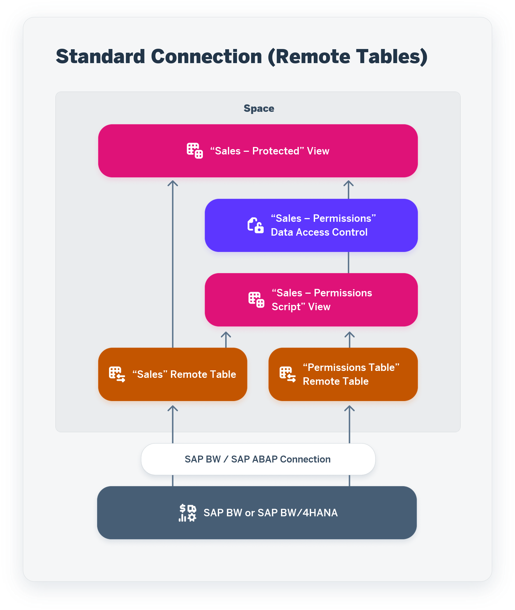

<!-- loiof56e4271dc4943aa9f21223ce5c93873 -->

<link rel="stylesheet" type="text/css" href="../css/sap-icons.css"/>

# Import SAP BW and SAP BW∕4HANA Analysis Authorizations

You can import analysis authorizations defined in SAP BW and SAP BW∕4HANA systems into SAP Datasphere to provide row-level protection for data imported from these systems.

This topic contains the following sections:

-   [Introduction](import-sap-bw-and-sap-bw-4hana-analysis-authorizations-f56e427.md#loiof56e4271dc4943aa9f21223ce5c93873__section_introduction)
-   [Importing Permissions](import-sap-bw-and-sap-bw-4hana-analysis-authorizations-f56e427.md#loiof56e4271dc4943aa9f21223ce5c93873__section_importing_permissions)

<a name="loiof56e4271dc4943aa9f21223ce5c93873__section_introduction"/>

## Introduction

This feature is supported only for SAP BW v7.5 SP16 and higher and SAP BW∕4HANA v2.0 and higher systems accessed via one of the following connection types:

-   SAP ABAP \(see [SAP ABAP Connections](../Integrating-Data-Via-Connections/sap-abap-connections-a75c1aa.md)\)
-   SAP BW \(see [SAP BW Connections](../Integrating-Data-Via-Connections/sap-bw-connections-e589041.md)\)
-   SAP BW∕4HANA Model Transfer connection \(see [Importing SAP BW∕4HANA Models](https://help.sap.com/viewer/24f836070a704022a40c15442163e5cf/DEV_CURRENT/en-US/a3d4a2f91bea4810ba8839ff73577dac.html "You can import existing analytic queries from SAP BW∕4HANA into SAP Datasphere in order to build new models on top of them or enhance them.") :arrow_upper_right:\)

An SAP BW or SAP BW∕4HANA administrator must have created the report that generates the `RSDWC_RSEC_DAC` permissions table on the source system \(see [SAP Note 3062381](https://launchpad.support.sap.com/#/notes/3062381)\). This SAP note also includes instruction on how to implement BAdI `RSDWC_DAC_RSEC_USER_UPDATE` for situations where your SAP BW or SAP BW∕4HANA instance does not use email addresses as user IDs.

> ### Note:  
> This SAP note has been updated to support importing permissions via an SAP BW∕4HANA Model Transfer connection. If you have previously used this feature, you must follow the updated steps to ensure you have the latest version of the report.

The objects to be protected must have already been imported into your space. For objects imported from:

-   SAP ABAP or SAP BW connections - Only analysis authorizations applied to characteristics used on InfoProviders and CompositeProviders can be imported with this wizard.

    > ### Note:  
    > Analysis authorizations applied to queries used as InfoProviders cannot be imported.

-   SAP BW∕4HANA Model Transfer connections - Analysis authorizations applied to navigation attributes can also be imported.

See the following blogs for additional information about this feature:

-   For a general introduction, see [Introducing Remote Authorizations from SAP BW/4HANA for SAP Datasphere](https://blogs.sap.com/2021/09/23/introducing-remote-authorizations-from-sap-bw-4hana-for-sap-data-warehouse-cloud/) \(updated February 2022\).
-   For information about leveraging SAP HANA-native analytical privileges in an open SQL schema in case of slow-running views or out of memory issues, see [HANA Analytical Privileges in SAP Datasphere – Part 1](https://blogs.sap.com/2023/01/02/hana-analytical-privileges-in-sap-dwc-part-1/) and [Part 2](https://blogs.sap.com/2023/01/05/hana-analytical-privileges-in-sap-dwc-part-2/) \(published January 2023\).

<a name="loiof56e4271dc4943aa9f21223ce5c93873__section_importing_permissions"/>

## Importing Permissions

The *Import Permissions* wizard will import the permissions table from the source system, create additional objects to calculate the permissions, and apply a data access control to each selected object.

1.  In the side navigation area, click  \(*Data Access Controls*\), select a space if necessary, and click *Import* \> *Import Permissions* to open the *Import Permissions* wizard.
2.  Select the connection from which you want to import permissions and click *Next*.
3.  Import or accept the permissions table for this connection. If the permissions table is:

    -   Not imported - Enter a *Business Name* and *Technical Name* and click *Import and Deploy*. Once the table has been imported and deployed, click *Next*.

        > ### Note:  
        > You cannot choose the name of the permissions table for a SAP BW∕4HANA Model Transfer connection.

    -   Imported - Click *Next*.
    -   Not generated on the server - Click *Cancel*. You cannot continue without importing the table.

        > ### Note:  
        > For SAP BW∕4HANA Model Transfer connections, if [SAP Note 3062381](https://launchpad.support.sap.com/#/notes/3062381) has been correctly applied and the wizard cannot find the permissions table, verify that the user specified in your connection has permission to access the permissions table `RSDWC_RSEC_DAC`. Your SAP BW∕4HANA administrator may need to add this permission to the user or provide an alternative user with the necessary permission.

    > ### Note:  
    > We recommend that the report generating the permissions table in SAP BW∕4HANA is run at least once a day and the remote table in SAP Datasphere is kept in remote \(federated\) access to ensure that it is always up-to-date. If you decide to replicate the permissions table, you should schedule at minimum a daily refresh. Real-time replication is not supported for this table.

4.  Select the objects for which you want to import permissions, and then click *Next*.

    Only those objects that have previously been imported from this connection, and which can be protected, are listed.

5.  Review the summary of the objects that will be created in SAP Datasphere.

    For each object to be protected, new objects are created:

    <table>
    <tr>
    <th valign="top">

    Standard Connection \(Remote Tables\)

    
    </th>
    <th valign="top">

    Model Transfer Connection \(Views\)

    
    </th>
    </tr>
    <tr>
    <td valign="top">
    
    

    For each selected remote table, the following objects are created:

    -   <code><i class="varname">&lt;table&gt;</i> - Permissions Script</code> \(<code><i class="varname">&lt;table&gt;</i>_P</code>\) - An SQL view to calculate the permissions to apply to the object.
    -   <code><i class="varname">&lt;table&gt;</i> - Permissions</code> \(<code><i class="varname">&lt;table&gt;</i>_D</code>\) - A data access control to consume the SQL view.
    -   <code><i class="varname">&lt;table&gt;</i> - Protected</code> \(<code><i class="varname">&lt;table&gt;</i>_V</code> - An SQL view to wrap the table selected for protection and apply the data access control. Once the import is complete, you should only access the table via this view.

    
    </td>
    <td valign="top">
    
    

    For each selected view, the following objects are created or modified:

    -   <code><i class="varname">&lt;view&gt;</i> - Base View</code> \(<code><i class="varname">&lt;view&gt;</i>_B</code>\) - A copy of the view to protect, used for generating the permissions script view.
    -   <code><i class="varname">&lt;view&gt;</i> - Permissions Script</code> \(<code><i class="varname">&lt;view&gt;</i>_P</code>\) - An SQL view to calculate the permissions to apply to the object.
    -   <code><i class="varname">&lt;view&gt;</i> - Permissions</code> \(<code><i class="varname">&lt;table&gt;</i>_D</code>\) - A data access control to consume the SQL view, which will be applied to the view selected for protection.
    -   <code><i class="varname">&lt;view&gt;</i></code> \(<code><i class="varname">&lt;view&gt;</i></code>\) - The original view is protected by applying the data access control to it and can continue to be used.

    
    </td>
    </tr>
    </table>
    
    > ### Note:  
    > If you have previously protected some or all of the selected objects, they will appear in the wizard with a *Status/Action* of `Overwrite` and will be overwritten.

6.  Click *Import and Deploy* to create, import, and deploy all these objects.
7.  Click *Finish* to exit the wizard and perform all the actions necessary to protect the data.

    All the objects are listed in the *Repository Explorer* and, where appropriate, also in the *Data Access Controls* and *Data Builder* start pages.

