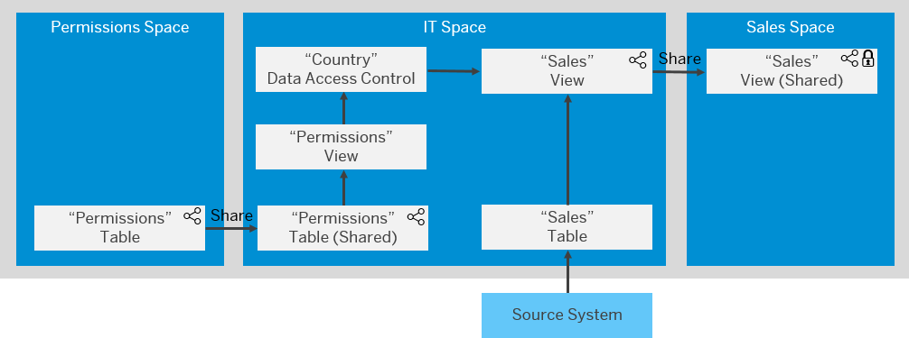

<!-- loioa032e51c730147c7a1fcac125b4cfe14 -->

# Securing Data with Data Access Controls

Users with a space administrator role can create data access controls to allow modelers to apply row-level security to *Data Builder* and *Business Builder* objects. Once a data access control is applied to an object, any user viewing its data either directly or via an object using it as a source, will see only those records they are authorized to view, based on the specified criteria. 

This topic contains the following sections:

-   [Permissions Entities](securing-data-with-data-access-controls-a032e51.md#loioa032e51c730147c7a1fcac125b4cfe14__section_permissions_entities)
-   [Data Access Control Best Practices](securing-data-with-data-access-controls-a032e51.md#loioa032e51c730147c7a1fcac125b4cfe14__section_best_practices)
-   [Applying Data Access Controls](securing-data-with-data-access-controls-a032e51.md#loioa032e51c730147c7a1fcac125b4cfe14__section_applying)
-   [Data Access Control Example](securing-data-with-data-access-controls-a032e51.md#loioa032e51c730147c7a1fcac125b4cfe14__section_example)

<a name="loioa032e51c730147c7a1fcac125b4cfe14__section_permissions_entities"/>

## Permissions Entities

Your criteria are defined in a table or view that lists SAP Datasphere user IDs \(in the form required by your identity provider\) and assigns them to one or more criteria. You can define the following types of criteria:

-   Single Values - Each user can only see the records that match any of the single values she is authorized for in the permissions entity. See [Create a "Single Values" Data Access Control](create-a-single-values-data-access-control-5246328.md).
-   Operator and Values - Each user can only see the records that fulfill the operator-value pairs she is authorized for in the permissions entity, including support for complex `AND` and `OR` combinations. See [Create an "Operator and Values" Data Access Control](create-an-operator-and-values-data-access-control-501594b.md).
-   Hierarchy - Each user can only see the records that match the hierarchy values she is authorized for in the permissions entity, along with any of their descendants. See [Create a "Hierarchy" Data Access Control](create-a-hierarchy-data-access-control-0afeeed.md)
-   Hierarchy - Each user can only see the records that match the hierarchy values she is authorized for in the permissions entity, along with any of their descendants. See [Create a "Hierarchy with Directory" Data Access Control](https://help.sap.com/viewer/9f36ca35bc6145e4acdef6b4d852d560/DEV_CURRENT/en-US/44ae6289f96949f48781959f9d284578.html "Users with the DW Space Administrator role (or equivalent privileges) can create data access controls in which criteria are defined as hierarchy values in a hierarchy with directory. Each user can only see the records that match the hierarchy values she is authorized for in the permissions entity, along with any of their descendants.") :arrow_upper_right:.

You can create one or more data access controls that consume each permissions entity, and select one or more columns in each data access control to specify the criteria that it will enforce. You can apply a single data access control to multiple views. Each view protected in this way will filter the results available in its data preview to only those rows meeting the criteria for the current user.

> ### Note:  
> Permissions entities must not, themselves, be protected by a data access control, or have any protected view among their sources.

<a name="loioa032e51c730147c7a1fcac125b4cfe14__section_best_practices"/>

## Data Access Control Best Practices

We recommend that you develop clear policies for securing data, and that you:

-   Focus in particular on securing transactional data and sensitive master data.
-   Avoid applying multiple data access controls to a view if possible.
-   Secure data as soon as possible once it is ingested into SAP Datasphere and then only use the protected view going forward, keeping the following factors in mind as you plan your modeling strategy for security and performance:
    -   Encapsulating individual source tables in views and applying data access controls to them:
        -   Improves performance by filtering records immediately, as fewer go forward for subsequent preparation.
        -   Can impact performance when any view that combines multiple sources is run, by increasing the number of data access controls that must be applied.
        -   Can impact performance by excluding the possibility of persisting subsequent views, since views cannot be persisted if any of their sources is protected by a data access control.

    -   Doing initial processing and joining separate data sources before applying a single, more targeted data access control to the result:
        -   Improves performance by applying only a single data access control to a combined view.
        -   Improves performance by allowing the use of persistence at any stage during the preparation.
        -   Can impact performance as more records will pass through each stage of the data preparation.

-   When using *Operator and Values* data access controls, try to control the size of the permissions entity and, in particular, avoid having more than 5,000 permissions records for a single user:
    -   Consider applying the filter against a different column that could simplify calculation.
    -   You can use the `*` operator to provide access to all records.

> ### Note:  
> The row-level security provided by the data access control can be circumvented while the view remains in its space. It is enforced only when the view is:
> 
> -   Shared to another space, or
> -   Consumed outside the space in SAP Analytics Cloud.

<a name="loioa032e51c730147c7a1fcac125b4cfe14__section_applying"/>

## Applying Data Access Controls

For information about:

-   Applying a data access control to a view, see [Apply a Data Access Control to a Graphical or SQL View](https://help.sap.com/viewer/24f836070a704022a40c15442163e5cf/DEV_CURRENT/en-US/8f79fc80d6134a89a03837a205d340cd.html "You can apply one or more data access controls to a view to control the data that users will see based on the specified criteria.") :arrow_upper_right:.

    > ### Note:  
    > For information about persisting data in a view that has a data access control applied to it, see [Persisted Views and Data Access Control](../Data-Integration-Monitor/persisted-views-and-data-access-control-7a4a983.md).

-   Applying a data access control to an analytic model, see [Apply a Data Access Control to an Analytic Model](https://help.sap.com/viewer/24f836070a704022a40c15442163e5cf/DEV_CURRENT/en-US/8d8e2f9b36a74de3b6f5f1384ad8f70d.html "You can apply one or more data access controls to an analytic model to control the data that users will see based on the specified criteria.") :arrow_upper_right:

    > ### Note:  
    > For analytic models containing standard, reference date, or X variables, mapping a data access control to a dimension attribute is not supported.

-   Using a data access control to create authorization scenarios in the business layer, see [Authorization Scenario](https://help.sap.com/viewer/24f836070a704022a40c15442163e5cf/DEV_CURRENT/en-US/46d8c42e1b1f421c9735a7cbc6fdba60.html "Authorization scenarios allow modelers to define which data is relevant to a user's context. They are made available through business entities and can be used in consumption models for specific use-cases.") :arrow_upper_right:.

> ### Note:  
> If you experience performance issues with a view protected by a data access control, we recommend enabling replication for source tables, particularly if any source contains more than 500,000 rows.

<a name="loioa032e51c730147c7a1fcac125b4cfe14__section_example"/>

## Data Access Control Example

This diagram shows a typical environment where a permissions entity is maintained by business users in one space and shared to a second space, where technical users create data access controls from it and apply them to views. These views are then shared to other spaces where they can be securely accessed by modelers and analysts:

In this environment:

-   The `Permissions` space users are a select group of business users who:
    -   Maintain the `Permissions` table, assigning users \(which, in this case, are identified by their email address\) to the appropriate country, department, and any other relevant criteria:

        <table>
        <tr>
        <th valign="top">

        User ID
        
        </th>
        <th valign="top">

        Country
        
        </th>
        <th valign="top">

        Department
        
        </th>
        </tr>
        <tr>
        <td valign="top">
        
        anne.archer@acme.com
        
        </td>
        <td valign="top">
        
        US
        
        </td>
        <td valign="top">
        
        Sales
        
        </td>
        </tr>
        <tr>
        <td valign="top">
        
        jennifer.jones@acme.com
        
        </td>
        <td valign="top">
        
        FR
        
        </td>
        <td valign="top">
        
        Sales
        
        </td>
        </tr>
        </table>
        
    -   Share the `Permissions` table to the `IT` space to use as a data source for data access controls.

        > ### Note:  
        > Tables and views shared to a space cannot be directly used as the permissions entity for a data access control. Modelers in the space receiving the shared object must encapsulate it in a view, which can then serve as the permissions entity for one or more data access controls.

-   The `IT` space users are technical users who:
    -   Use the shared `Permissions` table as the source for a `Permissions` view that they will use as a permissions entity in their space.
    -   Create a `Country` data access control, which uses the `Permissions` view as its permissions entity.
    -   Maintain a connection to a source system, from which they import the `Sales` table.
    -   Create a `Sales` view for use by business analysts, to which they apply the `Country` data access control.

        > ### Note:  
        > The row-level security provided by the `Country` data access control can still be circumvented while the view remains in the `IT` space.

    -   Share the `Sales` view to the `Sales` space where it can be used securely.

-   The `Sales` space users use the protected `Sales` view to do analytics on sales data:
    -   Anne is a data modeler in the US sales department. She connects to SAP Datasphere and combines the `Sales` view with other data. Whenever she previews data, she can only see US data.
    -   Jennifer is a business analyst in the French sales department. She connects to SAP Analytics Cloud, builds a story on the `Sales` view, and can only see French sales data.

