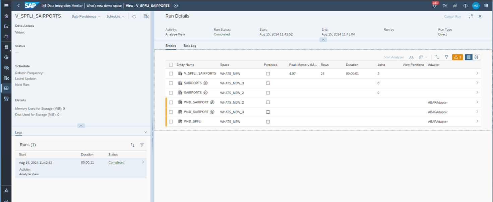
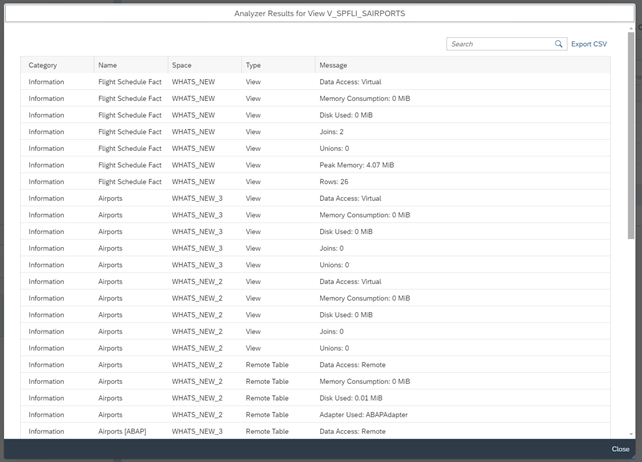

<!-- loio9ad9b8b42c82414c9cd166c55752c9a8 -->

<link rel="stylesheet" type="text/css" href="../css/sap-icons.css"/>

# Analyze Results

1.  Analyze your results

    To understand how you can interpret the analyzer's findings, let's take an example with the following View\_001\_001. It consumes 4 views \(in red\) and 4 remote tables \(in purple\): 

    Now, let's start the *View Analyzer* with memory consumption. On the total of 8 GiB that I have allowed in my statement memory limit, let's decide to limit the memory consumption to 4 GiB. This means that if a data persistence task exceeds this limit, the next data persistence simulations will be canceled:

    

    Once the *View Analyzer* has completed the task, 2 tabs are available in the details screen:

    > ### Note:  
    > The *Analyzed Views* tab was previously called the *Entities* tab.

    -   *Task Log*: It contains all information related to the *View Analyzer* task itself. You can see that my 5 views have been analyzed, and an overview of some key indicators is displayed: memory consumption, number of records, etc.

        

    -   *Analyzed Views*: It contains the details of the *View Analyzer* findings per analyzed entities. Information is displayed in a table format:

        

        <table>
        <tr>
        <th valign="top">

        Column
        
        </th>
        <th valign="top">

        Description
        
        </th>
        </tr>
        <tr>
        <td valign="top">
        
        *Entity Name*
        
        </td>
        <td valign="top">
        
        Name of the analyzed entity. It can be a local or a remote table, a view, a shared entity, an external entity, an intelligent lookup and or a data access control.
        
        </td>
        </tr>
        <tr>
        <td valign="top">
        
        *Space*
        
        </td>
        <td valign="top">
        
        Name of the space the entity resides in.
        
        </td>
        </tr>
        <tr>
        <td valign="top">
        
        *Persisted*
        
        </td>
        <td valign="top">
        
        Indicates if the view is already persisted, or the remote table replicated.
        
        </td>
        </tr>
        <tr>
        <td valign="top">
        
        *Partitions*
        
        </td>
        <td valign="top">
        
        Indicates if partitions have been defined for the analyzed views.

        > ### Note:  
        > If partitions have been defined for remote tables, it's not displayed. Only partitions defined for views are indicated by the *View Analyzer*.

        
        </td>
        </tr>
        <tr>
        <td valign="top">
        
        *Peak Memory \(MiB\)*
        
        </td>
        <td valign="top">
        
        Indicates the memory used during the simulation, or in case of the view already persisted, the memory used to persist the view.
        
        </td>
        </tr>
        <tr>
        <td valign="top">
        
        *Row*
        
        </td>
        <td valign="top">
        
        Indicates the number of rows.
        
        </td>
        </tr>
        <tr>
        <td valign="top">
        
        *Duration*
        
        </td>
        <td valign="top">
        
        Indicates the duration in second to persist the view \(simulation or actual data persistence\).
        
        </td>
        </tr>
        <tr>
        <td valign="top">
        
        *Adapter*
        
        </td>
        <td valign="top">
        
        Indicates if an adapter is used to access the remote table source.
        
        </td>
        </tr>
        </table>
        
        If you click on an entity row or click the \>, you'll access the details for the selected entity. For example, if I click on the table SCARR:

        

        In the message's details, you can see that the remote table is using an adapter that has limited capacities. This is why the entity was marked with a warning in the results.

        From the *Analyzed Views* tab, you can do many actions to explore your results:

        <table>
        <tr>
        <th valign="top">

        Action
        
        </th>
        <th valign="top">

        Description
        
        </th>
        </tr>
        <tr>
        <td valign="top">
        
         \(Sort\)
        
        </td>
        <td valign="top">
        
        Set sort order and sort columns:

        
        
        </td>
        </tr>
        <tr>
        <td valign="top">
        
         \(Filter\)
        
        </td>
        <td valign="top">
        
        Filter your results:

        
        
        </td>
        </tr>
        <tr>
        <td valign="top">
        
         \(Inspect\)
        
        </td>
        <td valign="top">
        
        Display the whole list of results that you can also export in CSV format:

        
        
        </td>
        </tr>
        <tr>
        <td valign="top">
        
        *Start Analyzer*
        
        </td>
        <td valign="top">
        
        You can select one or more views and start a new view analyzer.

        > ### Note:  
        > The analyzer will always start from the main view. Selecting the views here in the entity list, or in the lineage graph has an effect only on the data persistence simulation. In case memory consumption is chosen, the data persistence simulation will be executed for the selected views, regardless of their data persistence status.

        
        </td>
        </tr>
        <tr>
        <td valign="top">
        
         \(Lineage View\)
        
        </td>
        <td valign="top">
        
        Display the Lineage graph:

        

        If you click on one entity from the graph, you can see the view analyzer results and the indicators. For example, I click on SpfiJoinScarr view:

        

        > ### Note:  
        > It is also possible to select multiple views here and start the *View Analyzer* with memory consumption.

        
        </td>
        </tr>
        </table>
        

