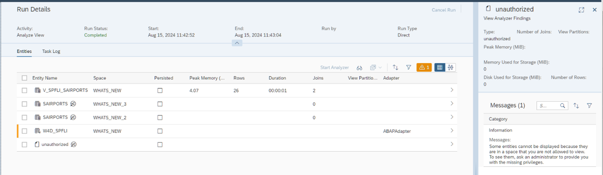
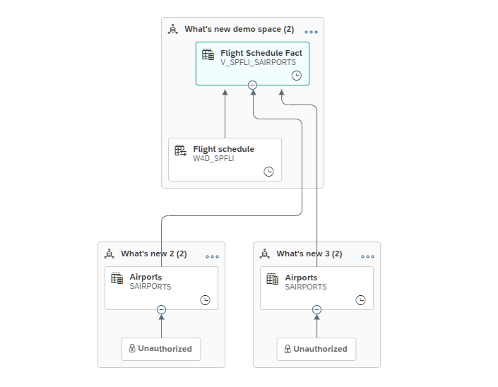

<!-- loioe5f9e8172d0340528c6bd1696d321e40 -->

# Authorization and Permissions

Working in *View Analyzer* requires different privileges and permissions depending on the tasks you want to perform. You will not be able to view entities that you are not authorized to view.

<a name="loioe5f9e8172d0340528c6bd1696d321e40__section_u52_mvf_scc"/>

## Unauthorized Notification

When a user does not have permission to access a space or spaces, a row titled *unauthorized* will be displayed.

You can only view entities that you are authorized to view. Entities from spaces that you are not allowed to view will be labeled as unauthorized. Contact your administrator to get authorization to view the hidden entities.

> ### Note:  
> To start the *View Analyzer* you will need the *DW Integrator* scoped role and the *Data Builder \(Read\)* privilege which can be found in the *DW Modeler* scoped role. You will be able to see all entities with either the global role *DW Administrator* or a custom role that includes *Data Warehouse Runtime \(Read\)* privilege.
> 
> Ask your tenant administrator to assign you a scoped or custom role that fits your required task.

This can also be seen in the lineage graph.

<a name="loioe5f9e8172d0340528c6bd1696d321e40__section_l4f_svf_scc"/>

## Permissions

The *View Analyzer* provides you with statistics and useful information on each entity that composes your view. There are a variety of ways to learn more about your view and make decisions to optimize your data model and performance. Due to the potential sensitivity of information gathered in *View Analyzer*, either the *DW Administrator* role or a custom role is required to run the view or to read the results of generated files.

Ask your tenant administrator to assign you a scoped or custom role that fits your required task.

****

<table>
<tr>
<th valign="top">

Action

</th>
<th valign="top">

Permission

</th>
</tr>
<tr>
<td valign="top">

Run *View Analyzer* without memory consumption

</td>
<td valign="top">

To run *View Analyzer* without memory consumption, you must have a role that is either based on the scoped role *DW Administrator* or on a custom role that includes the *Data Warehouse Data Integration \(Read, Update, Execute\)* and *Data Builder \(Read\)* privileges.

</td>
</tr>
<tr>
<td valign="top">

*Generate Explain Plan* 

</td>
<td valign="top">

You can generate the Explain Plan with the same permission required to run *View Analyzer* without memory consumption.

To generate Explain Plan, you must have either the scoped role *DW Administrator* or an additional custom role that includes *Data Warehouse Runtime \(Read\)* privilege.

</td>
</tr>
<tr>
<td valign="top">

Run *View Analyzer* with memory consumption

</td>
<td valign="top">

To run the*View Analyzer* with memory consumption you must have a role that is either based on the scoped role *DW Administrator* or a custom role that includes *Data Warehouse Data Integration \(Read, Update, Execute\)* and *Data Builder \(Read\)* and the additional *Space \(Read\)* privilege.

</td>
</tr>
<tr>
<td valign="top">

*Generate SQL Analyzer Plan File* 

</td>
<td valign="top">

You can generate a SQL analyzer plan file with the same permission required to run *View Analyzer* without memory consumption.

To download the SQL analyzer plan file, you must have either the scoped role *DW Administrator* or an additional custom role that includes *Data Warehouse Runtime \(Read\)* privilege.

</td>
</tr>
</table>

> ### Note:  
> For more information see: [Privileges and Permissions](https://help.sap.com/viewer/935116dd7c324355803d4b85809cec97/DEV_CURRENT/en-US/d7350c6823a14733a7a5727bad8371aa.html "A privilege represents a task or an area in SAP Datasphere and can be assigned to a specific role. The actions that can be performed in the area are determined by the permissions assigned to a privilege.") :arrow_upper_right:

