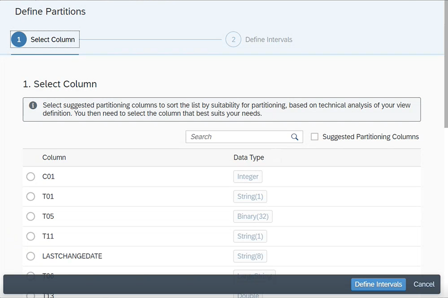
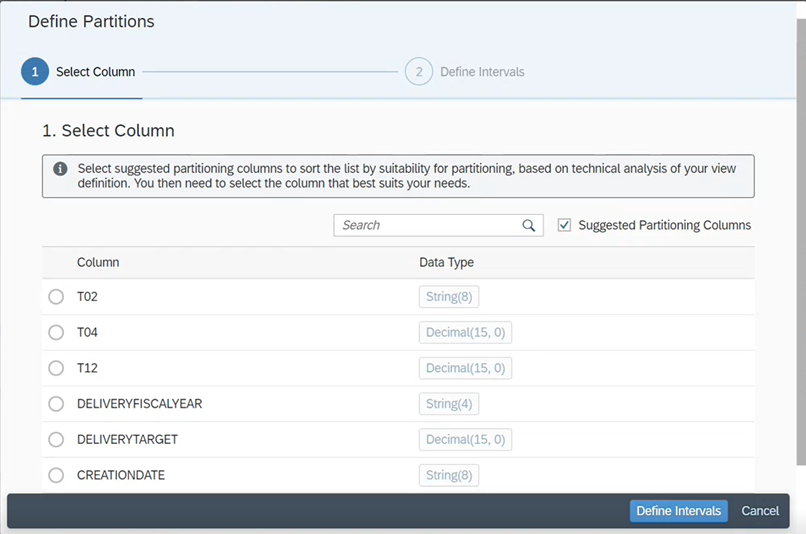
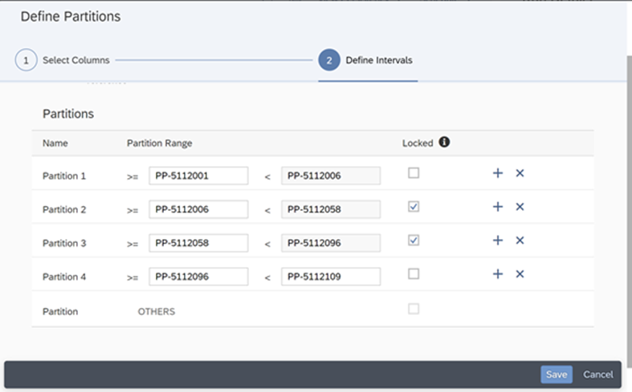
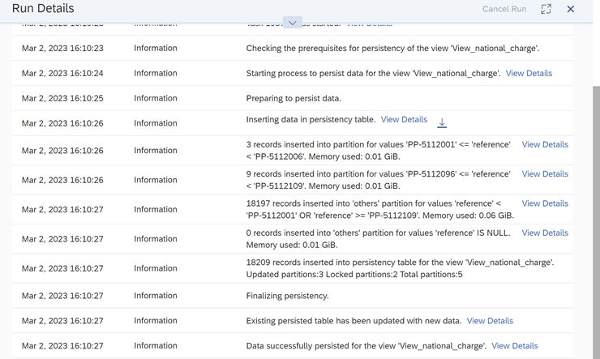
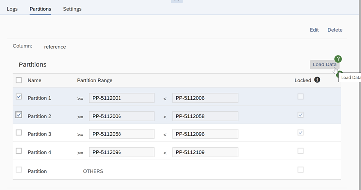
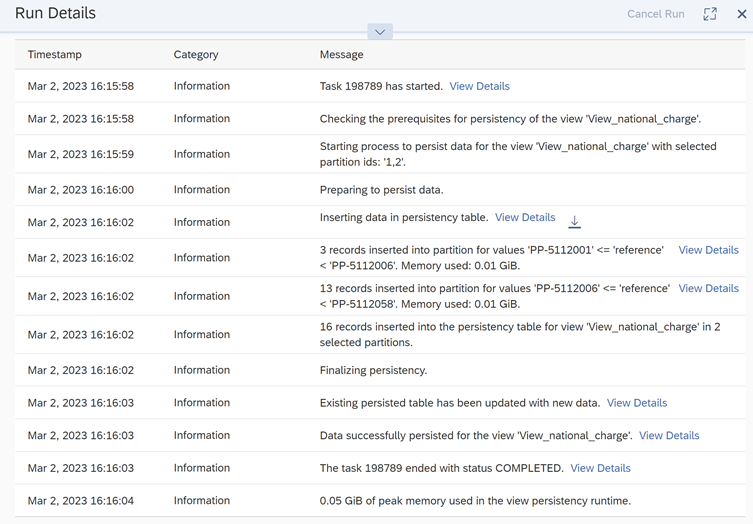

<!-- loio9b1b595054c34da5b67ac07595093f82 -->

<link rel="stylesheet" type="text/css" href="../css/sap-icons.css"/>

# Creating Partitions for Your Persisted Views

From the *View Persistency Monitor*- Details screen, you can create partitions on columns from your dataset and break your data down into smaller and more manageable parts to enable persistency on views with large data volume.

Persisting views with larger data volumes without having out-of-memory errors or high memory peaks can sometimes be a challenge for Data modelers. To avoid such situations, you can create partitions when persisting a view and thus enable partitioned data transfer of large datasets for supported connection types.

> ### Note:  
> For this action, *Data Builder.READ* privilege is required which is not included in the *DW Integrator* role. To perform this action, ask your tenant administrator to either assign the *DW Space Administrator* or *DW Administrator* role to your user or to create a custom role containing the required privileges.

> ### Caution:  
> Some adapters used by the connected sources are not able to push down the filters for the partitioning. Thus, performance can be impacted by the number of partitions created.

You can create partitions from the *View Persistency Monitor* – Details screen:

1.  Click  for the view in virtual access mode you would like to persist and for which you need to create partitions for.
2.  Go to the *Partitions* tab and click *Define Partitions*.

<a name="loio9b1b595054c34da5b67ac07595093f82__section_q5r_2yt_qwb"/>

## Selecting a Column

Select a column from the list, which will then become the partitioning column.

The columns available for selection are a subset of all view output columns. Some columns can be excluded because:

-   Supported data types include:

    -   String
    -   Integer, Integer 64, Decimal, hana.SMALLINT, hana.TINYINT
    -   Date, DateTime, Time, Timestamp
    -   Binary

    For more information, see [Partitioning Limits](https://help.sap.com/docs/HANA_CLOUD_DATABASE/f9c5015e72e04fffa14d7d4f7267d897/8dd866a688ec4914a074727a2c800142.html) in the *SAP HANA Cloud, SAP HANA Database* documentation.

-   You can't select a column containing analytical measures as partitioning-columns, only columns containing dimensions can be partitioned.
-   If you select a non-key column to define your partitions, you must ensure that the column value of a record in the source data is not changed while the view is persisted. Otherwise, data loading may fail because a record with the same key is persisted in two different partitions.

> ### Note:  
> Partitioning is not recommended on columns that stem from remote tables using ABAP adapter with ODP, as related filter conditions are not pushed to the source. Instead, use remote table partitioning. For connections using OData adapter, Camel JDBC adapter, or Cloud Data Integration adapter, partitioning may not have the desired effect as the related adapters have only limited capabilities and do may not push selections on partitioning intervals to the source system.

You can either select on a column that suits your business case:

Or click *Suggested Partitioning Columns*. When selecting *Suggested Partitioning Columns*, the list of column candidates is restricted to the most suitable columns for partitioning. A technical analysis of your view definition is carried out to determine which columns are suitable. For example, calculated columns or columns with moving values \(such as last changed date\) are excluded as it might be difficult to do a reliable partitioning on such data:

<a name="loio9b1b595054c34da5b67ac07595093f82__section_f1q_y3w_wvb"/>

## Defining Intervals for Your Partitions

Create the number of desired partitions by clicking  \(Add Partitions\) 

Enter an interval for each of them.

> ### Caution:  
> Intervals must not overlap

Check the *Locked* option if you don't want to update a partition in the next run.

> ### Caution:  
> If locked partitions contain data filtered by authorizations provided by data access controls, you need to unlock partitions and load a new snaphot of data, whenever these authorizations are changed.

An *OTHERS* partition is set by default. It contains data that is not covered by your defined intervals . For example, if rows have been inserted or modified since your last snapshot and they now don’t match any of the defined intervals. This *OTHERS* partitions can't be locked.

> ### Note:  
> -   Partitioning requires an in-depth knowledge of the values that are used or are valid for the chosen partitioning column.
> 
> -   Negative values are not valid for partition bounds of numeric columns and will be converted to 0 at runtime.
> 
> -   The low bound must be lower than the high bound. The order is checked according to the type of the partition column. Example: for string-like columns, '90' <= DOC\_ID < '100' is not valid, whereas '090' <= DOC\_ID < '100' is valid.
> 
> -   Values entered in the bounds for ABAP ODP remote tables must match the ABAP internal format: for example, enter "20210714" if the date is "July 14, 2021".

> ### Caution:  
> Once the partitions are created and the view is persisted, don't change data type of the column you have used to create the partition: if the data type is changed, it deletes the partitioning data.

<a name="loio9b1b595054c34da5b67ac07595093f82__section_xn3_4jw_wvb"/>

## Locking Partitions to Avoid Unnecessary Data Loads

When you think the data will no longer change, or no change is expected for a while, you can check this option to avoid unnecessary data load.

In the example below, I defined 2 partitions as *Locked* \(partitions 2 and 3\):

When I load a new snapshot, only partitions 1, 4 and OTHERS are refreshed:

> ### Note:  
> If you change the partition definition, you can lock unchanged partitions to avoid unnecessary data loads. In the case of adding partitions, if you lock the unchanged partitions, only the new partitions will be loaded \(Locking new partitions is ineffective, as they need to be updated once after they are introduced. They will only be locked in the subsequent runs.\)
> 
> A full snapshot load will happen for the following cases:
> 
> -   You have no locked partitions.
> -   You have changed the partitioning column. A full snapshot will happen at next data load.

<a name="loio9b1b595054c34da5b67ac07595093f82__section_xj2_n1x_wvb"/>

## Refreshing Single or Multiple Partitions

In some cases, you might want to refresh data for a single or for multiple partitions only, independently if they are locked or not. To do so, select the desired partitions and click *Load Selected Partitions*.

> ### Example:  
> In the example below, I have selected 2 partitions. Partition 1 is not locked and partition 2 is locked:
> 
> 
> 
> Only the selected partitions are updated:
> 
> 

> ### Note:  
> If you change the partition definition, then the next load will be a full load. No manual load will be possible, and the *Load Selected Partitions* button will be disabled.

