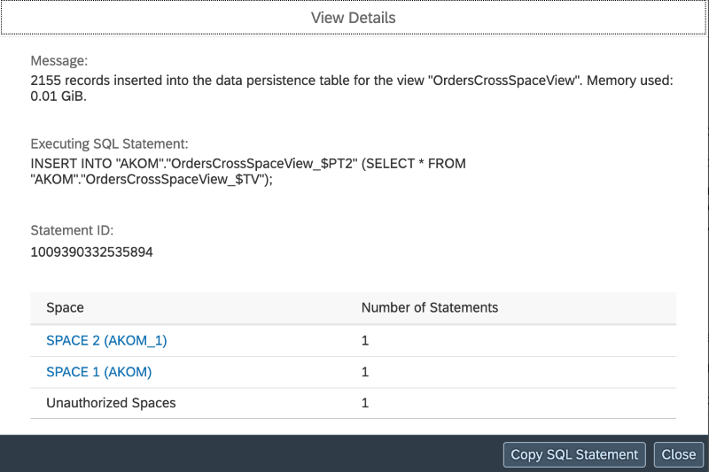

<!-- loio9eb35ee11f9747fd9d6381ccd26a442e -->

# Data Persistence, Detailed Logs and Remote Statements

Access the detailed log of a data persistence task to get statistics information and run details, and navigate to the remote statements for more information.

When your views are based on remote tables in *Remote* access, the data is read from a remote source system, and it can take times to persist the data.

In the details information of a data persistence run, you can view statistics information in the logs: number of remote statements, volume of data fetched from the remote source system:

When you click on *View Details* you can have detailed information and you can navigate to the *Remote Queries* monitor clicking on the space name.

> ### Note:  
> You must have the relevant privileges to access the *Remote Queries* monitor \(*Data Warehouse Data Integration* privilege\).

-   If your view consumes data from several spaces, the *View Details* provide you with information on the different spaces the data is coming from.

    > ### Note:  
    > If the data is coming from a space for which you don't have authorization to access, it will be indicated as "unauthorized spaces".

    

    Clicking on the space name will bring you to the *Remote Queries* monitor.

    > ### Note:  
    > Even if you are a member of the space, you must have the relevant privileges to access the *Remote Queries* monitor: *Data Warehouse Data Integration* privilege.

-   If your view contains partitions, the log also shows how many partitions and how many remote statements are involved during data persistence:

    

    You can analyze the remote statements per partitions because each partition has its own statement ID. Click on *View Details* on the partition row level of the log for more information or to navigate to the *Remote Queries* monitor if you have the relevant permissions.

