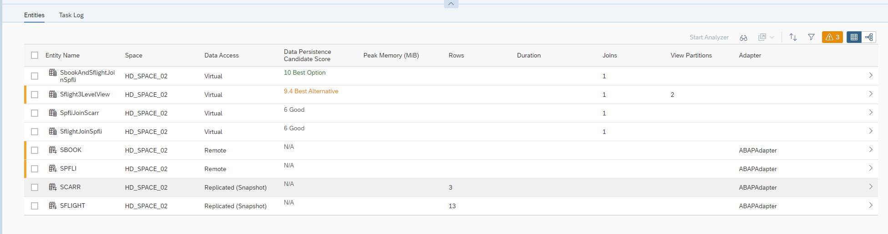
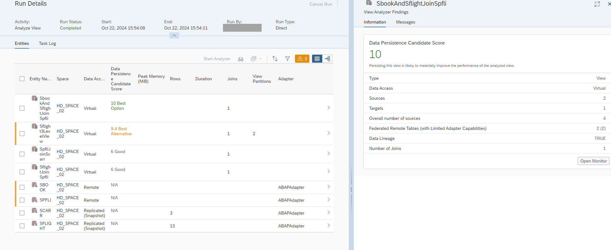
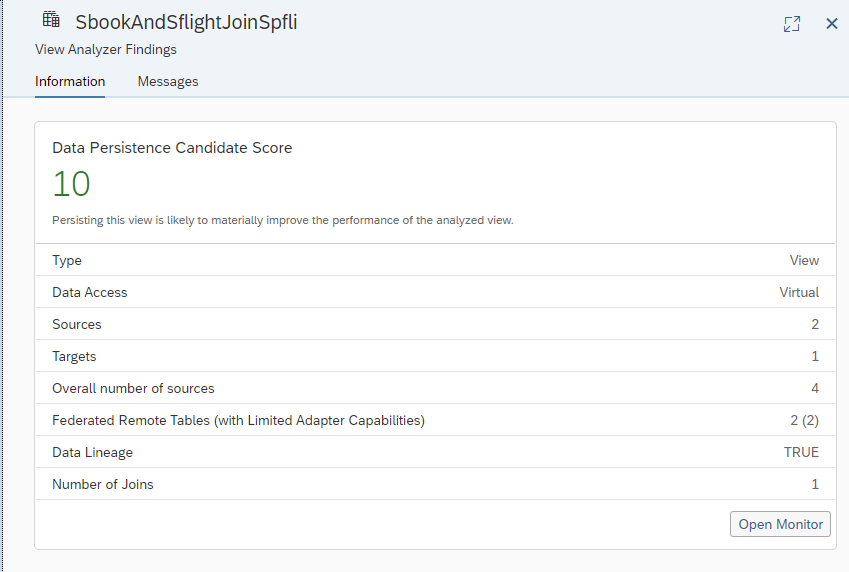

<!-- loio85f7be45761f4ae5b7e49819ce4b4d2e -->

# Data Persistence Guidance

Data persistence guidance provides recommendation on what views to persist in *View Analyzer*. The entire lineage graph is reviewed and relative metrics are analyzed to provide guidance for the optimal views to persist to improve performance, run-time, and memory consumption.

<a name="loio85f7be45761f4ae5b7e49819ce4b4d2e__section_nxn_jc2_ddc"/>

## About Data Persistence Guidance

The *View Analyzer* provides statistics and useful information on each entity that composes your view regardless of the the complexity of the model. A graphical view can look simple, but the underlying lineage graph can be complex and built with many stacked views. This can lead to technical challenges, performance problems, or time-out errors.

The best candidate to be persisted can be the main view or a view of the lineage graph.

> ### Note:  
> Data persistence guidance is most useful with models that have complex lineage graphs.

The *Data Persistence Candidate Score* column gives you recommendations by identifying views that can help improve your model if they are persisted.

The information tab provides more details of the *View Analyzer Results* and the metrics of the view.

> ### Tip:  
> Persist only one view at a time. Check the performance of the main view after the persistence run completed. One possibility to check the performance is to simulate the data persistence in the *View Analyzer* with the option, 'With memory consumption'. Continue the process in an iterative way until the optimal performance is reached. The goal is to persist the minimal number of views required to optimize performance.

> ### Note:  
> To get the best results from data persistence guidance, it is recommended that the user have permission to see all views in the model from all spaces. If a user is unauthorized to see some views, the view with the highest rating value may remain hidden \(a warning will be displayed\). For more information about authorization and permission in *View Analyzer* see [Authorization and Permissions](authorization-and-permissions-e5f9e81.md).

<a name="loio85f7be45761f4ae5b7e49819ce4b4d2e__section_l4m_4c2_ddc"/>

## Data Persistence Candidate Score

The *Data Persistence Candidate Score* provides a recommendation for the best views to persist to increase performance.

The Data Persistence Candidate Score is not a specific inherent value but a ranked score based on weighted values from a list of metrics that most affect the performance of a view or a model. The top scores show the best options to persist with the top five noted. The first is the 'Best Option'. The next are the 'Best Alternative'. Persist one view at a time, check the performance, and iterate the process if needed.

The primary metrics are: the number of sources, the number of targets, the overall number of sources, the number of federated remote tables, the number of federated remote tables with limited adapter capabilities, number of local tables \(file\), and if the view is a SQL script view.

> ### Note:  
> The values of the score are relative weighted values determined by the primary metrics in the lineage graph.

> ### Note:  
> Branches of the views that are already persisted are not considered in the metric evaluation of the *Data Persistence Candidate Score*. It is best to persist one view at a time and then check the performance.

A model can have a *Data Persistence Candidate Score* with values ranging from 0 - 10. Any change in the model, for example, persisting one view, will change the values due to the change in the metrics used to calculate the data persistence score.

<a name="loio85f7be45761f4ae5b7e49819ce4b4d2e__section_ubv_4c2_ddc"/>

## Views using Shared Entities from Other Spaces

Analysis for data persistence guidance will be run for all entities including shared entities from other spaces.

The best candidate score will be computed regardless of the entities the views belong to. Results of the analysis will be able to be viewed by those that have the authorization. If the best candidate is from a space the user does not have the authorization to see the result from, a message will be shown. See [Authorization and Permissions](authorization-and-permissions-e5f9e81.md) for more information.

<a name="loio85f7be45761f4ae5b7e49819ce4b4d2e__section_egb_pc2_ddc"/>

## Further Recommendations

Persisting data is one option to optimize a model or improve performance. Utilizing *Transformation Flows* is also a good option to consider instead of persisting data depending on the scenario.

For more information see [Creating a Transformation Flow](https://help.sap.com/viewer/c8a54ee704e94e15926551293243fd1d/cloud/en-US/f7161e6c20204672ac4a6d90c81762e4.html "Create a transformation flow to load data from one or more sources, apply transformations (such as a join), and output the result in a target table. You can load a full set of data from one or more sources to a target table. You can add local tables and views, Open SQL schema objects, and also remote tables located in BW Bridge spaces. You can also load delta changes (including deleted records) from one source table to a target table.") :arrow_upper_right:.

Consider replacing remote tables with local tables by using *Replication Flow* for replicating the data.

For more information see [Creating a Replication Flow](https://help.sap.com/viewer/c8a54ee704e94e15926551293243fd1d/cloud/en-US/25e2bd7a70d44ac5b05e844f9e913471.html "Create a replication flow to copy multiple data assets from a source to a target with support for delta loads.") :arrow_upper_right:.

