<!-- loio8921e5acf2ad4c8a98073edae4c214c7 -->

<link rel="stylesheet" type="text/css" href="../css/sap-icons.css"/>

# Exploring Views with View Analyzer

Use the *View Analyzer* to explore graphical or SQL views, and the entities they consume.

The *View Analyzer* provides you with statistics and useful information on each entity that composes your view, no matter the complexity of the view. It analyzes each view definition, the consumed views, the local tables and the data sources used by remote tables that compose your data model. You can then use this information to optimize your data model, and decide, for example, which view to persist when performance or technical problems such as out-of-memory errors occur.

> ### Tip:  
> While working with complex views, see [Persisted Views and Memory Consumption](persisted-views-and-memory-consumption-e3d0495.md).

> ### Note:  
> The *View Analyzer* can't analyze a view that has input parameters.

To use the *View Analyzer*,

1.  Go to *Data Integration Monitor**Views*. Select the view you need to analyze and navigate to the details screen of this view.

    > ### Note:  
    > You need to select a space if you are assigned to several spaces.

2.  Select *Data Persistence**Start View Analyzer*.

    > ### Note:  
    > For this action, *Data Builder* \(*Read*\) privilege is required which is not included in the *DW Integrator* role. To perform this action, ask your tenant administrator to assign your user to a scoped role that is based either on the *DW Space Administrator* role or on a custom role that includes the following required privileges: *Data Warehouse Data Integration* \(*Read*, *Update*, *Execute*\) and *Data Builder* \(*Read*\).

    You can choose between 3 options:

    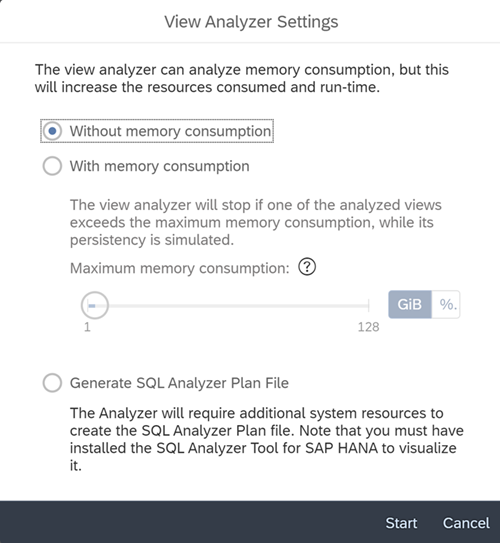

    -   Run the *View Analyzer* without memory consumption: The *View Analyzer* will not execute the data persistence simulation. For views already persisted , the memory consumption of data persistence task will be shown. The analyzer will analyze the entities that compose your data model and will provide you with the information it has collected.

        > ### Note:  
        > If your data persistence contains partitions, the number of partitions is displayed in the results, but the data persistence simulation does not consider it.

    -   Run the *View Analyzer* with memory consumption: In addition to exploring the entities that compose your data model, the analyzer will execute the data persistence simulation for non persisted views. It will report the memory consumption that would be used to get an entity persisted or will provide you with the actual memory consumption used when you have persisted your data. The simulations are executed sequentially as they may add some workloads to the system. To reduce these workloads, you can define a limit to the memory consumption that can be used to persist the view thanks to the threshold. If one of the analyzed views exceeds the limit, then no further data persistence simulations are run.

        > ### Note:  
        > -   To start the*View Analyzer* with memory consumption, you must have the space *Read* privilege. If you are missing this privilege, the *View Analyzer* will run without memory consumption by default.
        > -   If your data persistence contains partitions, the number of partitions is displayed in the results, but the data persistence simulation does not consider it.

        Note: The maximum memory consumption is based on the statement memory limit of the space workload configuration. For more information on statement limits, see [Set Priorities and Statement Limits for Spaces](https://help.sap.com/viewer/935116dd7c324355803d4b85809cec97/DEV_CURRENT/en-US/d66ac1efb5054068a104c4559b72d272.html "Prioritize between spaces for resource consumption and set limits to the amount of memory and threads that a space can consume when processing statements.") :arrow_upper_right:.

        > ### Caution:  
        > To use the *View Analyzer* with memory consumption during data persistence simulation, you must enable *Expensive Statement Tracing* in :wrench:. For more information, see [Configure Monitoring](https://help.sap.com/viewer/935116dd7c324355803d4b85809cec97/DEV_CURRENT/en-US/9cd0691c44a74f2aa47b52f615f74433.html "You can control which monitoring data is collected and also obtain independent access to the underlying SAP HANA monitoring views that power the System Monitor.") :arrow_upper_right:.

    -   *Generate SQL Analyzer Plan File*: Before using this option, you must consider the following requirements:

        > ### Caution:  
        > -   To download this file, you must have the *DW Administrator* role or a custom role that includes the *Data Warehouse Runtime* \(Read\) privilege. For more information, see [Privileges and Permissions](https://help.sap.com/viewer/935116dd7c324355803d4b85809cec97/DEV_CURRENT/en-US/d7350c6823a14733a7a5727bad8371aa.html "A privilege represents a task or an area in SAP Datasphere and can be assigned to a specific role. The actions that can be performed in the area are determined by the permissions assigned to a privilege.") :arrow_upper_right:.
        > -   To open this file, you must have installed a compatible SQL plan visualization tool, such as SQL Analyzer Tool for SAP HANA.
        > -   This option requires additional system resources.

        With this option, the data persistence simulation is run for the main view only, and the analyzer creates a file containing detailed information about your data model that you can download for further analysis.

        > ### Note:  
        > -   If your data persistence contains partitions, the number of partitions is displayed in the results, but the data persistence simulation does not consider it.
        > -   If you want to analyze one of the underlying views, select the relevant view from the dependency graph or the entity list, and launch the *View Analyzer* with SQL analyzer plan file option.
        > -   You can select only one view for analysis.

        The Plan File is stored along with task logs and has a retention period that is the same as the task logs:

        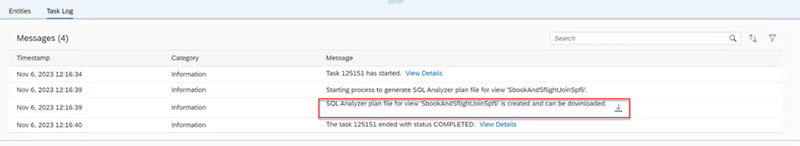

3.  Analyze your results

    To understand how you can interpret the analyzer's findings, let's take an example with the following View\_001\_001. It consumes 4 views \(in red\) and 4 remote tables \(in purple\): 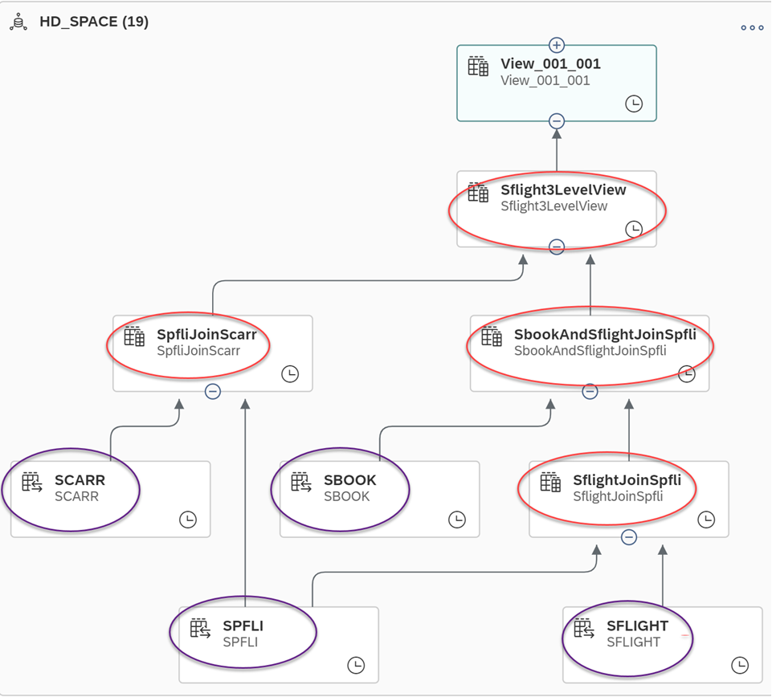

    Now, let's start the *View Analyzer* with memory consumption. On the total of 8 GiB that I have allowed in my statement memory limit, let's decide to limit the memory consumption to 4 GiB. This means that if a data persistence task exceeds this limit, the next data persistence simulations will be canceled:

    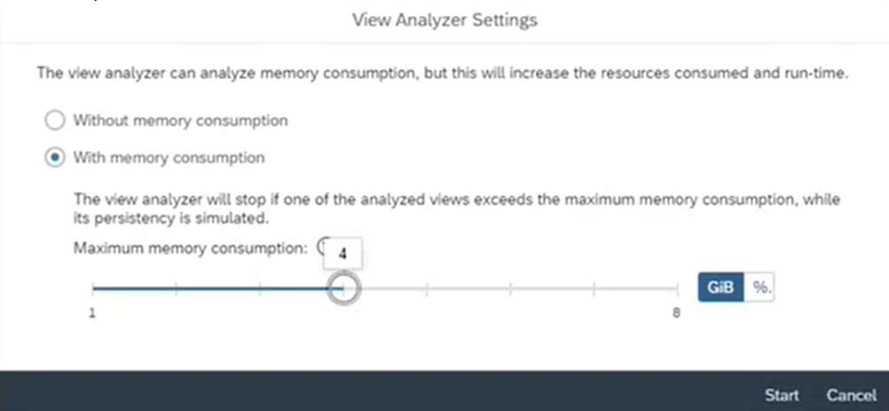

    Once the *View Analyzer* has completed the task, 2 tabs are available in the details screen:

    -   *Task Log*: It contains all information related to the *View Analyzer* task itself. You can see that my 5 views have been analyzed, and an overview of some key indicators is displayed: memory consumption, number of records, etc.

        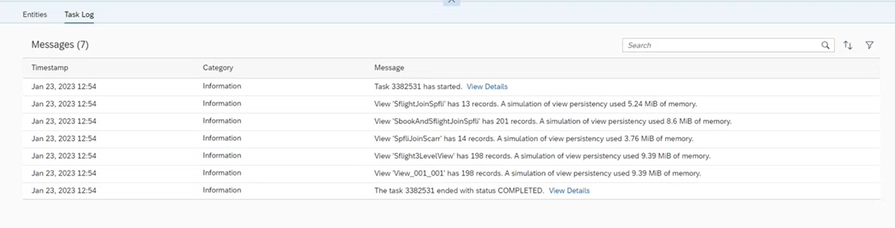

    -   *Entities*: It contains the details of the *View Analyzer* findings per analyzed entities. Information is displayed in a table format:

        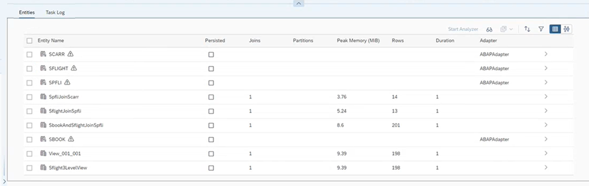

        <table>
        <tr>
        <th valign="top">

        Column
        
        </th>
        <th valign="top">

        Description
        
        </th>
        </tr>
        <tr>
        <td valign="top">
        
        *Entity Name*
        
        </td>
        <td valign="top">
        
        Name of the analyzed entity. It can be a local or a remote table, a view, a shared entity, an external entity, an intelligent lookup and or a data access control.
        
        </td>
        </tr>
        <tr>
        <td valign="top">
        
        *Persisted*
        
        </td>
        <td valign="top">
        
        Indicates if the view is already persisted, or the remote table replicated.
        
        </td>
        </tr>
        <tr>
        <td valign="top">
        
        *Partitions*
        
        </td>
        <td valign="top">
        
        Indicates if partitions have been defined for the analyzed views.

        > ### Note:  
        > If partitions have been defined for remote tables, it's not displayed. Only partitions defined for views are indicated by the *View Analyzer*.

        
        </td>
        </tr>
        <tr>
        <td valign="top">
        
        *Peak Memory \(MiB\)*
        
        </td>
        <td valign="top">
        
        Indicates the memory used during the simulation, or in case of the view already persisted, the memory used to persist the view.
        
        </td>
        </tr>
        <tr>
        <td valign="top">
        
        *Row*
        
        </td>
        <td valign="top">
        
        Indicates the number of rows
        
        </td>
        </tr>
        <tr>
        <td valign="top">
        
        *Duration*
        
        </td>
        <td valign="top">
        
        Indicates the duration in second to persist the view \(simulation or actual data persistence\).
        
        </td>
        </tr>
        <tr>
        <td valign="top">
        
        *Adapter*
        
        </td>
        <td valign="top">
        
        Indicates if an adapter is used to access the remote table source.
        
        </td>
        </tr>
        </table>
        
        If you click on an entity row or click the \>, you'll access the details for the selected entity. For example, if I click on the table SCARR:

        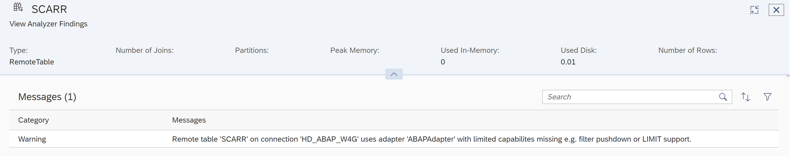

        In the message's details, you can see that the remote table is using an adapter that has limited capacities. This is why the entity was marked with a warning in the results.

        From the *Entities* tab, you can do many actions to explore your results:

        <table>
        <tr>
        <th valign="top">

        Action
        
        </th>
        <th valign="top">

        Description
        
        </th>
        </tr>
        <tr>
        <td valign="top">
        
         \(Sort\)
        
        </td>
        <td valign="top">
        
        Set sort order and sort columns:

        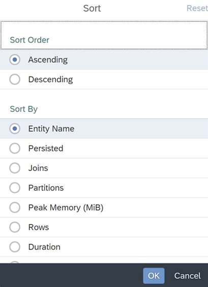
        
        </td>
        </tr>
        <tr>
        <td valign="top">
        
         \(Filter\)
        
        </td>
        <td valign="top">
        
        Filter your results:

        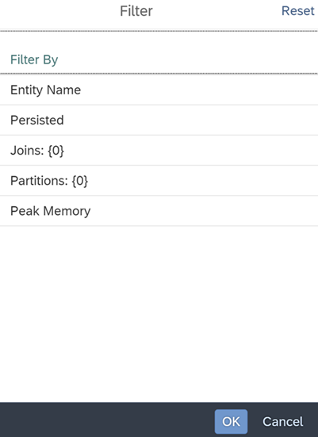
        
        </td>
        </tr>
        <tr>
        <td valign="top">
        
         \(Inspect\)
        
        </td>
        <td valign="top">
        
        Display the whole list of results that you can also export in CSV format:

        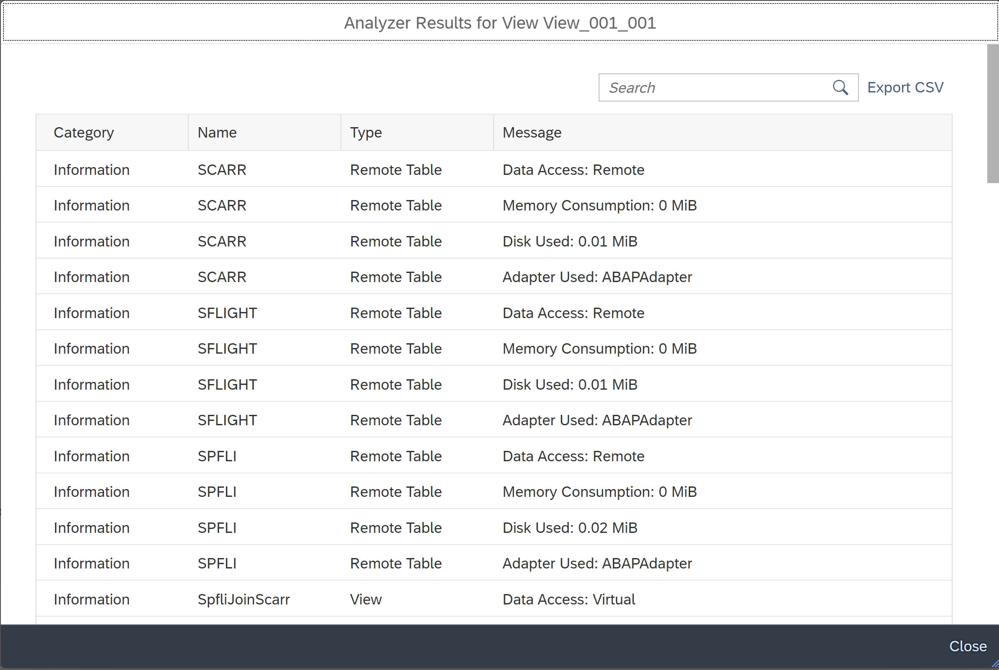
        
        </td>
        </tr>
        <tr>
        <td valign="top">
        
        *Start Analyzer*
        
        </td>
        <td valign="top">
        
        You can select one or more views and start a new view analyzer.

        > ### Note:  
        > The analyzer will always start from the main view. Selecting the views here in the entity list, or in the lineage graph has an effect only on the data persistence simulation. In case memory consumption is chosen, the data persistence simulation will be executed for the selected views, regardless of their data persistence status.

        
        </td>
        </tr>
        <tr>
        <td valign="top">
        
         \(Lineage View\)
        
        </td>
        <td valign="top">
        
        Display the Lineage graph:

        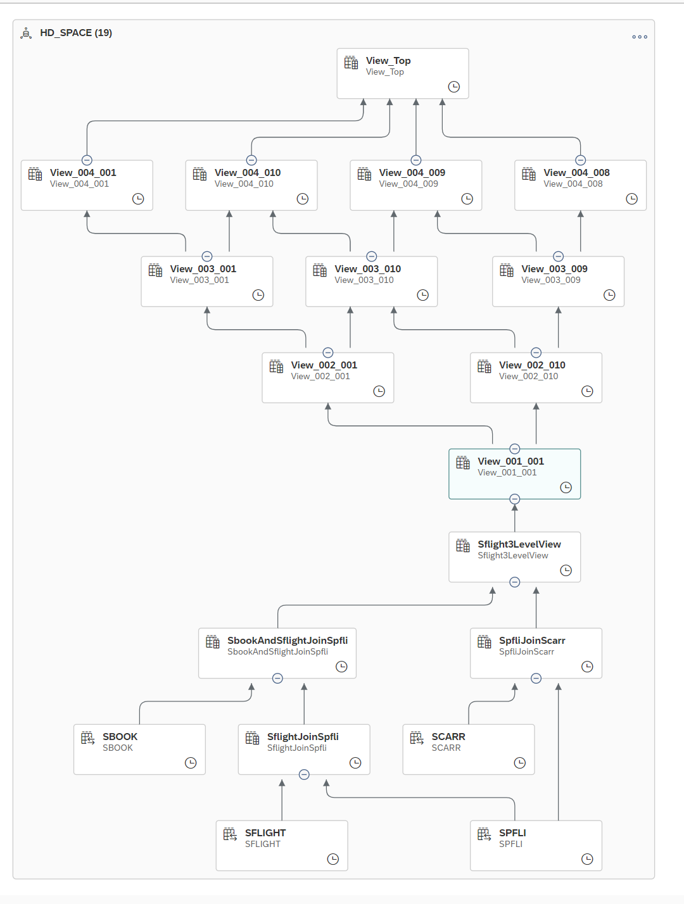

        If you click on one entity from the graph, you can see the view analyzer results and the indicators. For example, I click on SpfiJoinScarr view:

        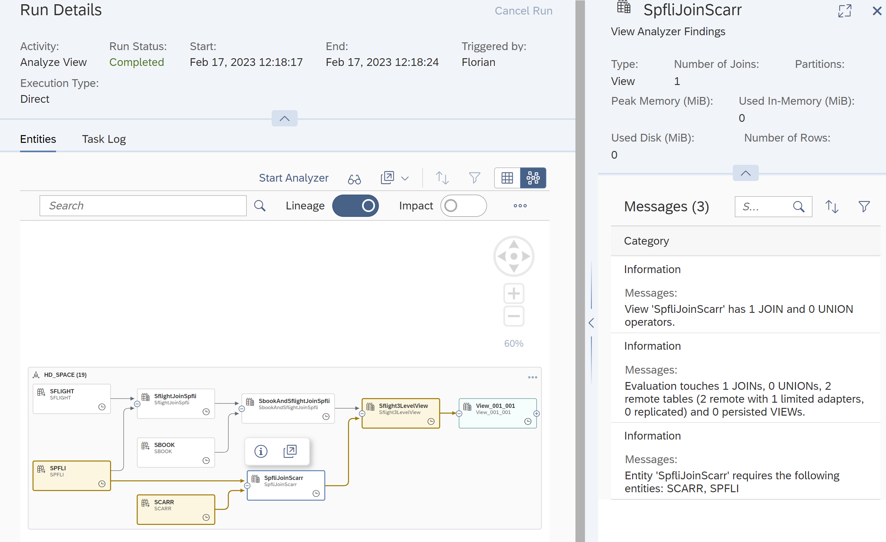

        > ### Note:  
        > It is also possible to select multiple views here and start the *View Analyzer* with memory consumption.

        
        </td>
        </tr>
        </table>
        

> ### Note:  
> The *View Analyzer* is executed in asynchronous mode. If necessary, for example if the run takes too long, you can select the task and use the *Cancel Run* button to stop it.

