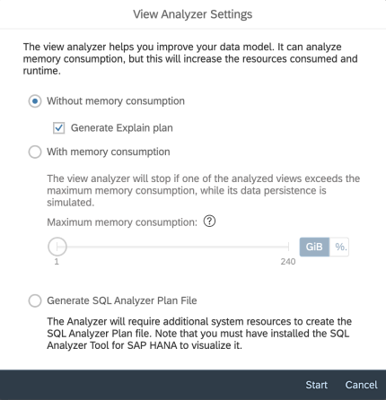

<!-- loioe0aeddba00b14be29b5e49b47001d43b -->

# Getting Started with View Analyzer

Use the *View Analyzer* to explore graphical or SQL views and the entities they consume.

The *View Analyzer* provides you with statistics and useful information on each entity that composes your view, no matter the complexity of the view. It analyzes each view definition, the consumed views, the local tables and the data sources used by remote tables that compose your data model. You can then use this information to optimize your data model and decide, for example, which view to persist when performance or technical problems such as out-of-memory errors occur.

To use *View Analyzer*,

1.  Go to *Data Integration Monitor* \> *Views*. Select the view you need to analyze and navigate to the details screen of this view. You need to select a space if you are assigned to several spaces.

2.  Select *Data Persistance* \> *Start View Analyzer*.

    > ### Note:  
    > For this action, *Data Builder \(Read\)* privilege is required which is not included in the *DW Integrator* role. To perform this action, ask your tenant administrator to assign your user to a scoped role that is based either on the DW Space Administrator role or on a custom role that includes the following required privileges: *Data Warehouse Data Integration \(Read, Update, Execute\)* and *Data Builder \(Read\)*. For more information see, [Create a Scoped Role to Assign Privileges to Users in Spaces](https://help.sap.com/viewer/935116dd7c324355803d4b85809cec97/DEV_CURRENT/en-US/b5c4e0b6c462414783ebbfc053815521.html "A scoped role inherits a set of scoped privileges from a standard or custom role and grants these privileges to users for use in the assigned spaces.") :arrow_upper_right:.

    You can choose between 4 options:

    

    1.  Run the *View Analyzer* without memory consumption: The *View Analyzer* will not execute the data persistence simulation. For views already persisted, the memory consumption of data persistence task will be shown. The analyzer will analyze the entities that compose your data model and will provide you with the information it has collected.

        > ### Note:  
        > If your data persistence contains partitions, the number of partitions is displayed in the results, but the data persistence simulation does not consider it.

    2.  Generate Explain Plan: In the *View Analyzer* click the option *Generate Explain Plan* to get a quick overview of your model and analyze the performance of a view.

        It is a lightweight tool that can be generated in case of data persistence simulation failure or out-of-memory errors of SQL analyzer plan file fails. 

        Once the explain plan is generated:

        -   You can directly display the details with *View Details*. You can expand or collapse rows to view specific details or click the settings button to choose a specific column to view.

        -   You can also download the details directly as a CSV file. If there are more than 1000 rows, you are required to download the results.

        > ### Note:  
        > Views with input parameters with default value are supported. 
        > 
        > You can start the *View Analyzer* from the Data Builder, but to view the results, you need to go to the details page. 

        > ### Note:  
        > You can generate the Explain Plan with the same permission required to run *View Analyzer* without memory consumption.
        > 
        > To download the Explain Plan, you must have either the scoped role *DW Administrator* DW Administrator or a custom role that includes *Data Warehouse Runtime \(Read\)* privilege.

    3.  Run the *View Analyzer* without memory consumption: The *View Analyzer* will not execute the data persistence simulation. For views already persisted, the memory consumption of data persistence task will be shown. The analyzer will analyze the entities that compose your data model and will provide you with the information it has collected.

        > ### Note:  
        > If your data persistence contains partitions, the number of partitions is displayed in the results, but the data persistence simulation does not consider it.

        Note: The maximum memory consumption is based on the statement memory limit of the space workload configuration. For more information on statement limits, see [Set Priorities and Statement Limits for Spaces](https://help.sap.com/viewer/935116dd7c324355803d4b85809cec97/DEV_CURRENT/en-US/d66ac1efb5054068a104c4559b72d272.html "Prioritize between spaces for resource consumption and set limits to the amount of memory and threads that a space can consume when processing statements.") :arrow_upper_right:.

    4.  *Generate SQL Analyzer Plan File*: Before using this option, you must consider the following requirements:

        > ### Note:  
        > -   To download this file, you must have the *DW Administrator* role or a custom role that includes the *Data Warehouse Runtime \(Read\)* privilege. For more information, see [Privileges and Permissions](https://help.sap.com/viewer/935116dd7c324355803d4b85809cec97/DEV_CURRENT/en-US/d7350c6823a14733a7a5727bad8371aa.html "A privilege represents a task or an area in SAP Datasphere and can be assigned to a specific role. The actions that can be performed in the area are determined by the permissions assigned to a privilege.") :arrow_upper_right:.
        > -   To open this file, you must install a compatible SQL plan visualization tool, such as [SQL Analyzer Tool for SAP HANA](https://help.sap.com/docs/hana-cloud-database/sap-hana-cloud-sap-hana-database-administration-guide/sql-analyzer?state=DRAFT&version=2024_2_QRC).
        > -   This option requires additional system resources.

        With this option, the data persistence simulation is run for the main view only, and the analyzer creates a file containing detailed information about your data model that you can download for further analysis.

        > ### Note:  
        > -   If your data persistence contains partitions, the number of partitions is displayed in the results, but the data persistence simulation does not consider it.
        > -   If you want to analyze one of the underlying views, select the relevant view from the dependency graph or the entity list, and launch the *View Analyzer* with SQL analyzer plan file option.
        > -   You can select only one view for analysis.

        The Plan File is stored along with task logs and has a retention period that is the same as the task logs:

        

        > ### Tip:  
        > While working with complex views, see [Persisted Views and Memory Consumption](persisted-views-and-memory-consumption-e3d0495.md).
        > 
        > Cross-space analysis can be analyzed in *View Analyer*, but you can only view entities that you are authorized to view. For more information see: [Authorization and Permissions](authorization-and-permissions-e5f9e81.md)

        > ### Note:  
        > For views with one input parameter with default value, you can execute views with memory consumption. For views with input parameters with default values, you can generate Explain Plan and SQL analyzer plan file.

