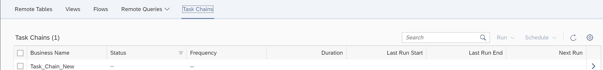
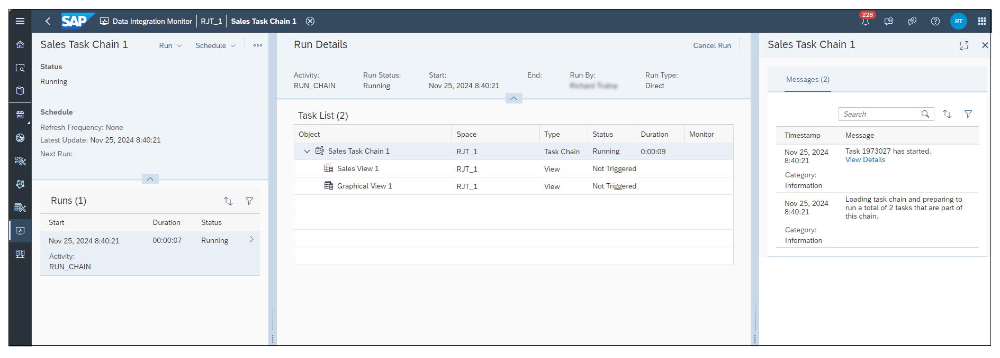
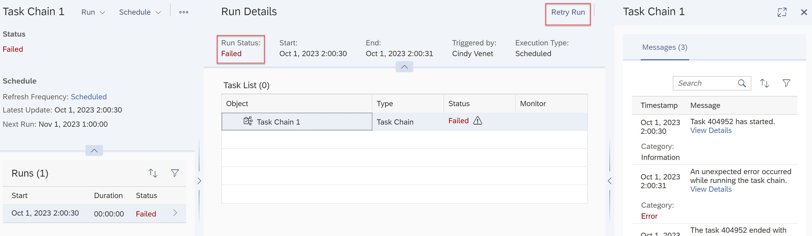

<!-- loio4142201ec1aa49faad89a688a2f1852c -->

<link rel="stylesheet" type="text/css" href="../css/sap-icons.css"/>

# Monitoring Task Chains

Monitor the status and progress of running and previously run task chains.

To view all task chains that are scheduled to run, are currently running, or have already been run in your space, go to *Data Integration Monitor* \> *Task Chains*:

The monitor displays information on your task chains:

<table>
<tr>
<th valign="top">

Properties

</th>
<th valign="top">

Comments

</th>
</tr>
<tr>
<td valign="top">

*Business Name* or *Technical Name*

</td>
<td valign="top">

Name of the task chain. Technical or Business Name is displayed, depending on how you have configured your UI settings in *Your Profile* \> *Settings*

</td>
</tr>
<tr>
<td valign="top">

*Status*

</td>
<td valign="top">

Status of the task chain after last run.

-   *Running*: the task chain is currently running.
-   *Completed*: the task chain is completed successfully.
-   *Failed*: Something goes wrong during the task chain run and it could not be completed. Go to the details screen of your task chain and check the logs to identify to issue.

All these statuses can be combined with a sub-status. For more information on sub-statuses, see [Understanding Statuses and Substatuses](understanding-statuses-and-substatuses-19cb5bd.md).

</td>
</tr>
<tr>
<td valign="top">

*Frequency*

</td>
<td valign="top">

See if a schedule is defined for the task chain:

-   *None \(--\)*: There is no schedule defined for this task chain. You can define one from *Schedule* \> *Create*.

-   *Scheduled*: A schedule is defined for this task chain. If you click *Scheduled*, you will get detailed information on the schedule. You can click *Schedule* to create, edit, delete, pause or resume a schedule for a selected task chain or to assign a schedule to your name.
-   *Paused*: A schedule is defined for this task chain but it's currently paused. You can resume it if you click*Schedule* \> *Resume*

</td>
</tr>
<tr>
<td valign="top">

*Duration*

</td>
<td valign="top">

How long it took to run the task chain.

</td>
</tr>
<tr>
<td valign="top">

*Last Run Start*

</td>
<td valign="top">

Date and Time when the last run started.

</td>
</tr>
<tr>
<td valign="top">

*Last Run End*

</td>
<td valign="top">

Date and Time when the last run ended.

</td>
</tr>
<tr>
<td valign="top">

*Next Run*

</td>
<td valign="top">

When the next run is scheduled.

</td>
</tr>
<tr>
<td valign="top">

*Schedule Owner*

</td>
<td valign="top">

Displays the name of the current schedule owners.

</td>
</tr>
</table>

You can personalize the columns you want to display clicking on :gear:

> ### Note:  
> A task chain consists of multiple tasks that run one after another. As it takes some time for the task chain monitor to collect and update all a task’s status information, the task runtime information displayed here might not exactly match the task runtime information shown in a respective detail monitor, for example, in the *Views* or *Flows* monitors.

Click *Run* \> *Start Run* to manually start a new run of a selected task chain. If a task chain’s last run failed, you can also choose the *Run* \> *Retry Latest Run* option to retry the failed task chain’s execution from the point at which it previously failed.

> ### Note:  
> If you add a remote table whose data access is *Replicated \(Real-time\)* in a task chain, the replication type will change from real-time replication to batch replication at the next run of the task chain. The data will no longer be updated in real-time.

You can click *Schedule* to create, edit, delete, pause or resume a schedule for a selected task chain or to assign a schedule to your name. Whenever it’s applicable, you can select several task chains to group the scheduling actions. For more information, see [Scheduling Data Integration Tasks](scheduling-data-integration-tasks-7fa0762.md).

> ### Note:  
> For optimal performance, it is recommended that you consider staggering the scheduled run time of tasks such as data flows and task chains that may contain these tasks. There is a limit on how many tasks can be started at the same time. If you come close to this limit, scheduled task runs may be delayed and, if you go beyond the limit, some scheduled task runs might even be skipped.

Click  in the right-most column to access the *Task Chain Log Details* page for the selected task chain. The *Details* page provides a flexible three-panel display to access all the relevant information about the selected task chain’s run history. It also provides details about individual child tasks or subtasks in the task chain, and log messages about a selected task chain’s execution.

> ### Note:  
> The task chain *Details* page also lets you resize \( and \), expand/collapse \(\), or close \( :x:\) the display of each panel to focus on specific detail information or log messages. In addition, you can sort \( \) and filter \( \) information displayed in the different panels, as well as search log messages.

To view details about a specific task run, select it in the *Runs* list in the left-side panel. The *Runs* list provides a summary of all the selected task chain’s previous runs as well as those scheduled in the future. It also indicates the status of each task chain run, whether previous task chains completed successfully, failed, are currently running, or are scheduled to be run.

> ### Note:  
> For failed task chain runs, you can click on *Failed* in the Status field to show the likely cause of the failure, when that information is available.

The center *Run Details* panel provides a list of task chain objects and child tasks \(if any are defined\) for a selected task chain and displays their individual type and execution status.

The *Run Details* panel also provides a *Cancel Run* link in the top right-hand corner of the display for a specific task chain. If you click this link, SAP Datasphere initiates the Cancel operation and immediately remove all child tasks not already triggered. For any child task that has already started, the effect of the Cancel operation depends on the individual object. For example, replication flows and Open SQL procedures cannot effectively be cancelled, so successful completion of the task chain cancellation will wait until those child tasks are completed. Finally, when the task chain cancellation is complete, the task chain cancel activity will then display a *Run Status* of *Completed*.

In the right-side panel, the task chain monitor displays log messages for a selected task chain. When you click on an object in the *Run Details* task list, detailed log messages for the selected task or subtask are displayed in the right-most panel.

> ### Note:  
> From each monitor, you can navigate back to the *Data Builder* to change your objects by clicking *Open in Data Builder*.

To return to the original *Run Details* display, click on the task chain name under the *Parent Task Chain* field in the upper right corner of the page.

<a name="loio4142201ec1aa49faad89a688a2f1852c__section_xkj_31l_dvb"/>

## Retrying Failed Task Chain Runs

If a task chain’s last run failed, the *Run Details* panel provides a *Retry Run* option to retry the failed task chain’s execution. You can also choose the *Run* \> *Retry Latest Run* option to retry the failed task chain's execution. Note that the *Retry Latest Run* option is only active when the last taskchain runs failed.

Any user with authorization to run the task chain can retry a task chain’s execution. Retries of a task chain are run on behalf of the original user and the retried task chain will have the same log ID as the original task chain run. The monitor will create a new log ID for retries of failed subtasks and both the original and retried subtasks appear in the hierarchy of tasks displayed in the *Run Details* panel.

Retries of a failed task chain will begin at the first failed child or subtask in the task chain, skipping any tasks already completed successfully. The monitor updates the status of a retried task as the new run is triggered.

