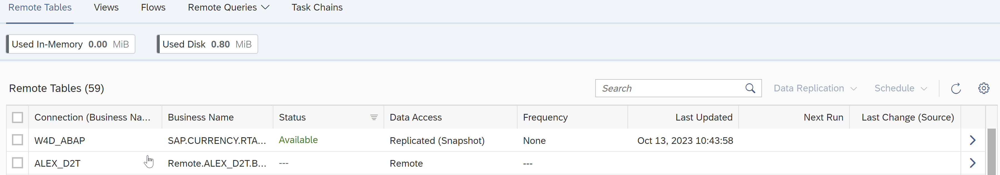
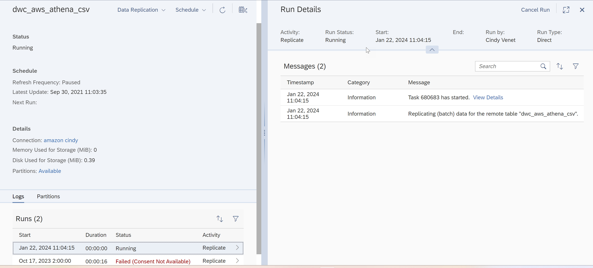

<!-- loio5d4af7620a214872a4dc5286f5e9e997 -->

<link rel="stylesheet" type="text/css" href="../css/sap-icons.css"/>

# Navigating in the Monitor Tabs

Selecting a specific monitor tab from *Data Integration Monitor* \( \) displays a tabular list of the scheduled tasks associated with the selected monitor type. You can personalize the columns you want to display clicking on :gear:. From the tabular display, you can click \> at the end of a particular task row to display details of that monitored item’s execution history including the completion date and status of each run. After selecting a specific monitor type, for *Remote Tables*, *Views*, *Flows*, or *Task Chains*, each of the monitor displays provides a summary listing of currently scheduled and previously executed tasks. For example, here is a sample of the monitor display for the *Remote Tables* monitor

The display provides a summary of all currently scheduled and previously executed remote table replication tasks, their schedule and refresh frequency, various memory and disk usage statistics, as well as the last task update or execution. Similar displays are provided for each of the other monitor types.

To view more information on any specific task in the summary list, click \> in the right-most column of the row to access the *Run Details* page for the task you selected. Depending on the monitor type you selected, the *Run Details* page provides a flexible two or three panel display in which you can resize \( and \), expand/collapse \(\), or close \( :x:\) the display of each panel to focus on specific detail information or log messages. In addition, you can sort \( \) and filter \( \) information displayed in the different panels, as well as search log messages.

The following is an example of the *Run Details* display for a remote table replication task.

In the left-most column or panel, the monitor displays a list of all previous runs of the selected task as well as the status of the task, completed successfully or failed. In the right-most column or panel, the monitor displays log messages detailing the steps executed for the selected task. For failed task runs or execution, you can click on the highlighted *Failed* status to show more information.

By default, the failed tasks appear on the top. For more information on statuses and substatuses, see [Understanding Statuses and Substatuses](understanding-statuses-and-substatuses-19cb5bd.md).

> ### Note:  
> From each monitor, you can navigate back to the *Data Builder* to change your objects by clicking *Open in Data Builder*.

You also get information about who runs the task \(*Run By*\) and how it has run \(*Run Type*\): *Direct* \(the task started directly while clicking the *Run* button\) or *Scheduled* \(a schedule is created\)

