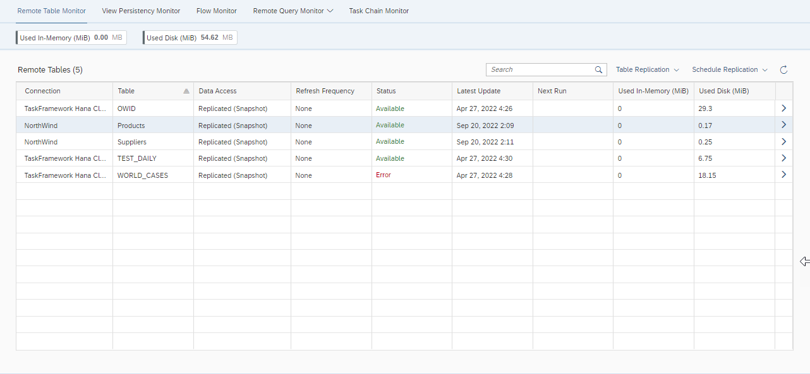
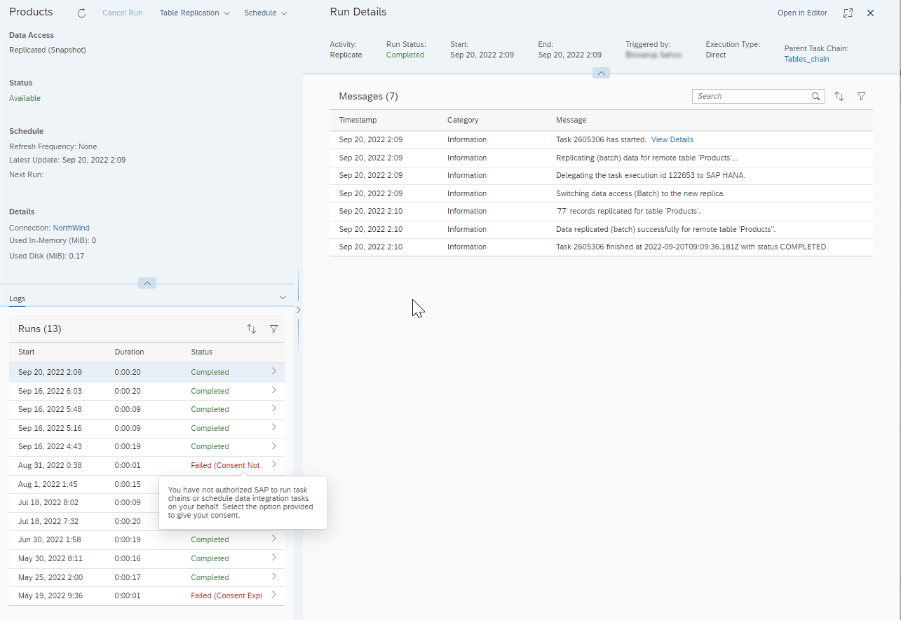

<!-- loio5d4af7620a214872a4dc5286f5e9e997 -->

<link rel="stylesheet" type="text/css" href="../css/sap-icons.css"/>

# Navigating in the Monitor Tabs

Selecting a specific monitor tab from *Data Integration Monitor* \( \) displays a tabular list of the scheduled tasks associated with the selected monitor type: remote table replication, view persistency, data flow, or task chain runs. From the tabular display, you can click \> at the end of a particular task row to display details of that monitored item’s execution history including the completion date and status of each run.

After selecting a specific monitor type, for remote table replication, view persistency, data flow, or task chain runs, each of the monitor displays provides a summary listing of currently scheduled and previously executed tasks. For example, here is a sample of the monitor display for the Remote Table Monitor.

The display provides a summary of all currently scheduled and previously executed remote table replication tasks, their schedule and refresh frequency, various memory and disk usage statistics, as well as the last task update or execution. Similar displays are provided for each of the other monitor types, view persistency, data flow, or task chain runs.

To view more information on any specific task in the summary list, click \> in the right-most column of the row to access the *Run Details* page for the task you selected. Depending on the monitor type you selected, the *Run Details* page provides a flexible two or three panel display in which you can resize \( and \), expand/collapse \(\), or close \( :x:\) the display of each panel to focus on specific detail information or log messages. In addition, you can sort \( \) and filter \( \) information displayed in the different panels, as well as search log messages.

The following is an example of the *Run Details* display for a Remote Table Monitor task.

In the left-most column or panel, the monitor displays a list of all previous runs of the selected task as well as the status of the task, completed successfully or failed. In the right-most column or panel, the monitor displays log messages detailing the steps executed for the selected task. For failed task runs or execution, you can click on the highlighted *Failed* status to show more information.

The following table lists and describes the available substatuses.

<table>
<tr>
<th valign="top">

Substatus

</th>
<th valign="top">

Description

</th>
</tr>
<tr>
<td valign="top">

CANCELLED

</td>
<td valign="top">

This task run was canceled, after it had started. In this case, the data was rolled back and restored to the state that existed before the task run was initially triggered.

</td>
</tr>
<tr>
<td valign="top">

FAIL\_CONSENT\_EXPIRED

</td>
<td valign="top">

The authorization that allows SAP to run task chains or schedule data integration tasks on your behalf has expired. Select the option provided to renew your consent \([Changing Your Profile Settings](https://help.sap.com/viewer/d4f3c5a0bb074d09ae9b42b2b9bd7a08/cloud/en-US/1084796d09464e78870f32cab8584dfc.html "A user profile resembles a business card and consists of standard user data, such as your name and email address. The profile also includes user preferences as well as data privacy and task scheduling consent options.") :arrow_upper_right:\).

</td>
</tr>
<tr>
<td valign="top">

FAIL\_CONSENT\_INVALIDATED

</td>
<td valign="top">

This task or task chain could not be executed, typically due to a change in the Identity Provider configuration of the tenant. In that case, no new task jobs or task chains can be run or scheduled in the name of the affected user. If the assigned user still exists in the new IdP, revoke the scheduling consent and then grant it again. If the assigned user no longer exists, assign a new task job or task chain owner and provide the required task scheduling consent. See the following SAP note [3089828](https://me.sap.com/notes/3089828) for more information.

</td>
</tr>
<tr>
<td valign="top">

FAIL\_CONSENT\_NOT\_AVAILABLE

</td>
<td valign="top">

You have not authorized SAP to run task chains or schedule data integration tasks on your behalf. Select the option provided to give your consent \([Changing Your Profile Settings](https://help.sap.com/viewer/d4f3c5a0bb074d09ae9b42b2b9bd7a08/cloud/en-US/1084796d09464e78870f32cab8584dfc.html "A user profile resembles a business card and consists of standard user data, such as your name and email address. The profile also includes user preferences as well as data privacy and task scheduling consent options.") :arrow_upper_right:\).

</td>
</tr>
<tr>
<td valign="top">

FAIL\_NOT\_TRIGGERED

</td>
<td valign="top">

This task job could not be executed due to a system outage or some part of the database system not being available at the time of the planned execution. Wait for the next scheduled job execution time or reschedule the job.

</td>
</tr>
<tr>
<td valign="top">

FAIL\_OWNER\_MISSING

</td>
<td valign="top">

This task job could not be executed because it does not have an assigned system user. Assign an owner user to the job.

</td>
</tr>
<tr>
<td valign="top">

FORBIDDEN

</td>
<td valign="top">

The assigned user does not have the privileges necessary to execute this task.

</td>
</tr>
<tr>
<td valign="top">

LOCKED

</td>
<td valign="top">

The same task was already running, so this task job cannot be run in parallel with an existing task’s execution.

</td>
</tr>
<tr>
<td valign="top">

PARTIALLY\_COMPLETED \(PARTIALLY\_EXECUTED\)

</td>
<td valign="top">

This task failed but, for some sub-objects, the execution ended successfully.

</td>
</tr>
<tr>
<td valign="top">

SCHEDULE\_CANCELLED

</td>
<td valign="top">

This task job could not be executed due to an internal error. Contact SAP Support and provide them with the correlation id and timestamp from this task job’s log detail information.

</td>
</tr>
<tr>
<td valign="top">

SET\_TO\_FAILED

</td>
<td valign="top">

This task was running but the user set this task’s status to FAILED.

</td>
</tr>
<tr>
<td valign="top">

STOPPED

</td>
<td valign="top">

This task was stopped, but no rollback was performed.

</td>
</tr>
<tr>
<td valign="top">

SUCCESS\_SKIPPED

</td>
<td valign="top">

This task’s execution has not been triggered because a previous run of the same task is still in progress.

</td>
</tr>
<tr>
<td valign="top">

TASK\_EXCEPTION

</td>
<td valign="top">

This task encountered an unspecified error during execution.

</td>
</tr>
<tr>
<td valign="top">

TASK\_EXECUTOR\_ERROR

</td>
<td valign="top">

This task encountered an internal error, likely during preparation steps for execution, and the task could not be started.

</td>
</tr>
<tr>
<td valign="top">

UNAUTHORIZED

</td>
<td valign="top">

The user could not be authenticated, has been locked, or deleted.

</td>
</tr>
</table>

