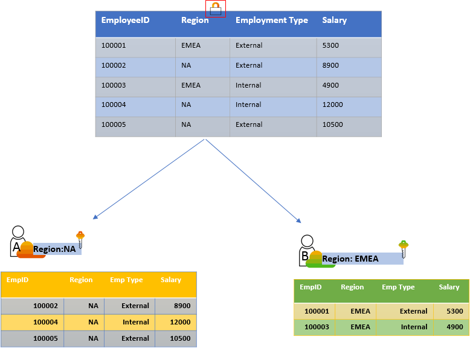
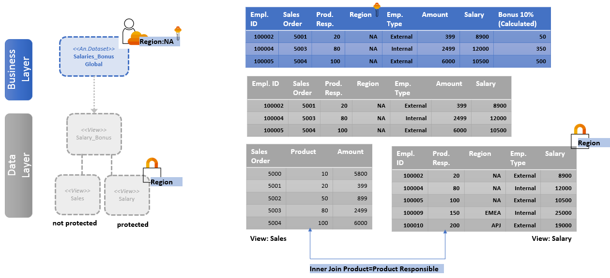
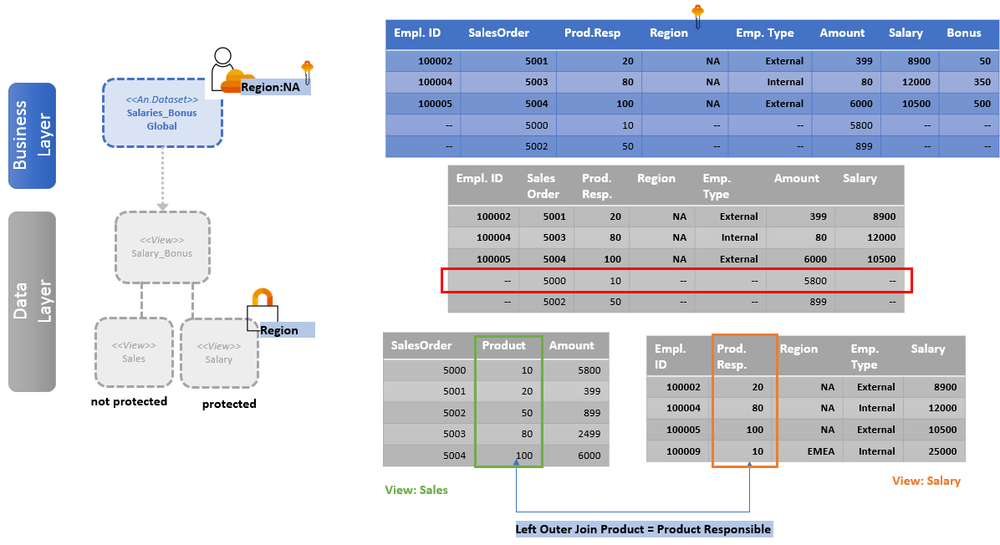
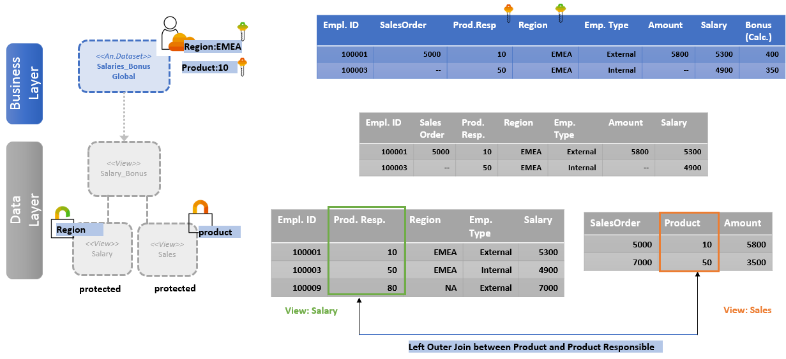
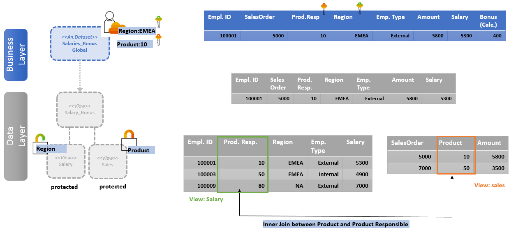
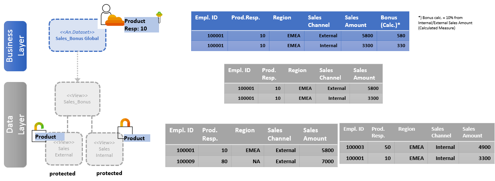

<!-- loio7a4a983611cc4efb9415e6f3db310eaa -->

# Persisted Views and Data Access Control

When *Data Access Control* is defined, it can impact the data persistence. Depending on where the *Data Access Control* is set, it might prevent you from persisting a view.

Without *Data Access Control* \(DAC\), all users assigned to a space in SAP Datasphere can see and consume all data available in this space. When DAC is applied to a data layer view or a business layer object, the rows of data contained in the object are filtered based on the specified criteria and can impact the data persistence.

<a name="loio7a4a983611cc4efb9415e6f3db310eaa__section_ylk_gf5_rnb"/>

## Persisted Views and Data Access Control on View Level

While defining *Data Access Control* in your view, you need to consider the impact on the data persistence:

-   You can persist a view if a data access control with structure "Values Only" is assigned to it.

    > ### Note:  
    > *Data Access Control* structures "Operator and Values" and "Hierarchy" are not supported by persisted views.

-   You can't persist a view consuming a view with *Data Access Control* set up.

    > ### Example:  
    > A view A is created as join of view B and C. As *Data Access Control* is set on view B, all users can see data from view C, but only authorized users can see data from view A and B. View A can't be persisted.
    > 
    > In such cases, we recommend persisting the data on views B and C. If *Data Access Control* is set to view A instead of view B, then also view A can be made persisted. And it may not be necessary to persist view B and C.

    > ### Example:  
    > A view A is created on top of view B and view B is created on top of view C. *Data Access Control* is set on view C. View B and view A can’t be persisted.

-   If you change *Data Access Control* on a view, the following happens:

    -   If the view is already set as persisted, the persistence is removed when the view is deployed. You need to persist the view again.
    -   If views on top are persisted, then the persistence of the top view is removed:
        -   For top views within the same space as the deployed view, the persistence is removed when you deploy your changes.

            > ### Example:  
            > View A is persisted, and it consumes view B. You add a DAC on view B. When redeploying view B, persistence of view A is removed.

        -   For other top views, the persistence is removed during the next data persistence run of the top view.

<a name="loio7a4a983611cc4efb9415e6f3db310eaa__section_v2k_xxt_y4b"/>

## Persisted Views and Data Access Control on Object Level

### Example 1: Data Access Control is set on one column.

*Data Access Control* is set on "Region" column:

User A has authorizations to see data from "NA" region and User B is authorized to see data from "EMEA" region.

The "Salary" view can be persisted.

### Example 2: DAC is defined on one column, and inner join is set.

Taking back the previous example, we now create the "Salary\_Bonus" view on top of the "Sales" and "Salary" views. Data from the "Sales" view is not protected whereas data from the "Salary" view is protected with DAC on the "Region" column. An inner join is set between the "Product" column issued in the "Sales" view and the "Product Responsible" column used in the "Salary" view:

Due to the inner join, only the sales records matching the authorized records from the "Salary" view are selected. The "Sales" and "Salary" views can be persisted but the "Salary\_Bonus" view can’t be persisted due to DAC assigned to the "Salary" view.

### Example 3: DAC is defined on one column and left outer join is set.

Again the "Salary\_Bonus" view is created on top of the "Sales" and "Salary" views. Data from the "Sales" view is not protected whereas data from the "Salary" view is protected with DAC on the "Region" column. A left outer join is set between the "Product" column from the "Sales" view and the "Product Responsible" column from the "Salary" view:

Due to the left outer join, the "Salary\_Bonus" view contains all records of the "Sales" view. Even the records from "Sales" view, where no authorized join partner exists in the "Salary" view are considered in the "Salary\_Bonus" view. The "Sales" and "Salary" views can be persisted but the Salary\_Bonus" view can’t be persisted due to DAC assigned to the "Salary" view.

### Example 4: DAC is defined on two columns and left outer join is set:

The "Salary\_Bonus" view is created on top of the "Sales" and "Salary" views. Data from the "Sales" view is protected with DAC on the "Product" column whereas data from the "Salary" view is protected with DAC on the "Region" column. A left outer join is set between the "Product" column from the "Sales" view and the "Product Responsible" column from the "Salary" view:

Due to left outer join, the salary records are selected as long as they are in the authorized region \(EMEA\), even when no dedicated "product" authorizations \(responsibility\) are granted. You can persist the "Sales" and "Salary" views but you can't persist the "Salary\_Bonus" view.

### Example 5: DAC is defined on two columns and inner join is set.

The "Salary\_Bonus" view is created on top of "Sales" and "Salary" views. Data from the "Sales" view is protected with DAC on the "Product" column whereas data from the "Salary" view is protected with DAC on the "Region" column. An inner join is set between "Product" column from the "Sales" view and "Product Responsible" column from the "Salary" view:

Due to the inner join, only the authorized "Sales" records matching the authorized records from the "Salary" view are selected. In the given example, this means that the "Salary\_Bonus" view contains only data for region EMEA and Product 10. You can persist the "Sales" and "Salary" views but you can't persist the "Salary\_Bonus" view.

### Example 6: DAC is defined on 2 columns and a union is set.

Now, the "Sales\_Bonus" view is created on top of "Sales External" and "Sales Internal" views. Data from both "Sales External" and "Sales Internal" views are protected with DAC on "Product" column . A union is set:

With a Union, data records are selected from the underlying sources and the respective authorizations are applied . The result set is the sum of the selected records. You can persist both the "Sales External" and "Sales Internal" views but you can't persist the "Sales\_Bonus" view.

### Example 7: Permissions entity for DAC is a view containing run-time dependent logic.

A DAC can use a view or a table as permissions entity. A view used as permissions entity for a DAC can contain run-time dependent logic. If such a DAC is assigned to a view and this view is persisted, wrong results may occur when reading data from the persisted view. This behavior occurs if the runtime dependent logic inside the view used as permissions entity returns different results when loading a snapshot and when reading later on from the snapshot. In this case, only a subset of the expected entries of the view will be considered. The subset may even be an empty set.

> ### Example:  
> Let's assume we have the "EMEA\_Sales" SQL View in which the "Current day" is fetched allowing users to see the sales amount per day. A DAC is created using the "EMEA\_Sales" view as permissions entity. This DAC is assigned to a "Global\_Sales" view.
> 
> Now, let's say that we are on April 1st, 2021 and you decide to persist the "Global\_Sales" view. Imagine that a user would like to consume data of the "Global\_Sales" view on April 4, 2021. As a result, no data is displayed as the view was persisted with entries of data from April 1st and the DAC is configured to always fetch the entries from the current day \(April 4\).

