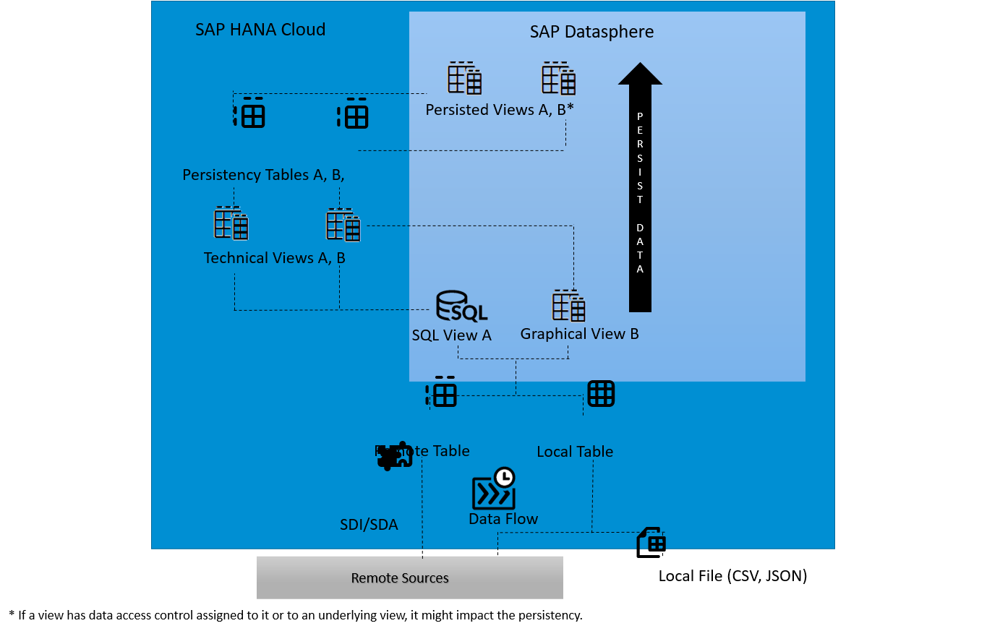

<!-- loio9af04c990f294fd28c00f46763dd8b0d -->

<link rel="stylesheet" type="text/css" href="../css/sap-icons.css"/>

# Persisting and Monitoring Views

From *Data Integration Monitor* \> *Views*, you can monitor views that have been created in the *Data Builder*. You can persist these views \(direct run or via a schedule\) to make them available locally to improve the performance when accessing your data. You can monitor the existing persisted views to keep control of your data sizing and free up memory space.

<a name="loio9af04c990f294fd28c00f46763dd8b0d__section_zpd_nhb_t2c"/>

## Prerequisites

To persist and monitor views, you must have a scoped role that grants you access to a space with the following privileges:

-   *Data Warehouse General* \(`-R------`\) - To access SAP Datasphere.
-   *Data Warehouse Data Integration* \(`-RU-E---`\) - To perform data replication/persistence actions \(in the *Data Integration Monitor* or *Data Builder*\), and schedule the actions. The *DW Integrator* role template, for example, grants this privilege.
-   *Data Warehouse Data Builder* \(`-R------`\) - To work with partitions. The *DW Space Administrator* role template, for example, grants this privilege.
-   *Data Warehouse Runtime* \(`-R------`\) - To allow users of the *View Analyzer* to download the generated SQL analyzer plan file. The *DW Space Administrator* role template, for example, grants this privilege.

For more information, see [Privileges and Permissions](https://help.sap.com/viewer/935116dd7c324355803d4b85809cec97/DEV_CURRENT/en-US/d7350c6823a14733a7a5727bad8371aa.html "A privilege represents a task or an area in SAP Datasphere and can be assigned to a specific role. The actions that can be performed in the area are determined by the permissions assigned to a privilege.") :arrow_upper_right: and [Standard Roles Delivered with SAP Datasphere](https://help.sap.com/viewer/935116dd7c324355803d4b85809cec97/DEV_CURRENT/en-US/a50a51d80d5746c9b805a2aacbb7e4ee.html "SAP Datasphere is delivered with several standard roles. A standard role includes a predefined set of privileges and permissions.") :arrow_upper_right:. 

To persist and monitor a view, the view must be deployed.

<a name="loio9af04c990f294fd28c00f46763dd8b0d__section_mnr_b1g_mtb"/>

## Introduction to Persisting and Monitoring Views

> ### Note:  
> While persisting complex views, see [Persisted Views and Memory Consumption](persisted-views-and-memory-consumption-e3d0495.md).

The interactive graphic below summarizes how views are persisted:

### Persisted Views

The definition of the view is stored in SAP Datasphere and data is read from the persistency table to improve performance when accessing the data.

### Persistency Tables

Tables created in SAP HANA Cloud that stored the required data. When a view is persisted, data is read from this table to improve performance. When you refresh the persisted data of a view, a new persistency table is created. Data from the technical view are inserted into the new persistency table. If everything runs properly, the old persisted data is replaced by the new inserted data. In case of issues, previously persisted data are still available, until you solve the issue and refresh the data with success.

### Technical Views

Copy of the virtual views to be persisted into SAP HANA Cloud. The definition of the view is stored \(including associations, hints, etc\). It serves to create the persistency table.

### Persist Data

Views can be persisted by running a data persistence or scheduling a data persistence task. You can also partition your data load into smaller parts to improve the performance.

For more information, see [Creating Partitions for Your Persisted Views](creating-partitions-for-your-persisted-views-9b1b595.md) and [Scheduling Data Integration Tasks](scheduling-data-integration-tasks-7fa0762.md).

### Views \(SQL, Graphical\) in virtual access

SQL or Graphical views are created in the data builder. The views are accessed directly from the source data. Once they are deployed in a space, they can be persisted.

For more information, see [Creating a Graphical View](https://help.sap.com/viewer/24f836070a704022a40c15442163e5cf/DEV_CURRENT/en-US/27efb479c4814252964d3fbc6ca2dfc3.html "Create a view to query sources in an intuitive graphical interface. You can drag and drop sources from the Source Browser, join them as appropriate, add other operators to remove or create columns and filter or aggregate data, and specify measures and other aspects of your output structure in the output node.") :arrow_upper_right: and [Creating an SQL View](https://help.sap.com/viewer/24f836070a704022a40c15442163e5cf/DEV_CURRENT/en-US/81920e4d583f45fd8761c662d3c8abab.html "Create a view to query sources in a powerful SQL editor. You can choose between writing a standard SQL query using SELECT statements and operators such as JOIN and UNION, or use SQLScript to produce a table function. You can drag sources from the Source Browser, and specify measures and other aspects of your output structure in the side panel.") :arrow_upper_right:.

### Remote table

Table created from a connection to allow source data to be accessed in SAP Datasphere. Views can be created using these tables as source. By default, data access of a remote table is "remote", but it can be "replicated".

For more info, see [Replicating Data and Monitoring Remote Tables](replicating-data-and-monitoring-remote-tables-4dd95d7.md).

### Local table

Table created from sources that have already been integrated into SAP Datasphere. It serves of source to create a view.

For more information, see [Creating a Local Table](https://help.sap.com/viewer/24f836070a704022a40c15442163e5cf/DEV_CURRENT/en-US/2509fe4d86aa472b9858164b55b38077.html "Create a table and define columns to receive data.. You can add data from a flow or a CSV file, or import tables from a connection or a CSN file.") :arrow_upper_right:.

### SAP HANA smart data integration/SAP HANA smart data access 

SAP HANA smart data integration and SAP HANA smart data access allow you to access remote data through virtual tables without copying the data into SAP HANA.

For more information, see [Connecting SAP HANA Cloud, SAP HANA Database to Remote Data Sources](https://help.sap.com/docs/HANA_CLOUD/db19c7071e5f4101837e23f06e576495/afa3769a2ecb407695908cfb4e3a9463.html?locale=en-US).

### Flows

Define the flow of your data, starting by reading data from sources and writing data into a target after performing transformations on the data.

For more information, see [Creating a Data Flow](https://help.sap.com/viewer/24f836070a704022a40c15442163e5cf/DEV_CURRENT/en-US/e30fd1417e954577baae3246ea470c3f.html "Create a data flow to move and transform data in an intuitive graphical interface. You can drag and drop sources from the Source Browser, join them as appropriate, add other operators to remove or create columns, aggregate data, and do Python scripting, before writing the data to the target table.") :arrow_upper_right: and [Creating a Replication Flow](https://help.sap.com/viewer/24f836070a704022a40c15442163e5cf/DEV_CURRENT/en-US/25e2bd7a70d44ac5b05e844f9e913471.html "Create a replication flow to copy multiple data assets from a source to a target.") :arrow_upper_right:.

### Remote Sources

You can connect several data sources to SAP Datasphere that support remote table functionalities. Views can then be created from these remote tables.

For more information, see [Integrating Data via Connections](../Integrating-Data-Via-Connections/integrating-data-via-connections-eb85e15.md).

### Local files

Local files can be imported and deployed to your space. They are then used to create a local table.

For more information, see [Creating a Local Table from a CSV File](https://help.sap.com/viewer/24f836070a704022a40c15442163e5cf/DEV_CURRENT/en-US/8bba251c78874736963703cff56b1b74.html "Import a .csv file to create a table and fill it with the data from the file.") :arrow_upper_right:.

<a name="loio9af04c990f294fd28c00f46763dd8b0d__section_jxb_ydh_snb"/>

## Action in *Views*

The monitor displays the views in 3 tabs:

-   *All Views*: It displays all the deployed views that have been created in the *Data Builder* for the current space.
-   *Scheduled* \(default\): It displays the views for which a schedule is defined to persist the data.
-   *Persisted*: It displays the views already persisted.

You can perform the following actions \(might depend on your role and privilege, see [Privileges and Permissions](https://help.sap.com/viewer/935116dd7c324355803d4b85809cec97/DEV_CURRENT/en-US/d7350c6823a14733a7a5727bad8371aa.html "A privilege represents a task or an area in SAP Datasphere and can be assigned to a specific role. The actions that can be performed in the area are determined by the permissions assigned to a privilege.") :arrow_upper_right: and [Roles and Privileges by App and Feature](https://help.sap.com/viewer/935116dd7c324355803d4b85809cec97/DEV_CURRENT/en-US/2d8b7d04dcae402f911d119437ce0a74.html "Review the standard roles and the privileges needed to access apps, tools, and other features of SAP Datasphere.") :arrow_upper_right::

<table>
<tr>
<th valign="top">

Action

</th>
<th valign="top">

Information

</th>
</tr>
<tr>
<td valign="top">

Data Persistence Menu

</td>
<td valign="top">

*Start Data Persistence*: Start a new data persistence to update or create the persisted view.

> ### Note:  
> You can set up a view as persisted even if it has been created on top of remote data.

*Remove Persisted Data*: Remove the data that have been persisted in the view and switch the access back to virtual.

*Start View Analyzer*: Analyzes each view definition, the consumed views and the data sources used by local and remote tables that compose your data model. You can then use the provided information and warnings to decide on some improvements for your data model. You can also generate an SQL Analyzer Plan File that you can download \(if you have the required authorizations\) for detailed analysis. For more information, see [Exploring Views with View Analyzer](exploring-views-with-view-analyzer-8921e5a.md).

</td>
</tr>
<tr>
<td valign="top">

Schedule Data Persistence

</td>
<td valign="top">

From this menu, you can :

-   *Create Schedule*: Select the relevant persisted view and create a simple or recurring schedule for your view. You define your scheduling options and thus ensure that you always have an up-to-date persisted view.

    *Edit Schedule*: Your scheduling options need to be updated? You can adapt them to your needs at any time from this menu.

-   *Delete Schedule*: You don't need to schedule a Data Persistence task anymore? Then you can simply delete it from this menu.
-   *Assign Schedule To Me*: Become the owner of the schedule.
-   *Pause Schedule*: Pause the scheduled task
-   *Resume Schedule*: Resume the pause scheduled task

> ### Note:  
> You need to authorize SAP to run the recurring scheduled tasks on your behalf. You can do so via the message that is displayed at the top of the monitor, or in your profile settings under *Schedule Consent Settings*.

For more information, see [Schedule a Data Integration Task \(Simple Schedule\)](schedule-a-data-integration-task-simple-schedule-7c11059.md).

</td>
</tr>
<tr>
<td valign="top">

Access the detailed logs to monitor what's happened with your persisted view.

</td>
<td valign="top">

Select the relevant view and click:  \(View Details\).

</td>
</tr>
</table>

> ### Note:  
> You can select several views to group actions whenever it's applicable:
> 
> -   *Schedule*: You can delete, pause or resume schedules for several views that have schedules defined. You can also assign several schedules to your name and become the owner of the schedules.
> -   *Remove Persisted Data*: You can select several views that have persisted data and remove the persisted data for all of them.
> -   Many actions like *Start Data Persistence*, *Run*, *Create Schedule*, etc. cannot be grouped. In such cases, they are disabled.
> 
> After triggering a group of actions, the status of each action is displayed in the notification area. As these operations run in an asynchronous mode, the status will not be updated automatically, and you need to manually *Refresh* the page to get the updated status.

> ### Note:  
> You can still access the current data until the load ends. Once the data persistence has successfully run, the data is updated. Please note that this data refresh behavior requires temporarily additional in-memory and disk-storage to be reserved during the processing of a new data persistence.

<a name="loio9af04c990f294fd28c00f46763dd8b0d__section_o51_rdm_htb"/>

## Monitoring the Persisted Views

The list of available persisted views is displayed in a table containing several information:

<table>
<tr>
<th valign="top">

Column

</th>
<th valign="top">

Information

</th>
</tr>
<tr>
<td valign="top">

*Technical Name \(or Business Name\)* 

</td>
<td valign="top">

Name of the persisted view.Technical or Business Name is displayed, depending on how you have configured your UI settings in *Your Profile* \> *Settings* 

</td>
</tr>
<tr>
<td valign="top">

*Data Access* 

</td>
<td valign="top">

Shows how you currently access your view.

-   *Persisted*: The view is persisted can be used immediately.
-   *Partially Persisted*: Not all view data has been persisted. If your view contains an input parameter, only records that match the input parameter default value are persisted.
-   *Virtual*: The view is accessed directly, no intermediate persistence is used. Or the view was persisted and has now been turned into virtual to free up memory space, for example.

</td>
</tr>
<tr>
<td valign="top">

*Frequency* 

</td>
<td valign="top">

Shows if a schedule is defined for the view.

-   *None*: There is no schedule task defined for this view. You can define one from *Schedule* \> *Create Schedule*.
-   *Scheduled*: A schedule task is defined for this view. If you click on *Scheduled*, you will get detailed information on the schedule. You can update the schedule options at any time from *Schedule* \> *Edit Schedule*, or delete the schedule from *Schedule* \> *Delete Schedule*.
-   *Paused*: Schedule is paused and the data is not refreshed.

</td>
</tr>
<tr>
<td valign="top">

*Last Updated* 

</td>
<td valign="top">

Shows when the persisted view was last updated.

</td>
</tr>
<tr>
<td valign="top">

*New Run* 

</td>
<td valign="top">

If a schedule is set for the view, see by when the next run is scheduled.

</td>
</tr>
<tr>
<td valign="top">

*Number Of Records* 

</td>
<td valign="top">

Shows the records of the persisted views.

</td>
</tr>
<tr>
<td valign="top">

*Memory Used for Storage \(MiB\)* 

</td>
<td valign="top">

Tracks how much size the view is using in your memory.

</td>
</tr>
<tr>
<td valign="top">

*Disk Used for Storage \(MiB\)* 

</td>
<td valign="top">

Tracks how much size the view is taking on your disk.

</td>
</tr>
<tr>
<td valign="top">

*Status* 

</td>
<td valign="top">

Shows the status of the persisted view.

-   *Available*: The persisted view is available and can be used.
-   *Loading*: The persisted view is currently creating or updating. You might need to refresh your screen until the loading is completed to get the final status. Until then the virtual access or the old persisted data is used if the view is accessed.
-   *Error*: Something goes wrong during the load of the data to the persisted table. The old persisted data is used or if the view was not successfully loaded before, the data is still accessed via virtual access \(status is virtual\). You need to fix the error to be able to complete the persisted view creation or update.

</td>
</tr>
<tr>
<td valign="top">

*Schedule Owner* 

</td>
<td valign="top">

Displays the name of the schedule owner.

</td>
</tr>
</table>

You can personalize the columns you want to display clicking on :gear:

<a name="loio9af04c990f294fd28c00f46763dd8b0d__section_lmn_ffp_rbc"/>

## Persisted Views and Input Parameters

Data persistence can be run in case a view contains a parameter only if the following prerequisites are met:

-   The view contains one single input parameter,
-   The input parameter has a default value maintained.

If a view contains several input parameters, or if the input parameter has no default value, the view can’t be persisted.

Once persisted, the view takes the data access value *Partially Persisted* because only records that match the input parameter default value are persisted.

<a name="loio9af04c990f294fd28c00f46763dd8b0d__section_f2z_cf5_rnb"/>

## Persisted Views and Deployment

When you deploy a persisted view, you need to consider the following cases:

-   If you update or redeploy a persisted view, you need the right permission level \(Data Integration - Update\). For more information, see [Privileges and Permissions](https://help.sap.com/viewer/935116dd7c324355803d4b85809cec97/DEV_CURRENT/en-US/d7350c6823a14733a7a5727bad8371aa.html "A privilege represents a task or an area in SAP Datasphere and can be assigned to a specific role. The actions that can be performed in the area are determined by the permissions assigned to a privilege.") :arrow_upper_right:. Note that after a redeployment, the data persistence might be deleted and the data access could be changed back to virtual for views with structural changes. This will happen as soon as the underlying database object is recreated as part of the deployment. This can be seen in the *Data Access* status in the *View Builder* or in the *Data Integration Monitor* \> *Views*. The update of the data persistence has to be triggered again.
-   If the view uses other views that were changed but not yet deployed, they are deployed as well. If these views are persisted, the persistence is deleted as well.
-   If the view uses other views that were not changed, these views are not touched by the deployment and therefore the persistence is still available
-   If you update or redeploy a view while you are persisting data, the persistence will fail. In this case, try again to persist the view or wait until the next scheduled run.
-   If the persisted view is consuming a view for which a data access control has changed \(a data access control is added or removed, or its assignment has changed\), then the persistence of your parent view is removed when the underlying view is redeployed.

<a name="loio9af04c990f294fd28c00f46763dd8b0d__section_exm_tyh_lpb"/>

## Canceling a Running Execution of a Data Persistence Task

If you need to cancel a running data persistence task, go to the Details screen of the relevant view and click *Cancel Run* . This will turn the status of the task into failed and you will be able to restart the task to persist the view later if needed.

> ### Note:  
> A task to persist a view consists of several steps that includes exchanges with SAP HANA. Therefore, it might take some time until the task is stopped and the status turns into *Failed*.

