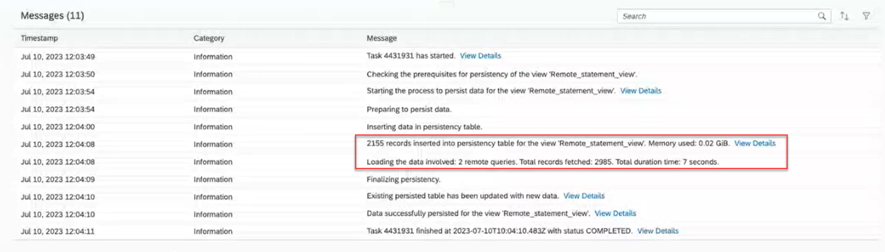
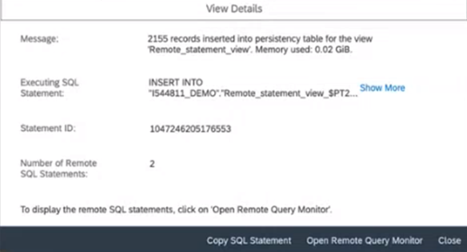
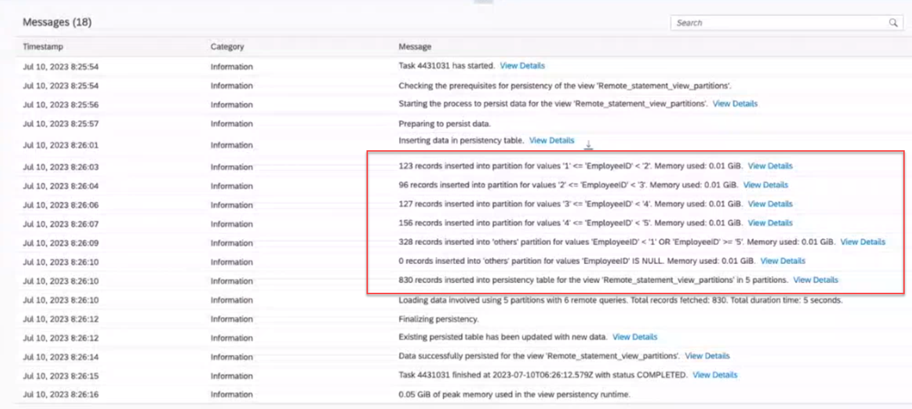
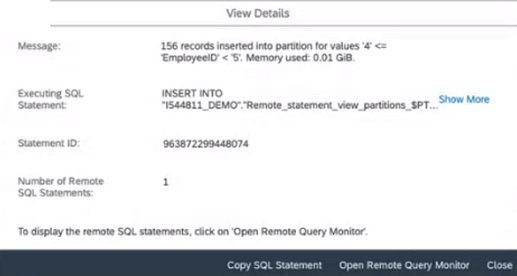

<!-- loio9af04c990f294fd28c00f46763dd8b0d -->

<link rel="stylesheet" type="text/css" href="../css/sap-icons.css"/>

# Persisting and Monitoring Views

In the *Data Integration Monitor*, you can monitor, persist or schedule view persistency. Persisted views are available locally and can be used directly to improve performance when accessing your data, for your models or stories, for example. You can monitor the existing persisted views to keep control of your data sizing and free up memory space.

**Prerequisites**: Your view must be deployed.

> ### Note:  
> While persisting complex views, see [View Persistency and Memory Consumption](view-persistency-and-memory-consumption-e3d0495.md).

The interactive graphic below summarizes how views are persisted:

### Persisted Views

The definition of the view is stored in SAP Datasphere and data is read from the persistency table to improve performance when accessing the data.

### Persistency Tables

Tables created in SAP HANA Cloud that stored the required data. When a view is persisted, data is read from this table to improve performance. When you refresh the persisted data of a view, a new persistency table is created. Data from the technical view are inserted into the new persistency table. If everything runs properly, the old persisted data is replaced by the new inserted data. In case of issues, previously persisted data are still available, until you solve the issue and refresh the data with success.

### Technical Views

Copy of the virtual views to be persisted into SAP HANA Cloud. The definition of the view is stored \(including associations, hints, etc\). It serves to create the persistency table.

### Persist Data

Views can be persisted by loading a snapshot or scheduling a persistency task. You can also partition your data load into smaller parts to improve the performance.

For more information, see [Creating Partitions for Your Persisted Views](creating-partitions-for-your-persisted-views-9b1b595.md) and [Scheduling Data Integration Tasks](scheduling-data-integration-tasks-7fa0762.md).

### Views \(SQL, Graphical\) in virtual access

SQL or Graphical views are created in the data builder. The views are accessed directly from the source data. Once they are deployed in a space, they can be persisted.

For more information, see [Creating a Graphical View](https://help.sap.com/viewer/c8a54ee704e94e15926551293243fd1d/cloud/en-US/27efb479c4814252964d3fbc6ca2dfc3.html "Create a view to query sources in an intuitive graphical interface. You can drag and drop sources from the Source Browser, join them as appropriate, add other operators to remove or create columns and filter or aggregate data, and specify measures and other aspects of your output structure in the output node.") :arrow_upper_right: and [Creating an SQL View](https://help.sap.com/viewer/c8a54ee704e94e15926551293243fd1d/cloud/en-US/81920e4d583f45fd8761c662d3c8abab.html "Create a view to query sources in a powerful SQL editor. You can choose between writing a standard SQL query using SELECT statements and operators such as JOIN and UNION, or use SQLScript to produce a table function. You can drag sources from the Source Browser, and specify measures and other aspects of your output structure in the side panel.") :arrow_upper_right:.

### Remote table

Table created from a connection to allow source data to be accessed in SAP Datasphere. Views can be created using these tables as source. By default, data access of a remote table is "remote", but it can be "replicated".

For more info, see [Replicating Data and Monitoring Remote Tables](replicating-data-and-monitoring-remote-tables-4dd95d7.md).

### Local table

Table created from sources that have already been integrated into SAP Datasphere. It serves of source to create a view.

For more information, see [Creating a Local Table](https://help.sap.com/viewer/c8a54ee704e94e15926551293243fd1d/cloud/en-US/2509fe4d86aa472b9858164b55b38077.html "Create a table to contain data by defining its column structure. Tables created in SAP Datasphere can be filled with data from a CSV file or via a data flow. You can also import tables from a connection or a CSN file.") :arrow_upper_right:.

### SAP HANA smart data integration/SAP HANA smart data access 

SAP HANA smart data integration and SAP HANA smart data access allow you to access remote data through virtual tables without copying the data into SAP HANA.

For more information, see [Connecting SAP HANA Cloud, SAP HANA Database to Remote Data Sources](https://help.sap.com/docs/HANA_CLOUD/db19c7071e5f4101837e23f06e576495/afa3769a2ecb407695908cfb4e3a9463.html?locale=en-US).

### Data Flow

Define the flow of your data, starting by reading data from sources and writing data into a target after performing transformations on the data.

For more information, see [Creating a Data Flow](https://help.sap.com/viewer/c8a54ee704e94e15926551293243fd1d/cloud/en-US/e30fd1417e954577baae3246ea470c3f.html "Create a data flow to move and transform data in an intuitive graphical interface. You can drag and drop sources from the Source Browser, join them as appropriate, add other operators to remove or create columns, aggregate data, and do Python scripting, before writing the data to the target table.") :arrow_upper_right:.

### Remote Sources

You can connect several data sources to SAP Datasphere that support remote table functionalities. Views can then be created from these remote tables.

For more information, see [Integrating Data via Connections](../Integrating-Data-Via-Connections/integrating-data-via-connections-eb85e15.md).

### Local files

Local files can be imported and deployed to your space. They are then used to create a local table.

For more information, see [Creating a Local Table from a CSV File](https://help.sap.com/viewer/c8a54ee704e94e15926551293243fd1d/cloud/en-US/8bba251c78874736963703cff56b1b74.html "Import a .csv file to create a table and fill it with the data from the file.") :arrow_upper_right:.

<a name="loio9af04c990f294fd28c00f46763dd8b0d__section_jxb_ydh_snb"/>

## Action in the View Persistency Monitor

From *View Persistency Monitor* tab, you perform the following actions on views:

<table>
<tr>
<th valign="top">

Action

</th>
<th valign="top">

Information

</th>
</tr>
<tr>
<td valign="top">

Add a new persisted view

</td>
<td valign="top">

Click *Add View* and select the view you want to persist. It's then added to the *Persisted View* list. You can then either persist the view immediately, by selecting *View Persistency* \> *Load New Snapshot*, or later by creating a schedule via *Schedule* \> *Create Schedule* \(see [Schedule a Data Integration Task](schedule-a-data-integration-task-7c11059.md)\).

> ### Note:  
> For this action, *Data Builder* \(*Read*\) privilege is required which is not included in the *DW Integrator* role. To perform this action, ask your tenant administrator to assign your user to a scoped role that is based either on the *DW Space Administrator* role or on a custom role that includes the following required privileges: *Data Warehouse Data Integration* \(*Read*, *Update*, *Execute*\) and *Data Builder* \(*Read*\).

> ### Note:  
> You can set up a view as persisted even if it has been created on top of remote data.

> ### Restriction:  
> A view, which contains input parameters can't be persisted.

</td>
</tr>
<tr>
<td valign="top">

*Delete persistency* 

</td>
<td valign="top">

The persisted data is deleted and the persisted view is deleted from the *Persisted View List*.

</td>
</tr>
<tr>
<td valign="top">

Perform action on data by clicking *View Persistency* 

</td>
<td valign="top">

*Load New Snapshot*: Load new data to update or create the persisted view.

*Remove Persisted Data*: Remove the data that have been persisted in the view and switch the access back to virtual.

</td>
</tr>
<tr>
<td valign="top">

Define, edit, delete, pause, resume or assign schedule to your name.

</td>
<td valign="top">

For more information, see [Schedule a Data Integration Task](schedule-a-data-integration-task-7c11059.md).

</td>
</tr>
<tr>
<td valign="top">

Access the detailed logs to monitor what's happened with your persisted view.

</td>
<td valign="top">

Select the relevant view and click:  \(View Persistency Logs\).

</td>
</tr>
</table>

> ### Note:  
> You can select several views to group actions whenever it's applicable:
> 
> -   *Schedule*: You can delete, pause or resume schedules for several views that have schedules defined. You can also assign several schedules to your name and become the owner of the schedules.
> -   *Remove Persisted Data*: You can select several views that have persisted data and remove the persisted data for all of them.
> -   Many actions like *Load New Snapshot*, *Run*, *Create Schedule*, etc. cannot be grouped. In such cases, they are disabled.
> 
> After triggering a group of actions, the status of each action is displayed in the notification area. As these operations run in an asynchronous mode, the status will not be updated automatically, and you need to manually *Refresh* the page to get the updated status.

<a name="loio9af04c990f294fd28c00f46763dd8b0d__section_o51_rdm_htb"/>

## Monitoring Persisted Views

The list of available persisted views is displayed in a table containing several information:

<table>
<tr>
<th valign="top">

Column

</th>
<th valign="top">

Information

</th>
</tr>
<tr>
<td valign="top">

*Name* 

</td>
<td valign="top">

Name of the persisted view

</td>
</tr>
<tr>
<td valign="top">

*Data Access* 

</td>
<td valign="top">

Shows how you currently access your view.

-   *Persisted*: The view is persisted can be used immediately.
-   *Virtual*: The view is accessed directly, no intermediate persistency is used. Or the view was persisted and has now been turned into virtual to free up memory space, for example.

</td>
</tr>
<tr>
<td valign="top">

*Refresh Frequency* 

</td>
<td valign="top">

Shows if a schedule is defined for the view.

-   *None*: There is no schedule task defined for this view. You can define one from *Schedule* \> *Create Schedule*.
-   *Scheduled*: A schedule task is defined for this view. If you click on *Scheduled*, you will get detailed information on the schedule. You can update the schedule options at any time from *Schedule* \> *Edit Schedule*, or delete the schedule from *Schedule* \> *Delete Schedule*.

</td>
</tr>
<tr>
<td valign="top">

*Last Updated* 

</td>
<td valign="top">

Shows when the persisted view was last updated.

</td>
</tr>
<tr>
<td valign="top">

*New Run* 

</td>
<td valign="top">

If a schedule is set for the view, see by when the next run is scheduled.

</td>
</tr>
<tr>
<td valign="top">

*Number Of Records* 

</td>
<td valign="top">

Shows the records of the persisted views.

</td>
</tr>
<tr>
<td valign="top">

*Used In-Memory \(MiB\)* 

</td>
<td valign="top">

Tracks how much size the view is using in your memory.

</td>
</tr>
<tr>
<td valign="top">

*Used Disk \(MiB\)* 

</td>
<td valign="top">

Tracks how much size the view is taking on your disk.

</td>
</tr>
<tr>
<td valign="top">

*Status* 

</td>
<td valign="top">

Shows the status of the persisted view.

-   *Available*: The persisted view is available and can be used.
-   *Loading*: The persisted view is currently creating or updating. You might need to refresh your screen until the loading is completed to get the final status. Until then the virtual access or the old persisted data is used if the view is accessed.
-   *Error*: Something goes wrong during the load of the data to the persisted table. The old persisted data is used or if the view was not successfully loaded before, the data is still accessed via virtual access \(status is virtual\). You need to fix the error to be able to complete the persisted view creation or update.

</td>
</tr>
</table>

<a name="loio9af04c990f294fd28c00f46763dd8b0d__section_f2z_cf5_rnb"/>

## Persistency and Deployment

When you deploy a persisted view, you need to consider the following cases:

-   If you update or redeploy a persisted view, you need the right permission level \(Data Integration - Update\). For more information, see [Permissions](https://help.sap.com/viewer/9f804b8efa8043539289f42f372c4862/cloud/en-US/862b88eed50244049d41361ba3290456.html#loio1c4bf1ee5cdf4333807b22568ce0d874). Note that after a redeployment, the persistency might be deleted and the data access could be changed back to virtual for views with structural changes. This will happen as soon as the underlying database object is recreated as part of the deployment. This can be seen in the *Data Access* status in the *View Builder* or in the *Data Integration Monitor* \> *View Persistency Monitor*. The update of the persistency has to be triggered again.
-   If the view uses other views that were changed but not yet deployed, they are deployed as well. If these views are persisted, the persistency is deleted as well.
-   If the view uses other views that were not changed, these views are not touched by the deployment and therefore the persistency is still available
-   If you update or redeploy a view while view persistency is running, view persistency will fail. In this case, try again to persist the view or wait until the next scheduled run.
-   If the persisted view is consuming a view for which a data access control has changed \(a data access control is added or removed, or its assignment has changed\), then the persistency of your parent view is removed when the underlying view is redeployed.

<a name="loio9af04c990f294fd28c00f46763dd8b0d__section_zfx_b54_dyb"/>

## Persistency and Remote Statements

When your views are based on remote tables where data access is *Remote*, the data is read from a remote source system, and it can take times to persist the data.

In the *View Persistency Monitor* - Details screen, when you run persistency for such views, you can access statistics information in the execution logs: number of remote statements, volume of data fetched from the remote source system:

When you click on *View Details* you get a direct link to the*Remote Query Monitor*, where you can further analyze what’s happened with the remote statements:

If your view contains partitions, the log also shows how many partitions and how many remote statements are involved during persistency:

You can analyze the remote statements per partitions because each partition has its own statement ID. Click on *View Details* on the partition row level of the log:

> ### Caution:  
> Remote statements can be shown for the remote connections from the same space only.

<a name="loio9af04c990f294fd28c00f46763dd8b0d__section_exm_tyh_lpb"/>

## Canceling a Running Execution of a View Persistency

If you need to cancel a running view persistency task, go to the *View Persistency Monitor* - Details screen of the relevant view persistency and click *Cancel Run* . This will turn the status of the task into failed and you will be able to restart the persistency task later if needed.

> ### Note:  
> A persistency task consists of several steps that includes exchanges with SAP HANA. Therefore, it might take some time until the persistency task is stopped and the status turns into *Failed*.

