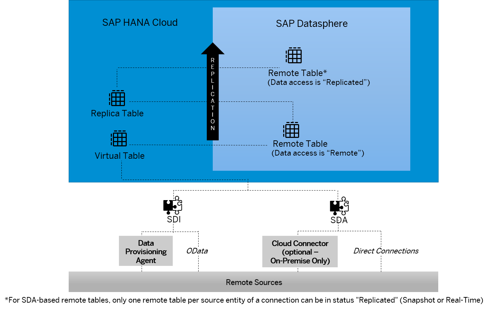

<!-- loio4dd95d7bff1f48b399c8b55dbdd34b9e -->

<link rel="stylesheet" type="text/css" href="../css/sap-icons.css"/>

# Replicating Data and Monitoring Remote Tables

In the *Remote Tables* monitor, you can find a remote table monitor per space. Here, you can copy data from remote tables that have been deployed in your space into SAP Datasphere, and you can monitor the replication of the data. You can copy or schedule copying the full set of data from the source, or you can set up replication of data changes in real-time via change data capturing \(CDC\).

The monitor shows the remote tables that have already been deployed in your space. Also, it only shows remote tables for connections that have been created within your space.

SAP Datasphere is using two types of adaptors to connect to remote tables:

-   SAP HANA smart data integration \(used in connections with *Data Provisioning* option = *Data Provisioning Agent*\)

-   SAP HANA smart data access adaptors \(used in connections with no *Data Provisioning* option or *Data Provisioning* option = *Cloud Connection*\)

For more information on these adapters, see [Connecting SAP HANA Cloud, SAP HANA Database to Remote Data Sources](https://help.sap.com/docs/HANA_CLOUD/db19c7071e5f4101837e23f06e576495/afa3769a2ecb407695908cfb4e3a9463.html).

Initially, by default, when a remote table is deployed, the data is directly accessed live from the source and no data is stored in SAP Datasphere.

For connection types that support replication, you can set up data replication to improve performance when accessing the data.

The *Data Access* property of a remote table shows you whether data is accessed directly from the source or whether data is replicated.

When replicating data, you can select:

-   *Start Data Replication* 

    It copies the full set of data from your source object \(usually a database table or view\) into SAP Datasphere.

-   *Enable Real-Time Data Replication*

    Real-time replication is only availabe for connection types and source objects that support copying data changes in real-time into SAP Datasphere via change data capturing \(CDC\). Examples are database connections such as SAP HANA, Microsoft SQL Server, or Oracle, supporting real-time replication for tables after the data has been updated in the source. With schedules, you can copy the full set of data from your source recurrently and asynchronously in the background.

> ### Note:  
> Parallel execution is not supported. You can't perform two similar tasks at the same time and therefore you need to wait until the currently running task is completed before launching a new identical task. For example, if you want to start a data replication, but another task is already replicating data from the same table, then you will get a notification and your task will fail.

The *Frequency* property of a remote table shows you whether or not data for a remote table is replicated and if yes, at what frequency the replication takes place. Replicated data is stored in a replica table.

For more information on which connection types support data replication \(direct or scheduled replication\) and real-time replication, see [Integrating Data via Connections](../Integrating-Data-Via-Connections/integrating-data-via-connections-eb85e15.md).

As long as the prerequisites are met, you can switch between directly accessing the data from the source \(remote\), or accessing to replicated data \(data replication in real-time or in direct or schedule mode\), according to your needs.

The interactive graphic below summarizes how data is replicated:

### Remote Table \(Replicated\):

Data is copied into SAP Datasphere and is read from the replica table:

-   For data replication, replicated means that data is read from the replica table but not expected to be updated in real-time. To get your data updated, you must start a direct data replication or create a schedule to plan regular replication.
-   For real-time replication, replicated means that data is read from the replica table and expected to be updated in real-time.

### Remote table \(Remote\)

Data is not accessed locally in SAP Datasphere. It’s read from a virtual table, which accesses the data directly from the source via the adaptors. Remote tables are created from the *Data Builder*.

For more information, see [Import Remote Tables](https://help.sap.com/viewer/24f836070a704022a40c15442163e5cf/DEV_CURRENT/en-US/fd04efbac29c44fb8cfeaf2166b3d882.html "Import remote tables from a connection into your space directly from the Data Builder start page or the Repository Explorer.") :arrow_upper_right:.

### Replica table

Remote data is read from these replica tables once the data access is replicated. For remote tables connected via SAP HANA smart data access, only one remote table per source entity of a connection can be in status "Replicated" \(direct or scheduled replication, or real-time replication\).

### Virtual Table

Virtual tables enable you to access objects in other databases, without having to replicate in SAP HANA.

For more information, see [Create Virtual tables](https://help.sap.com/docs/HANA_CLOUD_DATABASE/b9902c314aef4afb8f7a29bf8c5b37b3/00340d4ede0a43ceb0a67f36bbc46a3a.html?q=virtual%20table)

### Replication

Start a data replication to improve performance when accessing the data. For connection types that support replication, you can run a data replication to improve performance when accessing the data. You can replicate data via a direct data replication, real-time replication, or you can schedule your replication tasks. You can also partitions your data loads.

For more information, see [Integrating Data via Connections](../Integrating-Data-Via-Connections/integrating-data-via-connections-eb85e15.md) and [Scheduling Data Integration Tasks](scheduling-data-integration-tasks-7fa0762.md).

From the Data Builder, you can also restrict data loads to reduce the volume of data loaded in your remote table.

For more information, see [Restrict Remote Table Data Loads](https://help.sap.com/viewer/24f836070a704022a40c15442163e5cf/DEV_CURRENT/en-US/bd1ece5c9f78444c87708ef11eed0a31.html "Remove unnecessary columns, create filters or add columns to reduce the volume of data that is loaded in your remote table.") :arrow_upper_right:.

### SAP HANA smart data integration/SAP HANA smart data access

SAP HANA smart data access and SAP HANA smart data integration allow you to access remote data through virtual tables without copying the data into SAP HANA.

For more information, see [Connecting SAP HANA Cloud, SAP HANA database to Remote Data Sources](https://help.sap.com/docs/HANA_CLOUD/db19c7071e5f4101837e23f06e576495/afa3769a2ecb407695908cfb4e3a9463.html).

### DP Agent

The Data Provisioning Agent is a lightweight component running outside the SAP Datasphere environment. It hosts data provisioning adapters for connectivity to remote sources, enabling data federation and replication scenarios. The Data Provisioning Agent acts as a gateway to SAP Datasphere, providing secure connectivity between the database of your SAP Datasphere tenant and the adapter-based remote sources.

For more information, see [Preparing Data Provisioning Agent Connectivity](https://help.sap.com/viewer/935116dd7c324355803d4b85809cec97/DEV_CURRENT/en-US/f1a39d1a763e48c8872f45c110a5a4e2.html "Most connection types supporting remote tables use SAP HANA Smart Data Integration (SDI) and its Data Provisioning Agent. Before using the connection, the agent requires an appropriate setup.") :arrow_upper_right:

### Odata

SAP OData is a standard Web protocol used for querying and updating data present in SAP using ABAP, applying and building on Web technologies such as HTTP to provide access to information from a variety of external applications, platforms, and devices. To be able to successfully validate and use a connection to an OData service for remote tables, you need to configure some properties.

For more information, see [Generic OData Connections](../Integrating-Data-Via-Connections/generic-odata-connections-5d36f1a.md).

### Cloud Connector

The SAP Cloud Connector provides a secure tunnel between SAP Datasphere and on-premise systems. You need to set up and configure Cloud Connector before creating a connection to an on-premise source that you want to use for remote tables via SAP HANA smart data integration.

For more information, see [Configure Cloud Connector](https://help.sap.com/viewer/935116dd7c324355803d4b85809cec97/DEV_CURRENT/en-US/f289920243a34127b0c8b13012a1a4b5.html "Configure Cloud Connector before connecting to on-premise sources and using them in various use cases. In the Cloud Connector administation, connect the SAP Datasphere subaccount to your Cloud Connector, add a mapping to each relevant source system in your network, and specify accessible resources for each source system.") :arrow_upper_right:.

### Direct Connection

Some connections, don’t need extra connector \(for example Amazon Athena, Google Big Query, etc.\).

### Remote Sources

You can connect several data sources to SAP Datasphere that support remote table functionality.

For more information, see [Integrating Data via Connections](../Integrating-Data-Via-Connections/integrating-data-via-connections-eb85e15.md)

<a name="loio4dd95d7bff1f48b399c8b55dbdd34b9e__section_yyz_jbz_tjb"/>

## Monitoring Remote Tables

In the monitor, for all the remote tables that have been previously deployed in your space, you can see how the data is accessed, remotely from the source or replicated. For replicated data, the frequency shows how you are replicating your data: in real-time, using a schedule \(scheduled\) or on-demand \(none\) to capture your data changes. You monitor the size and replication status of the tables and you can see when the latest replication for a remote table took place.

<table>
<tr>
<th valign="top">

Column

</th>
<th valign="top">

Information

</th>
</tr>
<tr>
<td valign="top">

*Connection \(Business Name\) or Connection \(Technical Name* 

</td>
<td valign="top">

Displays the name of the connection the remote table belongs to. Technical or Business Name is displayed, depending on how you have configured your UI settings in *Your Profile* \> *Settings* 

</td>
</tr>
<tr>
<td valign="top">

*Technical Name \(or Business Name\)* 

</td>
<td valign="top">

Displays the name of the remote table. Technical or Business Name is displayed, depending on how you have configured your UI settings in *Your Profile* \> *Settings* 

</td>
</tr>
<tr>
<td valign="top">

*Data Access* 

</td>
<td valign="top">

Displays how data is currently accessed.

-   *Remote*: Data is accessed directly from the source \(federation\) and read from the virtual table.
-   *Replicated*: Data is copied in SAP Datasphere and is read from the replica table.
    -   *Replicated \(Snapshot\)*: The data is read from the replica table but is not expected to be updated in real-time. You can create a schedule to refresh the data regularly.
    -   *Replicated \(Real-Time\)*: The data is read from the replica table and expected to be updated in real-time.

</td>
</tr>
<tr>
<td valign="top">

*Frequency* 

</td>
<td valign="top">

Displays how often data is replicated. The value here shows the intended frequency that might have not been reached yet depending on the status of the remote table.

-   *–-*: Refresh frequency doesn't apply.
-   *None*: There is no schedule defined for this table.
-   *Scheduled*: A schedule is defined for this table.
-   *Real-Time*: Real-time replication has been set up for the remote table.
-   *Paused*: Data refresh is paused.

</td>
</tr>
<tr>
<td valign="top">

*Status* 

</td>
<td valign="top">

Displays the current status of the remote table.

-   *\---*: Initial state

-   *Loading*: Started to load a new snapshot

-   *Available*: Snapshot has been loaded and is available in the replica table

-   *Initializing*: Started to enable real-time data replication

-   *Active*: Data is replicated and updated in real-time

-   *Error*: Failed to load a new snapshot, or failed to enable real-time data replication, or data is replicated in real-time but remote exceptions occurred

-   *Paused*: Real-time replication is paused

-   *Disconnected*: SAP HANA smart data integration Data Provisioning Agent got disconnected

    For information about how to connect the agent, see [Connect and Configure the Data Provisioning Agent](https://help.sap.com/viewer/935116dd7c324355803d4b85809cec97/DEV_CURRENT/en-US/e87952d7c656477cb5558e5c2f44ae9c.html "Connect the Data Provisioning Agent to the SAP HANA database of SAP Datasphere. This includes configuring the agent and setting the user credentials in the agent.") :arrow_upper_right:.

</td>
</tr>
<tr>
<td valign="top">

*Latest Update* 

</td>
<td valign="top">

Displays when the data was last successfully updated in SAP Datasphere. 

</td>
</tr>
<tr>
<td valign="top">

*Latest Change \(Source\)* 

</td>
<td valign="top">

\(For remote tables connected with SAP HANA smart data integration in real-time replication only\). Displays the date and time when the data has been last updated in the source system. It can take up to 5 minutes to show the information in SAP Datasphere after the source has been updated.

> ### Note:  
> If the *Latest Change \(Source\)* column shows a significantly lower value than the *Latest Update* column, it is very likely that there is an overload situation in transferring changes from the source to SAP Datasphere. In that case, refer to the documentation[Best Practices and Sizing Guide for Smart Data Integration when used in SAP Data Warehouse Cloud](https://www.sap.com/documents/2022/06/008491bc-317e-0010-bca6-c68f7e60039b.html) 

</td>
</tr>
<tr>
<td valign="top">

*Number of Records* 

</td>
<td valign="top">

Displays the number of records replicated into SAP Datasphere. You can then compare this number with the number of records stored in the source system, and identify errors in your data replication.

</td>
</tr>
<tr>
<td valign="top">

*New Run* 

</td>
<td valign="top">

Displays the next scheduled run \(if a schedule is set for the remote table\).

</td>
</tr>
<tr>
<td valign="top">

*Memory Used for Storage \(MiB\)* 

</td>
<td valign="top">

Displays the size occupied by the remote table data in memory.

</td>
</tr>
<tr>
<td valign="top">

*Disk Used for Storage \(MiB\)* 

</td>
<td valign="top">

Displays the size occupied by the remote table data on disk.

</td>
</tr>
<tr>
<td valign="top">

*Schedule Owner* 

</td>
<td valign="top">

Displays the name of the current schedule owners.

</td>
</tr>
</table>

You can personalize the columns you want to display clicking on :gear:

<a name="loio4dd95d7bff1f48b399c8b55dbdd34b9e__section_flz_nlm_h4b"/>

## Actions in the *Remote Tables*

Depending on the combination of values in the *Data Access*, *Frequency* and *Status* columns, from the *Remote Tables* monitor, you can perform the following actions on remote tables:

<table>
<tr>
<th valign="top">

Action

</th>
<th valign="top">

Description

</th>
</tr>
<tr>
<td valign="top">

*Start Data Replication* 

</td>
<td valign="top">

Directly start a copy of the full set of data from the source in the background.

> ### Note:  
> If you start data replication on a remote table whose data access is Replicated \(Real-time\), you’ll remove the real-time replication for this table. Your data will no longer be updated in real-time and you’ll have to start a new data replication or create a schedule to get your data updated.

For more information, see [Replicate Full Set of Data](replicate-full-set-of-data-35632cd.md).

</td>
</tr>
<tr>
<td valign="top">

*Remove Replicated Data* 

</td>
<td valign="top">

Stop replication and delete data from replica table.

> ### Note:  
> If you need to remove the replicated data for a remote table whose data access is *Replicated \(Real-time\)*, you must ensure that the following requirements are met to allow a proper deletion:
> 
> -   The data provisioning agent is not disconnected.
> -   The real-time replication is not paused at connection level and is working properly.
> 
> If one of the requirement is not met, some objects won't be deleted and you'll have to delete them manually. See [3307334](https://me.sap.com/notes/3307334) for more information.

</td>
</tr>
<tr>
<td valign="top">

*Enable Real-Time Data Replication* 

</td>
<td valign="top">

Start replication of data changes in the source in real-time.

> ### Note:  
> When enabling the replication in real-time, the data is updated in real-time. You don’t need to start a new data replication or to create a schedule to update your data

For more information, see [Replicate Data Changes in Real-Time](replicate-data-changes-in-real-time-441d327.md).

</td>
</tr>
<tr>
<td valign="top">

*Disable Real-Time Data Replication*

</td>
<td valign="top">

Disable real-time data replication even if your source system is unreachable and switch the data access from *Replicated \(Real-time\)* to *Replicated \(snapshot\)*. It preserves the replica table and its replicated data to allow further actions on the remote table such as deleting or changing the properties of the connection. For more information, see [Disabling Real-Time Data Replication](disabling-real-time-data-replication-82380e6.md).

> ### Note:  
> The remote table must be connected via SAP HANA smart data integration, and must not be connected via SAP HANA smart data access.

</td>
</tr>
<tr>
<td valign="top">

*Create Schedule* 

</td>
<td valign="top">

Create a schedule to start a data replication in the background according to the settings defined in the schedule.

> ### Note:  
> If you create a schedule for a remote table whose data access is *Replicated \(Real-time\)*, the replication type will change from real-time replication to batch replication at the next run of the schedule. The data will no longer be updated in real-time

For more information, see [Scheduling Data Integration Tasks](scheduling-data-integration-tasks-7fa0762.md).

</td>
</tr>
<tr>
<td valign="top">

*Edit Schedule* 

</td>
<td valign="top">

Change how the schedule is specified, or change the owner of the schedule.

For more information, see [Take Over the Ownership of a Schedule](take-over-the-ownership-of-a-schedule-4b660c0.md).

</td>
</tr>
<tr>
<td valign="top">

*Delete Schedule* 

</td>
<td valign="top">

Delete the schedule if required.

</td>
</tr>
<tr>
<td valign="top">

*Assign Schedule To Me* 

</td>
<td valign="top">

Take the ownership of the schedule.

For more information, see .[Take Over the Ownership of a Schedule](take-over-the-ownership-of-a-schedule-4b660c0.md).

</td>
</tr>
<tr>
<td valign="top">

*Pause Schedule* 

</td>
<td valign="top">

Pause the scheduled task.

For more information, see [Pause or Resume a Scheduled Task](pause-or-resume-a-scheduled-task-5eb55cb.md).

</td>
</tr>
<tr>
<td valign="top">

*Resume Schedule* 

</td>
<td valign="top">

Resume the scheduled task that was previously paused.

</td>
</tr>
</table>

> ### Note:  
> You can select several remote tables to group actions whenever it's applicable:
> 
> -   *Schedule* data replication: You can delete, pause or resume schedules for several remote tables that have schedules defined. You can also assign several schedules to your name and become the owner of the schedules.
> -   *Remove Replicated Data*: You can select several remote tables that have replicated data available and remove the replicated data for all of them.
> -   Many actions like *Start Data Replication*, *Remove Replicated Data*, *Create Schedule*, etc. cannot be grouped. In such cases, they are disabled.
> 
> After triggering a group of actions, the status of each action is displayed in the notification area. As these operations run in an asynchronous mode, the status will not be updated automatically, and you need to manually *Refresh* the page to get the updated status.

<a name="loio4dd95d7bff1f48b399c8b55dbdd34b9e__section_v1r_znl_htb"/>

## Other Actions on Remote Tables \(connected via SAP HANA Smart Data Integration/SAP HANA Smart Data Access\)

Other actions are available on remote tables, but behavior depends on how your remote table is connected \(via SAP HANA smart data access or SAP HANA smart data integration\):

<table>
<tr>
<th valign="top">

Actions

</th>
<th valign="top">

Remote Tables via SAP HANA Smart Data Access

</th>
<th valign="top">

Remote Tables via SAP HANA Smart Data Integration

</th>
<th valign="top">

Comments

</th>
</tr>
<tr>
<td valign="top">

Filtering data loads

</td>
<td valign="top">

Supported but with restrictions depending on data type and adapter used.

</td>
<td valign="top">

Supported but with restrictions depending on data type and adapter used.

</td>
<td valign="top">

Action to be done from the  \(*Data Builder*\). For more information, see [Restrict Remote Table Data Loads](https://help.sap.com/viewer/24f836070a704022a40c15442163e5cf/DEV_CURRENT/en-US/bd1ece5c9f78444c87708ef11eed0a31.html "Remove unnecessary columns, create filters or add columns to reduce the volume of data that is loaded in your remote table.") :arrow_upper_right:

</td>
</tr>
<tr>
<td valign="top">

Exclude column when loading data

</td>
<td valign="top">

Supported

</td>
<td valign="top">

Supported

</td>
<td valign="top">

Action to be done from the  \(*Data Builder*\). For more information, see [Restrict Remote Table Data Loads](https://help.sap.com/viewer/24f836070a704022a40c15442163e5cf/DEV_CURRENT/en-US/bd1ece5c9f78444c87708ef11eed0a31.html "Remove unnecessary columns, create filters or add columns to reduce the volume of data that is loaded in your remote table.") :arrow_upper_right:

</td>
</tr>
<tr>
<td valign="top">

Refresh Remote Table Definition

</td>
<td valign="top">

Supported with some connections.

</td>
<td valign="top">

Supported.

</td>
<td valign="top">

Action to be done from the  \(*Data Builder*\). For more information, see [Process Source Changes in the Table Editor](https://help.sap.com/viewer/24f836070a704022a40c15442163e5cf/DEV_CURRENT/en-US/622328b59afa40fd810b44ac84d6afd3.html "Identify available table structure updates in your data sources and resolve conflicting errors resulting from these updates. This operation applies to any remote tables as well as local tables from an Open SQL Schema.") :arrow_upper_right:

</td>
</tr>
<tr>
<td valign="top">

Partitioning data loads

</td>
<td valign="top">

Partitioning on key columns only and for snapshot replication only \(no real-time\)

</td>
<td valign="top">

Partitioning on key and non-key columns with certain restrictions depending on data type and adapter used.

</td>
<td valign="top">

Action to be done from *Remote Tables* monitor details screen. For more information, see [Partitioning Remote Table Data Loads](partitioning-remote-table-data-loads-a218d27.md)

</td>
</tr>
<tr>
<td valign="top">

Statistics

</td>
<td valign="top">

Supported

</td>
<td valign="top">

Supported except for remote tables connected via an SAP HANA smart data integration CDI or an SAP HANA smart data integration ABAP adapters

</td>
<td valign="top">

Action to be done from *Remote Table Statistics* monitor.For more information, see [Creating Statistics for Your Remote Tables](creating-statistics-for-your-remote-tables-e4120bb.md).

</td>
</tr>
</table>

### Replicating Remote Tables Connected via SAP HANA Smart Data Access

For remote tables connected via SAP HANA smart data access, only one remote table per remote object can have data access *Replicated*.

> ### Example:  
> Example 1: Several remote tables \(A, B, and C\) are pointing to the same source object but none of the remote tables is replicated:
> 
> -   You are allowed to replicate only one remote table in this group. For example, you replicate remote table B.
> -   After the replication \(or the scheduling\) is triggered on this remote table B, the replication and the scheduling of the other remote tables \(A and C\) are disabled. Remote tables A and C will have to use the replicated data of the replicated remote table \(B\), or you must remove the schedule and replicated data of the remote table B to allow scheduling and replication of the remote table A or C.

> ### Example:  
> Example 2: Several remote tables \(A, B, and C\) are pointing to the same source object and one remote table \(A\) is replicated \(or is scheduled to do so\):
> 
> -   On remote table A, normal replication and scheduling actions are enabled, depending if it is replicated and/or scheduled.
> -   The replication and the scheduling of the other remote tables \(B and C\) are disabled. Remote tables B and C will have to use the replicated data of the replicated remote table \(A\), or you must remove the schedule and replicated data of the remote table A to allow scheduling and replication of the remote table B or C.

<a name="loio4dd95d7bff1f48b399c8b55dbdd34b9e__section_j3n_mkl_cmb"/>

## Repairing a Load

If the replication status shows an error for snapshot or real-time replication, you can repair the load.

1.  Select the remote table and choose *Data Replication* \> *Remove Replicated Data*.

2.  Select the remote table and choose *Data Replication* \> *Start Data Replication* or *Data Replication* \> *Enable Real-Time Data Replication*.

<a name="loio4dd95d7bff1f48b399c8b55dbdd34b9e__section_ybh_gts_vqb"/>

## Canceling a Run

If you need to cancel a running snapshot replication or an initialization task \(for example if the replication or initialization takes long\) you can click the *Cancel Run* button available in the *Remote Tables* Details screen:

1.  From the *Remote Tables* , Click  of the remote table you need to cancel the run.
2.  Click *Cancel Run*.

    > ### Note:  
    > A replication task consists of several steps that include exchanges with SAP HANA. Therefore, you might get different status while clicking *Cancel Run*, depending where you are in the processing steps.

As a consequence, the replication status of your remote table turns into *Failed*, and a cancel replication task starts.

> ### Note:  
> If replica data already exists from a previous run, the remote table continues to use it after the run is canceled.

