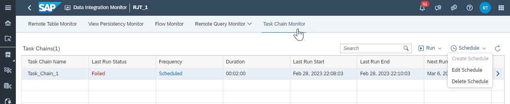
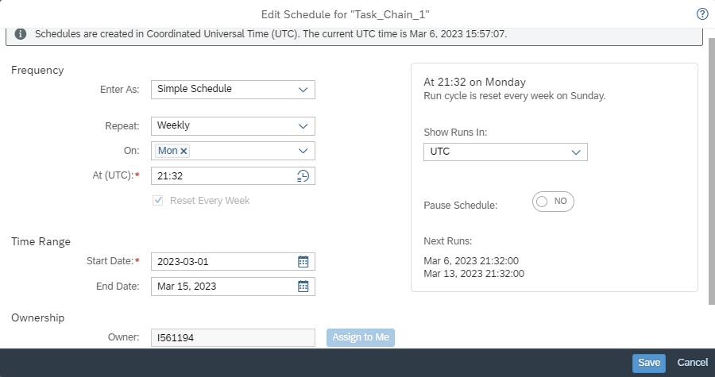

<!-- loio5eb55cbcaa8241f5a488d16036e78e15 -->

# Suspend or Pause a Scheduled Task

Using options available for creating, editing, and removing task scheduling, you can suspend or pause previously scheduled data integration tasks such as remote table replication, persisting views, data flow or task chain execution.

After previously scheduling a task, you can select the *Schedule* \> *Edit Schedule* option for a specific task, to temporarily suspend or pause the next schedule run of that task, as well as any of its future scheduled runs.

For example, for task chains, the scheduling options appear similar to the following:

> ### Note:  
> For remote table replication, scheduling options are available from the *Schedule Replication* menu. You also have the option with all tasks, to pause or postpone execution of a task when initially creating a schedule.

Choosing the *Edit Schedule* option opens the Edit Schedule dialog:

To suspend or pause the scheduled task, toggle the *Pause Schedule* switch from *No* to *Yes*. Then, click *Save*.

Now, when you return to the task display, the Frequency column displays *Paused* for the selected task, and the Next Run column is cleared of any future scheduled runs. The defined schedule for future scheduled runs is still saved, however, so you can simply go back later to the Edit Schedule dialog and toggle the *Pause Schedule* switch back again to *No*, and future scheduled task runs will be enabled again.

