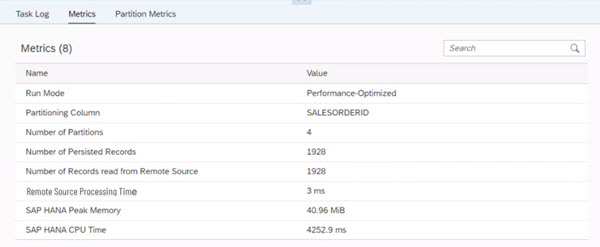
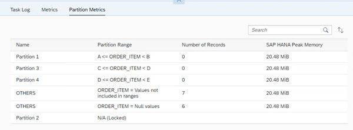

<!-- loiod65994c3611946c19c2634e1a6c0a7ad -->

<link rel="stylesheet" type="text/css" href="../css/sap-icons.css"/>

# Understanding the Data Persistence Metrics

Check the data persistence metrics to decide on design change to prevent performance issues

> ### Note:  
> The data persistence task has run successfully.

Administrators or data integrators want to analyze metrics information for a persisted view. The information can be used to manually schedule data persistence tasks so that peaks memory can be avoided, or quicky identify overload memory situations and decide on design change to prevent such situations, for example.

When your data persistence task has completed successfully, in the run details of the data persistence task, you can see additional tabs: *Metrics* and *Partitions Metrics* \(if you have defined partitions to persist your view data\).

<a name="loiod65994c3611946c19c2634e1a6c0a7ad__section_k3p_2xf_cbc"/>

## The Metrics Tab

The *Metrics* tab displays information for the persisted view:

<table>
<tr>
<th valign="top">

Metrics Name

</th>
<th valign="top">

Description

</th>
</tr>
<tr>
<td valign="top">

*Number of Persisted Records* 

</td>
<td valign="top">

Displays the number of records persisted for the view.

</td>
</tr>
<tr>
<td valign="top">

*Number of Records Read From Remote Sources* 

</td>
<td valign="top">

Displays the number of records read from the remote source.

</td>
</tr>
<tr>
<td valign="top">

*Remote Sources Processing Time* 

</td>
<td valign="top">

Displays the time \(in seconds\) spent reading data from the remote sources.

</td>
</tr>
<tr>
<td valign="top">

*SAP HANA Peak Memory* 

</td>
<td valign="top">

Displays the maximum amount of memory \(in MiB\) the task to persist view data has used during the runtime in SAP HANA.

> ### Note:  
> You can see this information if the option *Enable Expensive Statement Tracing* is enabled, and if the task exceeds the thresholds specified in  \(Configuration\) → *Monitoring*. Otherwise, no number is displayed.

For more information, see [Monitoring SAP Datasphere](https://help.sap.com/viewer/935116dd7c324355803d4b85809cec97/DEV_CURRENT/en-US/28910cded17a42a0bf16225309cb8bf6.html "Administrators have access to various monitoring logs and views, and can create database analysis users, if necessary, to help troubleshoot issues.") :arrow_upper_right:.

</td>
</tr>
<tr>
<td valign="top">

*SAP HANA Total CPU Time* 

</td>
<td valign="top">

Displays the amount of CPU time \(in ms\) the task to persist view data has used in SAP HANA.

> ### Note:  
> You can see this information if the option *Enable Expensive Statement Tracing* is enabled, and if the task exceeds the thresholds specified in  \(Configuration\) → *Monitoring*. Otherwise, no number is displayed.

For more information, see [Monitoring SAP Datasphere](https://help.sap.com/viewer/935116dd7c324355803d4b85809cec97/DEV_CURRENT/en-US/28910cded17a42a0bf16225309cb8bf6.html "Administrators have access to various monitoring logs and views, and can create database analysis users, if necessary, to help troubleshoot issues.") :arrow_upper_right:.

</td>
</tr>
<tr>
<td valign="top">

*Used Storage* 

</td>
<td valign="top">

Displays how much size \(in MiB\) the view is using in your memory.

</td>
</tr>
<tr>
<td valign="top">

*Number of Partitions* 

</td>
<td valign="top">

Displays how many partitions have been defined for this view.

For more information, see [Creating Partitions for Your Persisted Views](creating-partitions-for-your-persisted-views-9b1b595.md).

</td>
</tr>
<tr>
<td valign="top">

*Number of Locked Partitions* 

</td>
<td valign="top">

Displays how many partitions have been locked for this persisted view.

> ### Note:  
> Locked partitions are not updated and metrics related to these partitions will take the value N/A in the *Partition Metrics* tab.

For more information, see [Creating Partitions for Your Persisted Views](creating-partitions-for-your-persisted-views-9b1b595.md).

</td>
</tr>
<tr>
<td valign="top">

*Run Mode* 

</td>
<td valign="top">

Displays the run mode used to persist your view data: performance-optimized or memory-optimized.

For more information, see [Data Persistence and Run Mode](data-persistence-and-run-mode-d04f5dd.md)

</td>
</tr>
</table>

<a name="loiod65994c3611946c19c2634e1a6c0a7ad__section_bk1_d3g_cbc"/>

## The Partition Metrics Tab

The *Partition Metrics* tab displays the metrics for each defined partitions of the persisted view:

<table>
<tr>
<th valign="top">

Partition Metrics Name

</th>
<th valign="top">

Description

</th>
</tr>
<tr>
<td valign="top">

*Name* 

</td>
<td valign="top">

Displays the name of the partition.

</td>
</tr>
<tr>
<td valign="top">

*Partition Range* 

</td>
<td valign="top">

Display the partition range for this partition as defined during creation.

> ### Note:  
> OTHERS partitions can contain NULL value or values not included in the defined ranges.

For more information, see [Creating Partitions for Your Persisted Views](creating-partitions-for-your-persisted-views-9b1b595.md).

</td>
</tr>
<tr>
<td valign="top">

*Number of records* 

</td>
<td valign="top">

Displays the number of records persisted with the partition.

</td>
</tr>
<tr>
<td valign="top">

*SAP HANA Peak Memory* 

</td>
<td valign="top">

Displays the maximum amount of memory \(in MiB\) the task to persist view data for this partition range has used during the runtime in SAP HANA.

> ### Note:  
> You can see this information if the option *Enable Expensive Statement Tracing* is enabled, and if the task exceeds the thresholds specified in  \(Configuration\) → *Monitoring*. Otherwise, no number is displayed.

For more information, see [Monitoring SAP Datasphere](https://help.sap.com/viewer/935116dd7c324355803d4b85809cec97/DEV_CURRENT/en-US/28910cded17a42a0bf16225309cb8bf6.html "Administrators have access to various monitoring logs and views, and can create database analysis users, if necessary, to help troubleshoot issues.") :arrow_upper_right:.

</td>
</tr>
</table>

