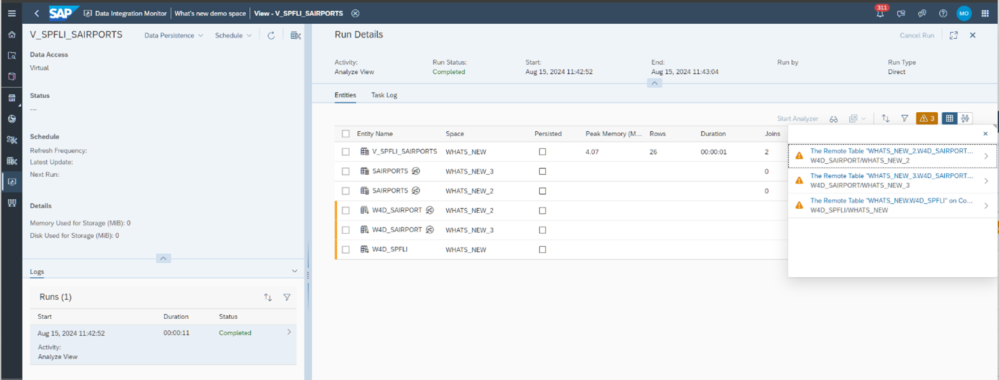
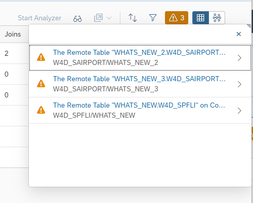
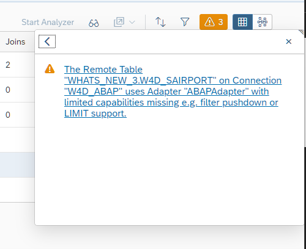
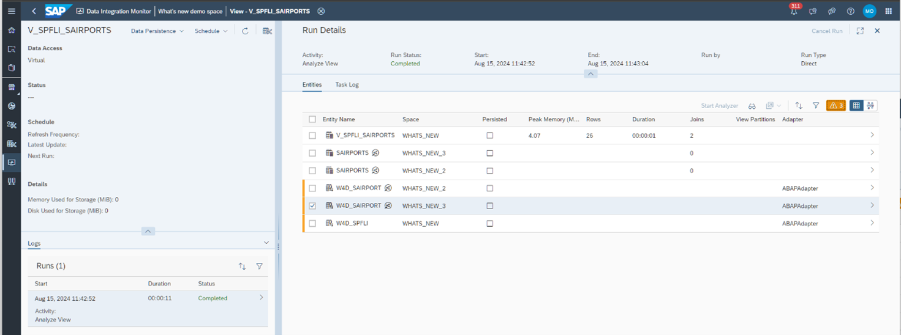

<!-- loio8337d8d84c0942328e44984cbd09ecf9 -->

# Warning Notifications

The entities results list show the name of the entity and the space that it resides in. The orange bar on the left side of the table signifies any entities that have warnings. The warnings icon in the task bar opens a popover that will provide more information about entities with warnings.

Expand a single text with the navigation icon "\>"

Click on this and it will take you to the relevant entity in the list.

