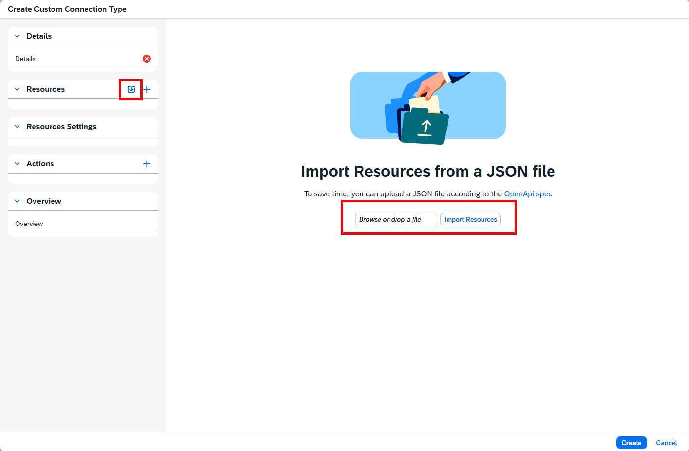

<!-- loiof22b2588d8fc453883ae303e685965c9 -->

<link rel="stylesheet" type="text/css" href="../css/sap-icons.css"/>

# Define Resources

Define the resources for your custom connection type, which represent the API endpoints you want to consume.

## Context

For each endpoint you want to consume, you need to define the path, request parameters and response schemas. The method is predefined to GET and cannot be changed.

Multiple response schemas can be defined per resource. The root of the response schema can be defined as either an object or an array of objects. You can add attributes to the response schema manually, or you can copy and paste the response schema from a JSON file. You can optionally add validation to each response schema attribute based on predefined formats or allowed values of your choice.

The response schema defines the structure of the returned data and determines how data is interpreted and ingested.

There are two ways to define resources for a custom connection type:

-   By importing a resource from a JSON file. The file format should be based on the OpenAPI standard.

    

    > ### Restriction:  
    > This option only works if you haven't yet defined any resources for this custom connection type.

-   By creating the resource manually, as described in the following procedure.

## Procedure

1.  To add a resource manually, in the *Resources* section of the custom connection type dialog click  \(Add another entity\).

2.  Under *Resource Details*, enter the path for your endpoint, and optionally, a description. The method is predefined to GET and cannot be changed.

3.  Under *Request Parameters*, click *New Parameter* to define the request parameter names, where they're passed in the request \(query, header, or cookie\), and whether or not each parameter is required.

    Request parameters can be populated with dynamic values at runtime when configuring an action. For more information about supported placeholders, see [Use Dynamic Placeholders in Request Parameter Values](use-dynamic-placeholders-in-request-parameter-values-1e05f83.md).

    > ### Note:  
    > You can also add request parameters to the path you enter in the *Resource Details*. To do so, specify a placeholder in the format <code>{<i class="varname">&lt;parameter&gt;</i>}</code>.
    > 
    > If you, for example, enter the path <code>/my/path/{<i class="varname">&lt;parameter&gt;</i>}</code> in the *Resource Details*, the system automatically adds a required path parameter with the *<parameter\>* name under *Request Parameters*.

4.  Under *Response Schemas*, click *New Schema* to add a response schema.

5.  Enter a name for your response schema.

6.  Select the schema root type: *Object* if the schema root is an object or *Object Array* if the schema root is an array of objects.

7.  You can define the structure of your schema in two ways:

    -   Manually, by selecting *Create Node* in the *Tree* view.
    -   By copying and pasting a JSON schema in the *JSON* view.

    > ### Caution:  
    > For schema attributes, you must only use:
    > 
    > -   data types that are supported by local tables \(file\) \(see [Data Types Supported By Local Tables (File)](https://help.sap.com/viewer/c8a54ee704e94e15926551293243fd1d/cloud/en-US/2f39104e5bd847919b8daee1580c4f68.html "Review the list of data types supported by file tables and the partitioning of such tables.") :arrow_upper_right: and [SAP Datasphere Targets for Replication Flows](https://help.sap.com/viewer/c8a54ee704e94e15926551293243fd1d/cloud/en-US/12c45eb2659f4069b29ef4d69bdd9070.html "If you use the local repository (SAP Datasphere) as the target for your replication flow, you need to consider additional specifics and conditions.") :arrow_upper_right: for information about unsupported data types\)
    > -   characters that are supported in target column names of local tables \(file\) \([SAP Datasphere Targets for Replication Flows](https://help.sap.com/viewer/c8a54ee704e94e15926551293243fd1d/cloud/en-US/12c45eb2659f4069b29ef4d69bdd9070.html "If you use the local repository (SAP Datasphere) as the target for your replication flow, you need to consider additional specifics and conditions.") :arrow_upper_right:\)
    > 
    > If you use unsupported characters in column names or unsupported data types, this will result in auto-projection and cause the replication flow to fail.

8.  When adding schema attributes manually, select the type of the attribute \(string, Boolean, object, number or integer\), set it as an array if necessary, and enter a name for the attribute. Optionally, you can add a display name and a description.

    > ### Caution:  
    > When you set an attribute of a type other than object as an array, its data is not replicated.

9.  For schema attributes of type string, you can add validation. To do so, choose the *Validation* tab and set the *Validation* toggle to ON. Choose the validation type:

    -   *By Format* allows you to select one of the predefined formats:

        -   Date: ensures the value is in date format, based on ISO 8601 standards.

        -   Date-Time: ensures the value is in a timestamp format that includes a date and time, based on ISO 8601 standards.

        -   Email: ensures the data is formatted as a valid email address.

        -   Hostname: ensures the data is formatted as a valid internet hostname.

        -   IPv4: ensures the data is formatted as a valid IP address in IPv4 format \(32-bit\).

        -   IPv6: ensures the data is formatted as a valid IP address in IPv6 format \(128-bit\)

        -   Regex: ensures the data conforms with the format defined using a regular expression \(Regex\)

        -   Time: ensures the data is formatted as a timestamp, based on ISO 8601 standards.

        -   URI: ensures the data is formatted as a valid URI.

    -   *By Allowed Values* allows you to manually add the values that may be passed for this attribute. Once one or more values are entered, only these values are allowed to be passed. If no values are entered, no validation is performed and all values for the selected attribute are allowed.

10. To add another response schema for the resource, select *New Schema* and repeat the configuration steps. A resource can contain multiple response schemas.

11. To create a copy of an existing response schema, select the *Duplicate* icon. You can then modify the copied schema without affecting the original schema.

    

