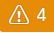

<!-- loioeb85e157ab654152bd68a8714036e463 -->

<link rel="stylesheet" type="text/css" href="../css/sap-icons.css"/>

# Integrating Data via Connections

Users with a space administrator or integrator role can create connections to SAP and non-SAP source systems, including cloud and on-premise systems and partner tools, and to target systems for outbound replication flows. Users with modeler roles can import data via connections for preparation and modeling in SAP Datasphere.

SAP Datasphere delivers predefined connection types where each connection type represents a specific category of remote system, for example SAP S/4HANA Cloud, SAP HANA Cloud, data lake Files, or Google Cloud Storage \(see [Connection Types](connection-types-9456242.md)\).

Each connection type supports:

-   A defined set of properties that applies to the remote system category.

    To connect to a specific remote system, you create a connection based on the corresponding connection type and complete the properties as applicable to your specific remote system and requirements \(see [Create a Connection](create-a-connection-c216584.md)\).

-   A defined set of features in SAP Datasphere \(remote tables, replication flows, data flows, and/or model import\).

    When a feature is enabled in a connection, users with a modeler role can use the connection with the feature, for example to import remote tables from the connected remote system \(see [Features Supported by Connections](features-supported-by-connections-505bf40.md)\).

## Working with Connections

In the  \(*Connections*\) app, you get an overview of all connections created in your space and use the following tools to create and manage connections:

<table>
<tr>
<th valign="top">

Tool

</th>
<th valign="top">

Description

</th>
</tr>
<tr>
<td valign="top">

 \(Add Connection\) ** \> *Create Connection*

</td>
<td valign="top">

Create a connection to allow users assigned to the space to use the connected remote system for data modeling and data access in SAP Datasphere.

For more information, see [Create a Connection](create-a-connection-c216584.md).

</td>
</tr>
<tr>
<td valign="top">

Edit

</td>
<td valign="top">

Select and edit a connection to change its properties. Warnings might indicate that you need to edit a connection.

For more information, see [Edit a Connection](edit-a-connection-ba20892.md).

</td>
</tr>
<tr>
<td valign="top">

Delete

</td>
<td valign="top">

Select and delete one or more connections if they are not used anymore.

For more information, see [Delete a Connection](delete-a-connection-e90c290.md).

</td>
</tr>
<tr>
<td valign="top">

Validate

</td>
<td valign="top">

Select and validate a connection to get detailed status information and make sure that it can be used for data modeling and data access. Always validate a connection after you have created or edited it.

For more information, see [Validate a Connection](validate-a-connection-99bd229.md).

</td>
</tr>
<tr>
<td valign="top">

Pause/Restart

</td>
<td valign="top">

For connections that connect to a remote system through SAP HANA Smart Data Integration and its Data Provisioning Agent, you can pause and restart real-time replication for selected connections, if required.

For more information, see [Pause Real-Time Replication for a Connection](pause-real-time-replication-for-a-connection-a11f244.md).

</td>
</tr>
<tr>
<td valign="top">

 \(Reload Connection List\)

</td>
<td valign="top">

Reload the connections list to include the latest updates into the list.

</td>
</tr>
<tr>
<td valign="top">

 \(Sort Connections\)

</td>
<td valign="top">

Open the *Sort* dialog to control the ordering of the connections list.

By default, the list is sorted by *Business Name*. To sort on a specific column, select a *Sort Order* and a *Sort By* column, and then click *OK* to apply them.

</td>
</tr>
<tr>
<td valign="top">

 \(Filter Connections\)

</td>
<td valign="top">

Select one or more filter values to restrict the connection list according to your needs.

The following filter categories and values are available:

-   *Features* that a connection type supports
    -   *Data Flows*
    -   *Model Import*
    -   *Remote Tables*
    -   *Replication Flows*
    -   *API Tasks*

-   *Categories* that the corresponding source belongs to
    -   *Cloud*
    -   *On-Premise*

-   *Sources* that you would like to connect
    -   *Non-SAP*
    -   *Partner Tools*
    -   *SAP*

</td>
</tr>
<tr>
<td valign="top">

:gear:

</td>
<td valign="top">

Open the *Columns* dialog to control the display of columns in the results table.

Modify the column list in any of the following ways, and then click *OK* to apply your changes:

-   To select a column for display, select its checkbox. To hide a column deselect its checkbox.
-   Click on a column token to highlight it and use the arrow buttons to move it in the list.
-   Click *Reset* to go back to the default column display.

</td>
</tr>
<tr>
<td valign="top">

Search

</td>
<td valign="top">

Enter one or more characters in the *Search* field to restrict the list to connections containing the string.

Search considers the *Technical Name*, *Business Name*, *Real-Time Replication Status*, and *Created By* column.

</td>
</tr>
<tr>
<td valign="top">

\(Warning Messages\)

</td>
<td valign="top">

When there is one or more messages for your connections, a button is displayed specifying the number of warning messages for all connections in the list.

Click the button to open the list of messages. Clicking a message title selects the corresponding connection in the list. Clicking  \(Navigation\) for a message opens a more detailed message containing guidance on how to solve the issue.

In the connections list, connections with warning messages are highlighted in yellow.

</td>
</tr>
</table>

