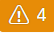

<!-- loioeb85e157ab654152bd68a8714036e463 -->

<link rel="stylesheet" type="text/css" href="../css/sap-icons.css"/>

# Integrating Data via Connections

Users with a space administrator or integrator role can create connections to SAP and non-SAP source systems, including cloud and on-premise systems and partner tools, and to target systems for outbound replication flows. Users with modeler roles can import data via connections for preparation and modeling in SAP Datasphere.

This topic contains the following sections:

-   [Introduction to Connections and Connection Types](integrating-data-via-connections-eb85e15.md#loioeb85e157ab654152bd68a8714036e463__intro)
-   [Working with Connections](integrating-data-via-connections-eb85e15.md#loioeb85e157ab654152bd68a8714036e463__connections)
-   [Working with Custom Connection Types](integrating-data-via-connections-eb85e15.md#loioeb85e157ab654152bd68a8714036e463__connection_types)

<a name="loioeb85e157ab654152bd68a8714036e463__intro"/>

## Introduction to Connections and Connection Types

A connection links a remote data source or target to SAP Datasphere. When you create a connection, you create an instance based on a specific connection type. The connection type serves as a template and determines which configuration settings you need to provide when setting up your connection. SAP Datasphere provides predefined connection types, and you can also create your own custom connection types:

### Predefined, SAP-delivered Connection Types

A predefined, SAP-managed connection type represents a specific category of remote system, for example SAP S/4HANA Cloud, SAP HANA Cloud, data lake Files, or Google Cloud Storage \(see [Connection Types Delivered by SAP](connection-types-delivered-by-sap-9456242.md)\).

Each connection type supports:

-   A defined set of properties that applies to the remote system category.

    To connect to a specific remote system, you create a connection based on the corresponding connection type and complete the properties as applicable to your specific remote system and requirements \(see [Create a Connection](create-a-connection-c216584.md)\).

-   A defined set of integration scenarios in SAP Datasphere, also called features.

    Connection types can support one or more of the following features: replication flows, remote tables, data flows, model import, or API tasks \(see [Features Supported by Connections](features-supported-by-connections-505bf40.md)\).

    When a supported feature is enabled in a connection, users with a modeler role can use the connection with the feature. For example, they can use the connection to replicate data from or to the connected remote system with a replication flow, or to federate data from the connected remote system with remote tables.

You can create connections from predefined connection types in spaces with storage type *SAP HANA Database \(Disk and In-Memory\)* and, if supported by the connection type, in spaces with storage type *SAP HANA Data Lake Files* \(file spaces\).

Connections created from predefined, SAP-managed connection types depend on their connection type and can be updated according to changes in the connection type definition. For example when an additional authentication type is introduced for a connection type to better secure your connections, you can update existing connections to use the new authentication type.

### Custom Connection Types

> ### Note:  
> Custom connection types to connect to REST APIs are not available by default in SAP Datasphere tenants. To enable custom connection types in your tenant, see SAP note [3696110](https://me.sap.com/notes/3696110).

Custom connection types allow you to connect to external REST APIs and load JSON-based data into the SAP Datasphere object store using replication flows \(see [Creating a Custom Connection Type](creating-a-custom-connection-type-9c582ca.md)\).

Custom connection types complement SAP Datasphere-managed connectivity by enabling data replication from REST APIs where standard SAP Datasphere-managed connectivity is either not available \(third-party source systems\) or cannot be provided \(customer-built REST APIs\).

You can create custom connection types and connections based on these connection types in spaces with storage type *SAP HANA Data Lake Files* \(file spaces\).

When creating a connection from a custom connection type, the custom connection type only serves as a template. Upon saving the connection, the connection is decoupled and completely independent from the custom connection type used to create it. Any later changes in a custom connection type are not reflected in existing connections created from this connection type.

<a name="loioeb85e157ab654152bd68a8714036e463__connections"/>

## Working with Connections

In the  \(*Connections*\) app on the *Connections* tab, you get an overview of all connections created in your space and use the tools listed below to create and manage connections.

<table>
<tr>
<th valign="top">

Tool

</th>
<th valign="top">

Description

</th>
</tr>
<tr>
<td valign="top">

 \(Add Connection\) ** \> *Create Connection*

</td>
<td valign="top">

Create a connection to allow users assigned to the space to use the connected remote system for data modeling and data access in SAP Datasphere.

For more information about creating connections based on SAP-managed connection types, see [Create a Connection](create-a-connection-c216584.md).

For more information about creating connections based on custom connection types in file spaces, see [Create a Connection from a Custom Connection Type](create-a-connection-from-a-custom-connection-type-d0653d3.md).

</td>
</tr>
<tr>
<td valign="top">

Edit

</td>
<td valign="top">

Select and edit a connection to change its properties. Warnings might indicate that you need to edit a connection.

For more information, see [Edit a Connection](edit-a-connection-ba20892.md).

</td>
</tr>
<tr>
<td valign="top">

Delete

</td>
<td valign="top">

Select and delete one or more connections if they are not used anymore.

For more information, see [Delete a Connection](delete-a-connection-e90c290.md).

</td>
</tr>
<tr>
<td valign="top">

Validate

</td>
<td valign="top">

Select and validate a connection to get detailed status information and make sure that it can be used for data modeling and data access. Always validate a connection after you have created or edited it.

For more information, see [Validate a Connection](validate-a-connection-99bd229.md).

> ### Note:  
> Validation is not supported for connections created from custom connection types.

</td>
</tr>
<tr>
<td valign="top">

Pause/Restart

</td>
<td valign="top">

For connections that connect to a remote system through SAP HANA Smart Data Integration and its Data Provisioning Agent, you can pause and restart real-time replication for selected connections, if required.

For more information, see [Pause Real-Time Replication for a Connection Using SAP HANA Smart Data Integration](pause-real-time-replication-for-a-connection-using-sap-hana-smart-data-integrati-a11f244.md).

</td>
</tr>
<tr>
<td valign="top">

 \(Reload Connection List\)

</td>
<td valign="top">

Reload the connections list to include the latest updates into the list.

</td>
</tr>
<tr>
<td valign="top">

 \(Sort Connections\)

</td>
<td valign="top">

Open the *Sort* dialog to control the ordering of the connections list.

By default, the list is sorted by *Business Name*. To sort on a specific column, select a *Sort Order* and a *Sort By* column, and then click *OK* to apply them.

</td>
</tr>
<tr>
<td valign="top">

 \(Filter Connections\)

</td>
<td valign="top">

Select one or more filter values to restrict the connection list according to your needs.

The following filter categories and values are available:

-   *Features* that a connection type supports
    -   *Replication Flows*
    -   *Data Flows* \(in spaces with storage with storage type *SAP HANA Database \(Disk and In-Memory\)*\)
    -   *Model Import* \(in spaces with storage with storage type *SAP HANA Database \(Disk and In-Memory\)*\)
    -   *Remote Tables* \(in spaces with storage with storage type *SAP HANA Database \(Disk and In-Memory\)*\)
    -   *API Tasks* \(in spaces with storage with storage type *SAP HANA Database \(Disk and In-Memory\)*\)

-   *Categories* that the corresponding source belongs to
    -   *Cloud*
    -   *On-Premise*

-   *Sources* that you would like to connect
    -   *SAP*
    -   *Non-SAP*
    -   *REST API* \(custom connection types\)
    -   *Partner Tools* \(in spaces with storage with storage type *SAP HANA Database \(Disk and In-Memory\)*\)

</td>
</tr>
<tr>
<td valign="top">

:gear:

</td>
<td valign="top">

Open the *Columns* dialog to control the display of columns in the results table.

Modify the column list in any of the following ways, and then click *OK* to apply your changes:

-   To select a column for display, select its checkbox. To hide a column deselect its checkbox.
-   Click on a column token to highlight it and use the arrow buttons to move it in the list.
-   Click *Reset* to go back to the default column display.

</td>
</tr>
<tr>
<td valign="top">

Search

</td>
<td valign="top">

Enter one or more characters in the *Search* field to restrict the list to connections containing the string.

Search considers the *Technical Name*, *Business Name*, *Real-Time Replication Status*, and *Created By* column.

</td>
</tr>
<tr>
<td valign="top">

\(Warning Messages\)

</td>
<td valign="top">

When there is one or more messages for your connections, a button is displayed specifying the number of warning or error messages for all connections in the list.

Click the button to open the list of messages. Clicking a message title selects the corresponding connection in the list. Clicking  \(Navigation\) for a message opens a more detailed message containing guidance on how to solve the issue.

In the connections list, connections with warning messages are highlighted in yellow, connections with error messages are highlighted in red.

</td>
</tr>
</table>

In addition to working with connections in the *Connections* app, you can also:

-   Read, list, validate, create, edit, and delete them using the `datasphere` command line interface \(see [Managing Connections via the Command Line](https://help.sap.com/viewer/7e55516989bd4d04a4c461a0e55fefc9/DEV/en-US/8eb811898d1049fbb426339e44a2eb70.html "You can use the datasphere command line interface to read, list, validate, create, edit, and delete connections.") :arrow_upper_right:\).
-   Read, list, validate, create, edit, and delete them using a REST API \(see [Managing Connections via the REST API](managing-connections-via-the-rest-api-5aafe32.md)\).

> ### Note:  
> Connections based on custom connection types are not supported by the SAP Datasphere command line interface or the SAP Datasphere *Connections* API. You cannot list, read, create, edit, delete, or validate these connections via the command line interface or the API.

<a name="loioeb85e157ab654152bd68a8714036e463__connection_types"/>

## Working with Custom Connection Types

In the  \(*Connections*\) app on the *Custom Connection Types* tab, you get an overview of all connection types created in your file space and use the tools listed below to create and manage connection types.

<table>
<tr>
<th valign="top">

Tool

</th>
<th valign="top">

Description

</th>
</tr>
<tr>
<td valign="top">

 \(Add Connection Type\) 

</td>
<td valign="top">

Create a custom connection type to allow users assigned to a SAP Datasphere file space to connect to external REST APIs and load JSON-based data into SAP Datasphere.

For more information, see [Creating a Custom Connection Type](creating-a-custom-connection-type-9c582ca.md).

</td>
</tr>
<tr>
<td valign="top">

Edit

</td>
<td valign="top">

Select and edit a custom connection type.

When you edit a custom connection type, existing connection instances based on it remain unchanged. Changes are not applied retroactively.

For more information, see [Edit a Custom Connection Type](edit-a-custom-connection-type-80d8b8a.md).

</td>
</tr>
<tr>
<td valign="top">

Delete

</td>
<td valign="top">

Select and delete one or more custom connection types.

When you delete a custom connection type, existing connection instances based on it remain unaffected.

</td>
</tr>
<tr>
<td valign="top">

 \(Reload Connection Type List\)

</td>
<td valign="top">

Reload the custom connection type list to include the latest updates into the list.

</td>
</tr>
<tr>
<td valign="top">

 \(Sort Connection Types\)

</td>
<td valign="top">

Open the *Sort* dialog to control the ordering of the custom connection type list.

By default, the list is sorted by *Business Name*. To sort on a specific column, select a *Sort Order* and a *Sort By* column, and then click *OK* to apply them.

</td>
</tr>
<tr>
<td valign="top">

:gear:

</td>
<td valign="top">

Open the *Columns* dialog to control the display of columns in the results table.

Modify the column list in any of the following ways, and then click *OK* to apply your changes:

-   To select a column for display, select its checkbox. To hide a column deselect its checkbox.
-   Click on a column token to highlight it and use the arrow buttons to move it in the list.
-   Click *Reset* to go back to the default column display.

</td>
</tr>
<tr>
<td valign="top">

Search

</td>
<td valign="top">

Enter one more characters in the *Search* field to restrict the list to custom connection types containing the string.

Search considers the *Technical Name*, *Business Name*, and *Created By* column.

</td>
</tr>
</table>

