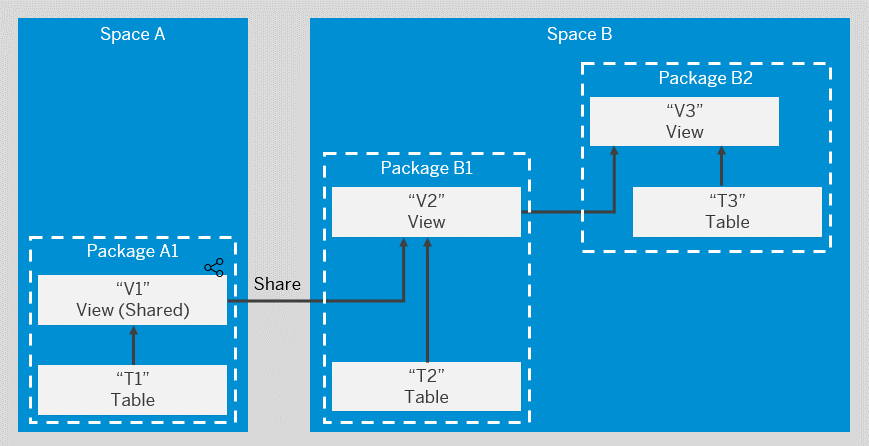

<!-- loio24aba84ceeb3416881736f70f02e3a0a -->

<link rel="stylesheet" type="text/css" href="../css/sap-icons.css"/>

# Creating Packages to Export

Users with the *DW Space Administrator* role can create packages to model groups of related objects for transport between tenants. Modelers can add objects to packages via the *Package* field, which appears in editors when a package is created in their space. Once a package is complete and validated, the space administrator can export it to the Content Network. The structure of your package is preserved and, as the objects it contains evolve, you can easily export updated versions of it.

This topic contains the following sections:

-   [Introduction to Packages](creating-packages-to-export-24aba84.md#loio24aba84ceeb3416881736f70f02e3a0a__section_intro)
-   [Create a Package](creating-packages-to-export-24aba84.md#loio24aba84ceeb3416881736f70f02e3a0a__section_create)
-   [Export a Package](creating-packages-to-export-24aba84.md#loio24aba84ceeb3416881736f70f02e3a0a__section_export)
-   [Update a Package](creating-packages-to-export-24aba84.md#loio24aba84ceeb3416881736f70f02e3a0a__section_update)
-   [Delete a Package](creating-packages-to-export-24aba84.md#loio24aba84ceeb3416881736f70f02e3a0a__section_delete)

<a name="loio24aba84ceeb3416881736f70f02e3a0a__section_intro"/>

## Introduction to Packages

Each package must contain a complete and coherent set of objects:

-   A package can contain one or more objects from one space.
-   Each object can belong to only one package.
-   A package must:
    -   Contain the complete lineage of all the objects that belong to it, or
    -   Include other packages containing all or part of this lineage as required packages.

-   Required packages can be selected from other spaces.

    If an object in a package has, as part of its lineage, an object shared from another space, then the shared object must be included in a package defined in its origin space, which is then added as a required package.

In our example:

-   `Package A1` - Contains `T1` and `V1`, where `V1` has a single source, `T1`.
-   `Package B1` - Contains `T2` and `V2`, where `V2` has two sources, `T2` and `V1`.
    -   `Package B1` adds `Package A1` as a required package.

-   `Package B2` - Contains `T3`, and `V3`, where `V3` has two sources, `T3` and `V2`.
    -   `Package B2` adds `Package B1` as a required package.

<a name="loio24aba84ceeb3416881736f70f02e3a0a__section_create"/>

## Create a Package

Users with the *DW Space Administrator* role can create packages:

1.  In the side navigation area, click  \(*Transport*\)** \> **:package: \(*Packages*\) to open the list of packages. 

    Use the *Space* filter field to show packages from all spaces or only one space.

2.  Click *Add* and specify a space, if necessary, to create a new package and open it in the editor.
3.  Enter the following properties on the *General* tab:

    <table>
    <tr>
    <th valign="top">

    Property
    
    </th>
    <th valign="top">

    Description
    
    </th>
    </tr>
    <tr>
    <td valign="top">
    
    Business Name 
    
    </td>
    <td valign="top">
    
    Enter a descriptive name to help users identify the object. This name can be changed at any time. 
    
    </td>
    </tr>
    <tr>
    <td valign="top">
    
    Technical Name 
    
    </td>
    <td valign="top">
    
    Displays the name used in scripts and code, synchronized by default with the *Business Name*.

    To override the default technical name, enter a new one in the field. Technical names can contain only alphanumeric characters and underscores.

    > ### Note:  
    > Once the object is saved, the technical name can no longer be modified.

    
    </td>
    </tr>
    <tr>
    <td valign="top">
    
    Business Purpose
    
    </td>
    <td valign="top">
    
    Provide a description, purpose, contacts, and tags to help other users understand the package. 
    
    </td>
    </tr>
    <tr>
    <td valign="top">
    
    Category
    
    </td>
    <td valign="top">
    
    The only available category is `My Content`.
    
    </td>
    </tr>
    <tr>
    <td valign="top">
    
    Target Location
    
    </td>
    <td valign="top">
    
    Select the location within `My Content` to export to. 
    
    </td>
    </tr>
    <tr>
    <td valign="top">
    
    Version
    
    </td>
    <td valign="top">
    
    Enter the version number of the package in the format `1.0.0` \(major version, minor version, patch number\). 

    You can re-export your package with the same version number to overwrite the current exported version or change the version to export a package update. The version number must always go up and never down.
    
    </td>
    </tr>
    <tr>
    <td valign="top">
    
    Status
    
    </td>
    <td valign="top">
    
    Displays the current status of the package. 

    Possible statuses are:

    -   Not Exported - Initial state.
    -   Exporting - Export is in progress. The package and its contents are locked.
    -   Exported - The latest version of the package is exported.
    -   Changes to Export - One or more of the objects in the package is new or has been updated. You can re-export at any time.
    -   Design Time Error - For one or more of the objects in the package, the dependencies of these objects cannot be resolved in the package. Add missing dependencies to the package or contact a space administrator to ask them to review and resolve the situation \(see [Add an Object to a Package](https://help.sap.com/docs/SAP_DATASPHERE/c8a54ee704e94e15926551293243fd1d/a806c67ed11749c788142775d2cc2494.html?version=cloud#add-an-object-to-a-package)\).

    
    </td>
    </tr>
    <tr>
    <td valign="top">
    
    Current Exported Version
    
    </td>
    <td valign="top">
    
    Displays the last exported version of the package. 
    
    </td>
    </tr>
    </table>
    
4.  \[optional\] Add any packages that contain objects that the objects you add to your package depend on as part of their lineage. 
    1.  Click the *Required Packages* tab.
    2.  Click *Add* to open the *Select Packages* dialog, which lists all packages you have permission to see.

        The list includes packages created in your space and packages shared to your space.

    3.  Select one or more packages and click *Select* to add them as required packages.

5.  Add objects from your space to the package.
    1.  Click the *Objects* tab.
    2.  Click *Add* to open the *Add Objects* dialog, which lists all objects in your space.
    3.  Select the objects you want to add to your package.

        As objects can only be added to one package, any objects that have been added to a different package cannot be selected.

    4.  Click *Next* and wait for the dialog to analyze your objects and extend your selection by adding any sources and other required dependencies.

        Each object must be able to resolve its entire lineage either by adding the objects it depends on to the package or by referencing them via a required package.

    5.  Click *Add Objects* to add the extended object selection to your package.

        You can add your objects even if errors are shown. In general errors can be resolved by adding the package containing the objects that cannot be added as a required package.

6.  Click *Save* to save your package and validate all dependencies.

    -   If no errors are found, your package is ready to be exported.
    -   If errors are found, you should try to resolve them by adding required packages or objects or by removing objects whose dependencies cannot be resolved, and then re-saving.

    Once your package is created, it becomes available to modelers in your space who can add further objects to it \(see [Packages](https://help.sap.com/viewer/24f836070a704022a40c15442163e5cf/DEV_CURRENT/en-US/a806c67ed11749c788142775d2cc2494.html "Users with the DW Space Administrator role can create packages to model groups of related objects for transport between tenants. Modelers can add objects to packages via the Package field, which appears in editors when a package is created in their space. Once a package is complete and validated, the space administrator can export it to the Content Network. The structure of your package is preserved and, as the objects it contains evolve, you can easily export updated versions of it.") :arrow_upper_right:\).

    > ### Note:  
    > Though modelers can add tables, views, ER models, and analytic models to a package, they cannot remove objects from a package.

<a name="loio24aba84ceeb3416881736f70f02e3a0a__section_export"/>

## Export a Package

Users with the *DW Space Administrator* role can export packages:

1.  Verify that your package is ready to export:
    -   Your package must be validated.
    -   All deployable objects in your package must have a status of *Deployed* \(see [Deploy Objects](https://help.sap.com/docs/SAP_DATASPHERE/c8a54ee704e94e15926551293243fd1d/7c0b560e2cb94eea86219d78d87f9623.html?version=cloud#deploy-objects)\).
    -   Any required packages must have a status of *Exported*.

2.  Click *Export* to export your package to the Content Network with the filename <code><i class="varname">&lt;TechnicalName_Version&gt;</i></code>. 

    When the export is complete, the package status changes to *Exported* and you will receive a notification confirming the export.

3.  \[optional\] Review your exported package in the *Export* app by navigating to the target location \(see [Exporting Content for Sharing with Other Tenants](exporting-content-for-sharing-with-other-tenants-44e775c.md)\).

<a name="loio24aba84ceeb3416881736f70f02e3a0a__section_update"/>

## Update a Package

Once your package is exported, you can continue to evolve it by adding, removing, or updating objects. Modelers in your space may also deploy changes to the objects it contains and add new objects to it.

When any updates are made to a package that has been exported, its status changes to *Changes to Export*. You can choose at any time to export these changes. If you:

-   Leave the version number unchanged, your new export will overwrite the previous exported version.
-   Set a new, higher version number, a new package version is exported.

<a name="loio24aba84ceeb3416881736f70f02e3a0a__section_delete"/>

## Delete a Package

Select a package and click *Delete* to delete it.

You cannot delete a package if it is listed among the *Required Packages* for any other package.

