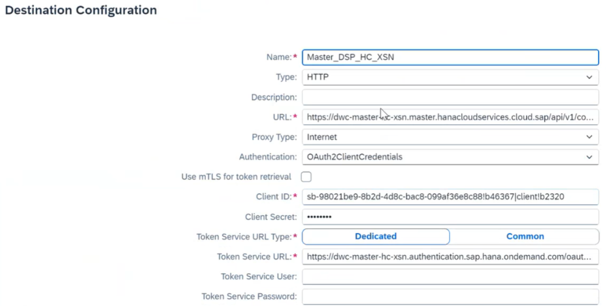

<!-- loio05383980f0704c71ab9872360ce45622 -->

<link rel="stylesheet" type="text/css" href="../css/sap-icons.css"/>

# Transporting Your Content through SAP Cloud Transport Management

Integrate SAP Datasphere with SAP Cloud Transport Management service to transport content packages across different landscapes.

SAP Cloud Transport Management service lets you manage software deliverables between accounts of different environments \(such as Cloud Foundry, ABAP, and Neo\), by transporting them across various runtimes.

To transport your SAP Datasphere content through SAP Cloud Transport Management, you first must configure your SAP Cloud Transport Management system.

Once you’ve configured the system, you must connect it to your SAP Datasphere tenant.

Then you can use the SAP Datasphere Transport app to transfer your content to SAP Cloud Transport Management.

> ### Note:  
> Users with the *DW Administrator* global role \(or users with both a scoped *DW Space Administrator* role and a global role providing the *Lifecycle* privilege\), can use the *Transport* app to export content.

Finally, you can return to SAP Cloud Transport Management to ensure the transferred content is available and ready to be imported to another SAP Datasphere tenant.

## Configuring SAP Cloud Transport Management

1.  As an administrator of SAP Cloud Transport Management, set up an environment to transport content objects directly in SAP Datasphere, see [Initial Setup to Transport Content Objects Directly in an Application](https://help.sap.com/docs/cloud-transport-management/sap-cloud-transport-management/set-up-environment-to-transport-content-archives-directly-in-application).
2.  Configure the landscape for your transports, by creating transport destinations, routes, and nodes.

    > ### Tip:  
    > -   Go to *System*→*Administration*→*App Integration* to find the token URL and add the extension `<Token URL>?grant_type=client_credentials`.
    > -   You must create the OAuth Client \(client ID and secret\) with the purpose *API Access* and the access *Analytics Content Network Interaction*. See [Create OAuth2.0 Clients to Authenticate Against SAP Datasphere](https://help.sap.com/viewer/935116dd7c324355803d4b85809cec97/DEV_CURRENT/en-US/3f92b46fe0314e8ba60720e409c219fc.html "Users with the DW Administrator role can create OAuth2.0 clients and provide the client parameters to users who need to connect clients, tools, or apps to SAP Datasphere.") :arrow_upper_right: for more information.

    1.  Create a destination in the SAP Cloud Transport Management subaccount for each target environment of SAP Datasphere. See [Create Transport Destinations](https://help.sap.com/docs/cloud-transport-management/sap-cloud-transport-management/create-transport-destinations).

        To integrate with SAP Datasphere, the destination must have an endpoint URL in this format: `https://<tenant_URL>/api/v1/content/deploy/`

        

    2.  Create nodes and routes. See [Create Transport Nodes](https://help.sap.com/docs/cloud-transport-management/sap-cloud-transport-management/create-transport-nodes) and [Create Transport Routes](https://help.sap.com/docs/cloud-transport-management/sap-cloud-transport-management/create-transport-routes). Make sure to select the checkbox *Allow Upload to Node* when creating a source node. When defining a target node, the content type must be *Application Content* to be able to select the destination name you've created in the previous step.

3.  Go to your SAP Business Technology Platform subaccount. Choose the SAP Cloud Transport Management instance of your choice. In the instance details page, choose *…* → *Download* to download the SAP Cloud Transport Management instance key.

## Connecting to SAP Cloud Transport Management from SAP Datasphere

1.  In the side navigation area, click *Transport* \> *Export*.
2.  Navigate to *My Content* and click *Settings* from the menu bar.
3.  In the *Settings* dialog box, click the *Upload JSON* button to upload the instance key you previously downloaded from SAP Cloud Transport Management \(See step 3 in the previous section\).
4.  The connection of your SAP Datasphere tenant with SAP Cloud Transport Management is now live: click *OK*.

## Using the SAP Datasphere Transport App to Transfer Content to SAP Cloud Transport Management

1.  In the side navigation area, click *Transport* \> *Export* and select the package you want to export.
2.  Click  *Upload to SAP Cloud Transport Management Node* from the menu bar: in the dialog box, you can see the list of selected packages.
3.  In the *Export Node* dropdown, choose the source node of SAP Cloud Transport Management to which you want to export your packages. For more information on source and target nodes, see [Create Transport Nodes](https://help.sap.com/docs/cloud-transport-management/sap-cloud-transport-management/create-transport-nodes).
4.  Select the checkbox to agree to use your user rights \(based on user's email ID\) to import the package in the target tenant.
5.  Click *Upload*.

## Using SAP Cloud Transport Management to Transfer Content to SAP Datasphere

1.  Log into your SAP Cloud Transport Management tenant: in the *Transport Nodes* panel, select the target node where you have uploaded the SAP Datasphere package.
2.  In the *Target Node Details* page, you can see your packages that are ready for import: select the package and click *Import Selected*.

Once the import is completed, you see the content of the package available in its corresponding destination in your SAP Datasphere account.

> ### Note:  
> The user who uploaded the package must be a member of the target tenant.

## Troubleshooting

In case of import failure, you can access the logs to investigate the error by adding this endpoint to the target tenant URL in your browser:

`{TenantURL}/contentmanager/v4/jobs/{ProcessID}?brief=false` 

> ### Note:  
> The Process ID is retrieved from the SAP Cloud Transport Management import logs.

