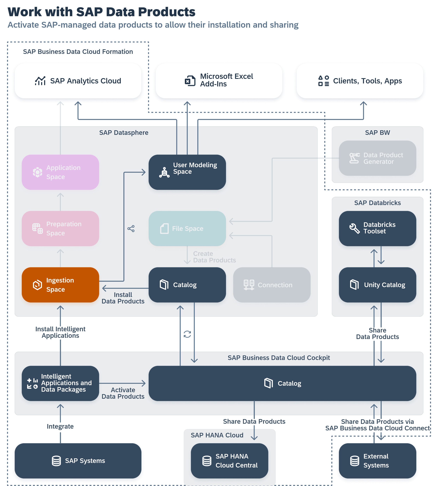

<!-- loio6c7799abaf6241ccacd724c25ebe335d -->

# Activating Data Packages and Installing Data Products

An SAP Business Data Cloud administrator can activate data packages to make the contained data products available for installation in SAP Datasphere \(see [Activating Data Packages](https://help.sap.com/docs/SAP_BUSINESS_DATA_CLOUD/f7acf8c9dad54e99b5ce5ebc633ed8e1/fcf9975b49ea4adeb837e4be16116175.html) in the *SAP Business Data Cloud* documentation\).

When a data package is activated, SAP Datasphere users can work with data products in the following ways:

-   An SAP Datasphere administrator must choose the spaces where data products can be installed \(see [Authorize Spaces to Install SAP Business Data Cloud Data Products](https://help.sap.com/viewer/9f804b8efa8043539289f42f372c4862/cloud/en-US/67ec785b5de842488781f20c4ab52a9f.html "An SAP Datasphere administrator must choose the spaces to which SAP Business Data Cloud data products from an activated data package can be installed.") :arrow_upper_right:\). During the installation process, they will also choose the appropriate data access method: using remote tables or replication flows \(see [Installing Data Products](https://help.sap.com/viewer/c8a54ee704e94e15926551293243fd1d/cloud/en-US/ea7cb802cbea47b39a441888873c3a49.html "Use the catalog Data Product collection to view data products for use in your modeling and other projects. You can see detailed metadata for each data product and if you have the appropriate permissions, install it to an SAP Datasphere space.") :arrow_upper_right: in the *SAP Datasphere help*\).
-   SAP Datasphere modelers can install data products to their space for use in their modeling projects \(see [Installing Data Products](https://help.sap.com/viewer/c8a54ee704e94e15926551293243fd1d/cloud/en-US/ea7cb802cbea47b39a441888873c3a49.html "Use the catalog Data Product collection to view data products for use in your modeling and other projects. You can see detailed metadata for each data product and if you have the appropriate permissions, install it to an SAP Datasphere space.") :arrow_upper_right:.
-   SAP Business Data Cloud Catalog administrators can share data products to SAP Databricks \(see [Sharing Data Products to SAP Systems](https://help.sap.com/docs/business-data-cloud/governing-and-publishing-data-in-catalog/sharing-data-products-to-sap-systems)\).

