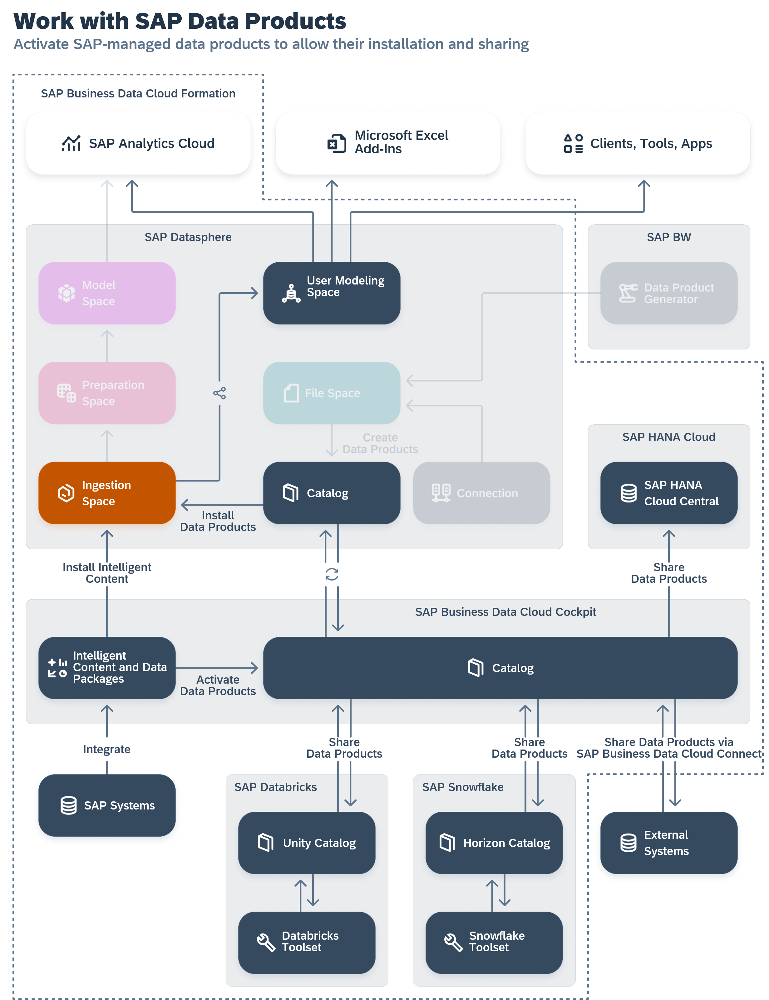

<!-- loio6c7799abaf6241ccacd724c25ebe335d -->

# Activating Data Packages and Installing Data Products

An SAP Business Data Cloud administrator can activate data products included in a data packages to make them available for installation in SAP Datasphere.

For more information, see [Activating Data Packages](https://help.sap.com/docs/SAP_BUSINESS_DATA_CLOUD/f7acf8c9dad54e99b5ce5ebc633ed8e1/fcf9975b49ea4adeb837e4be16116175.html) in the *SAP Business Data Cloud* documentation.

When data products are activated, SAP Datasphere users can work with them in the following ways:

-   An SAP Datasphere administrator must request access to data products \(see [Requesting Access to Data Products](https://help.sap.com/viewer/c8a54ee704e94e15926551293243fd1d/cloud/en-US/ea7cb802cbea47b39a441888873c3a49.html "You can request access to data products in the Data Product collection for installation to an SAP Datasphere space. After your request is approved, you can install the data product to the space where users can access its data for use in modeling and other projects.") :arrow_upper_right:\). After the access request is approved, they can choose the appropriate data access method when they install the data product to the space \(see [Installing Data Products](https://help.sap.com/viewer/c8a54ee704e94e15926551293243fd1d/cloud/en-US/605b734f433f4c3895ec827fa71bea41.html "Access requests that have been approved become access agreements and appear under the Agreements tab. You can install a data product for an access agreement or end an access agreement that's no longer needed.") :arrow_upper_right:\).
-   SAP Datasphere modelers can install data products to their space for use in their modeling projects \(see [Requesting Access to Data Products](https://help.sap.com/viewer/c8a54ee704e94e15926551293243fd1d/cloud/en-US/ea7cb802cbea47b39a441888873c3a49.html "You can request access to data products in the Data Product collection for installation to an SAP Datasphere space. After your request is approved, you can install the data product to the space where users can access its data for use in modeling and other projects.") :arrow_upper_right:.
-   SAP Business Data Cloud users can request access for data products to SAP Databricks \(see [Requesting Access to Data Products](https://help.sap.com/docs/business-data-cloud/governing-and-publishing-data-in-catalog/requesting-access-to-data) in the *SAP Business Data Cloud* documentation\).

