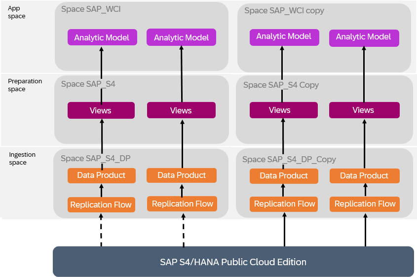

<!-- loio3c158685865d4b408938a148e828e21f -->

# Extending Insight Apps

The data products installed via SAP Business Data Cloud as part of an insight app do not include any extensions defined in your source system. However, you can modify the data products to add any required custom columns, and adjust the delivered views and analytic models to consume them.

<a name="loio3c158685865d4b408938a148e828e21f__section_czq_q33_hdc"/>

## Context

If your organization has extended the SAP Business Data Cloud tables exposed via data products as part of your insight app, you will need to copy the relevant data products and associated content from an SAP-managed space to a new space to add these custom columns.

> ### Note:  
> If SAP updates the data products and content, these updates are not copied over automatically to your copied space and therefore, you would need to repeat this process for any updated data products.

## Procedure

1.  Identify all the relevant spaces which contain your data product or depend on it.

    In this example, two data products are consumed by views and eventually exposed via analytic models:

    

    

    

2.  Request a user with the **DW Administrator** role \(or equivalent privileges\) to copy each of these spaces. This will create editable versions of all objects by removing them from the protective namespace, transforming `sap.s4.entity` technical names to `sap_s4_entity`.

    For more information, see [Copy a Space](https://help.sap.com/docs/SAP_DATASPHERE/9f804b8efa8043539289f42f372c4862/73068ac8e1934615b419d8c6c4095a9a.html).

    In our example, the spaces are copied but the preparation and app spaces are still consuming data from the original ingestion space:

    

3.  A user with the**DW Modeler** role \(or equivalent privileges\) adjusts the sources of all the relevant objects, so that they now consume the data products or views in the copied spaces.

    For more information, see [Replace a Source](https://help.sap.com/docs/SAP_DATASPHERE/c8a54ee704e94e15926551293243fd1d/51cc5a70a95e46a7aadbe49512b18ddb.html).

    In our example, the copied spaces consume the data correctly from the copied ingestion space, but data replication is still active in the original ingestion space:

    

4.  Update the data products in the new ingestion space to include the extension columns by re-importing them using the *Import Entities* wizard. This should update the local entities and replication flow with the new columns, and optionally start the replication flow.

    For more information, see [Importing Entities with Semantics from SAP S/4HANA](https://help.sap.com/docs/SAP_DATASPHERE/c8a54ee704e94e15926551293243fd1d/845fedbd28574aa8b84239df848936f6.html).

5.  Stop replication into the original ingestion space and start replication into the copied space, if not yet done.

    For more information, see [Running a Flow](https://help.sap.com/docs/SAP_DATASPHERE/c8a54ee704e94e15926551293243fd1d/5b591d4998fa4a148750016a29ada91e.html).

    In our example, replication is now active only in the copied ingestion space:

    

6.  Ensure that the data access controls applied to the fact views are still protecting data appropriately.

    For more information, see [Applying Row-Level Security to Data Delivered through Insight Apps](applying-row-level-security-to-data-delivered-through-insight-apps-c83225f.md).

7.  Modify the objects in the preparation and app spaces, to take into account the new extension columns added in the ingestion space.

    For more information, see [Process Source Changes in the Graphical View Editor](https://help.sap.com/docs/SAP_DATASPHERE/c8a54ee704e94e15926551293243fd1d/702350c755d24d629545de04673acb1b.html) or [Process Source Changes in the SQL View Editor](https://help.sap.com/docs/SAP_DATASPHERE/c8a54ee704e94e15926551293243fd1d/f7e43ced828940178efb3143c2956d9d.html).

