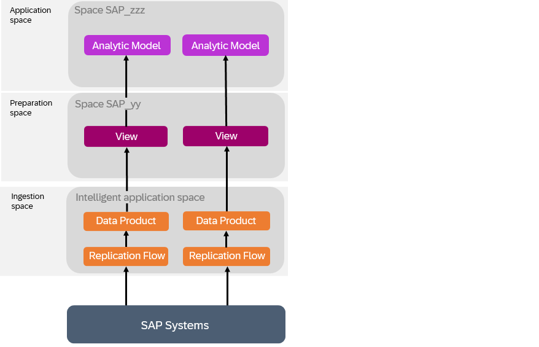

<!-- loio3c158685865d4b408938a148e828e21f -->

# Extending Insight Apps

The data products installed via SAP Business Data Cloud as part of an insight app do not include any extensions defined in your source system. However, you can modify the data products to add any required custom fields, and adjust the delivered views and analytic models to consume them.

<a name="loio3c158685865d4b408938a148e828e21f__section_czq_q33_hdc"/>

## Context

If your organization has extended the SAP source system via data products as part of your insight app, then to consume the custom fields included in the reinstalled data products you will need to copy the preparation and app spaces in order to modify the SAP-managed content.

> ### Note:  
> If SAP updates the data products and content, these updates are not made available automatically to your copied space and, therefore, you would need to repeat this process for any updated data products.

## Procedure

1.  Identify all the relevant spaces which contain your data product or depend on it.

    In this example, two data products are consumed by views and eventually exposed via analytic models:

    

2.  Request a user with the **DW Administrator** role \(or equivalent privileges\) to copy the preparation and app spaces. This will create editable versions of all objects by removing them from the protective namespace, transforming `sap.s4.entity` technical names to `sap_s4_entity`.

    For more information, see [Copy a Space](https://help.sap.com/docs/SAP_DATASPHERE/9f804b8efa8043539289f42f372c4862/73068ac8e1934615b419d8c6c4095a9a.html).

    > ### Note:  
    > There is no need to copy the ingestion space.

    In our example, the spaces are copied and, for the moment, the preparation and app spaces are still consuming data from the insight app ingestion space:

    

3.  Request a user with the **DW Administrator** role \(or equivalent privileges\) to add the necessary Modeler users to the new preparation and app spaces, and to authorise the new preparation space to install the data products.

    For more information, see [Authorize Spaces to Install SAP Business Data Cloud Data Products](https://help.sap.com/docs/SAP_DATASPHERE/9f804b8efa8043539289f42f372c4862/67ec785b5de842488781f20c4ab52a9f.html).

4.  A user with the*DW Modeler* role \(or equivalent privileges\) installs the data products in the copied preparation space \(for more information, see [Install Insight Apps](https://help.sap.com/docs/SAP_BUSINESS_DATA_CLOUD/f7acf8c9dad54e99b5ce5ebc633ed8e1/35b64d44efd54502a935f67ba66ffd4e.html)\). When the first data product is installed, the new ingestion space is created, and all subsequent data product installs will use this space to ingest data.

    For more information, see [Evaluating and Installing SAP Business Data Cloud Data Products](https://help.sap.com/docs/SAP_DATASPHERE/c8a54ee704e94e15926551293243fd1d/ea7cb802cbea47b39a441888873c3a49.html).

    In our example, the data products have been installed in the preparation space, and the data product ingestion space has been created:

    

5.  The user with the*DW Modeler* role \(or equivalent privileges\) adjusts the sources of the views in the copied preparation space so that they use the newly installed data products from the new ingestion space as sources. They then adjust the analytic models in the copied app space to use the views in the copied preparation space as sources.

    For more information, see [Replace a Source](https://help.sap.com/docs/SAP_DATASPHERE/c8a54ee704e94e15926551293243fd1d/51cc5a70a95e46a7aadbe49512b18ddb.html).

    In our example, the copied preparation and app spaces consume the data correctly from the data product ingestion space, but data replication is still active in the insight app ingestion space:

    

6.  Modify the objects in the preparation and app spaces, to take into account the new extension fields added in the data product ingestion space.

    For more information, see [Process Source Changes in the Graphical View Editor](https://help.sap.com/docs/SAP_DATASPHERE/c8a54ee704e94e15926551293243fd1d/702350c755d24d629545de04673acb1b.html) or [Process Source Changes in the SQL View Editor](https://help.sap.com/docs/SAP_DATASPHERE/c8a54ee704e94e15926551293243fd1d/f7e43ced828940178efb3143c2956d9d.html).

7.  Stop replication into the insight app ingestion space and start replication into the data product ingestion space, if not yet done.

    For more information, see [Running a Flow](https://help.sap.com/docs/SAP_DATASPHERE/c8a54ee704e94e15926551293243fd1d/5b591d4998fa4a148750016a29ada91e.html).

    In our example, replication is now active only in the data product ingestion space:

    

8.  Ensure that the data access controls applied to the fact views are still protecting data appropriately.

    For more information, see [Applying Row-Level Security to Data Delivered through Insight Apps](applying-row-level-security-to-data-delivered-through-insight-apps-c83225f.md).

