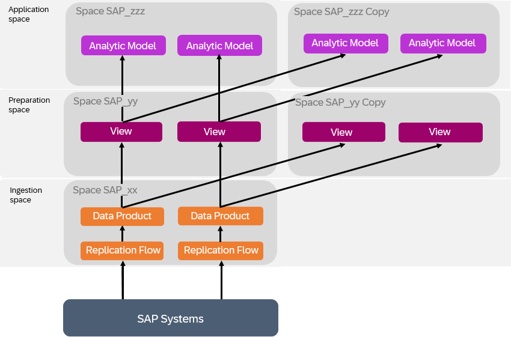

<!-- loio3c158685865d4b408938a148e828e21f -->

# Extending Intelligent Applications

The data products installed via SAP Business Data Cloud as part of an intelligent application do not include any extensions defined in your source system. However, you can update the data products to include any required custom fields, and adjust the delivered views and analytic models to consume them.

<a name="loio3c158685865d4b408938a148e828e21f__section_czq_q33_hdc"/>

## Context

If your organization has extended the SAP source system with custom fields in this way, then you will need to copy the preparation and application spaces in order to modify the SAP-managed content and consume the updated data products in your intelligent application.

> ### Note:  
> You must always copy both the preparation and application spaces and complete the entire extension process, so that your copied spaces are entirely independent of the intelligent application preparation and application spaces. A situation, for example, where objects in a copied application space depend on objects in the intelligent application preparation space, is not supported.

> ### Note:  
> If SAP updates the data products and content, these updates are not made available automatically to your copied space and, therefore, you would need to repeat this process for any updated data products.

## Procedure

1.  Identify all the relevant spaces which contain your data product or depend on it.

    In this example, two data products are consumed by views and eventually exposed via analytic models:

    

2.  Request a user with the **DW Administrator** role \(or equivalent privileges\) to copy the preparation and application spaces. This will create editable versions of all objects by removing them from the protective namespace, transforming `sap.s4.entity` technical names to `sap_s4_entity`.

    For more information, see [Copy a Space](https://help.sap.com/docs/SAP_DATASPHERE/9f804b8efa8043539289f42f372c4862/73068ac8e1934615b419d8c6c4095a9a.html).

    In our example, the spaces are copied and, for the moment, the preparation and application spaces are still consuming data from the ingestion space:

    

3.  Request a user with the **DW Administrator** role \(or equivalent privileges\) to add the necessary Modeler users to the new preparation and application spaces, and to authorise the new preparation space to install the data products.

    For more information, see [Authorize Spaces to Install SAP Business Data Cloud Data Products](https://help.sap.com/docs/SAP_DATASPHERE/9f804b8efa8043539289f42f372c4862/67ec785b5de842488781f20c4ab52a9f.html).

4.  A user with the *DW Modeler* role \(or equivalent privileges\) installs the data products in the copied preparation space \(for more information, see [Evaluating and Installing SAP Business Data Cloud Data Products](https://help.sap.com/docs/SAP_DATASPHERE/c8a54ee704e94e15926551293243fd1d/ea7cb802cbea47b39a441888873c3a49.html)\). This updates the data products in the ingestion space to include the custom fields.
5.  The user with the *DW Modeler* role \(or equivalent privileges\) adjusts the sources of the views, and they then adjust the analytic models in the copied application space to use the views in the copied preparation space as sources.

    For more information, see [Replace a Source](https://help.sap.com/docs/SAP_DATASPHERE/c8a54ee704e94e15926551293243fd1d/51cc5a70a95e46a7aadbe49512b18ddb.html).

    In our example, the copied preparation and application spaces consume the data correctly from the ingestion space, but data replication is still active in the ingestion space:

    

6.  Modify the objects in the preparation and application spaces, to take into account the new extension fields.

    For more information, see [Process Source Changes in the Graphical View Editor](https://help.sap.com/docs/SAP_DATASPHERE/c8a54ee704e94e15926551293243fd1d/702350c755d24d629545de04673acb1b.html) or [Process Source Changes in the SQL View Editor](https://help.sap.com/docs/SAP_DATASPHERE/c8a54ee704e94e15926551293243fd1d/f7e43ced828940178efb3143c2956d9d.html).

7.  Ensure that the data access controls applied to the fact views are still protecting data appropriately.

    For more information, see [Applying Row-Level Security to Data Delivered through Intelligent Applications](applying-row-level-security-to-data-delivered-through-intelligent-applications-c83225f.md).

8.  Communicate the new models and fields to the business analyst working in SAP Analytics Cloud. See [Modifying and Sharing Intelligent Applications](https://help.sap.com/docs/business-data-cloud/viewing-insight-apps/modifying-and-sharing-insight-apps) for the next steps.

