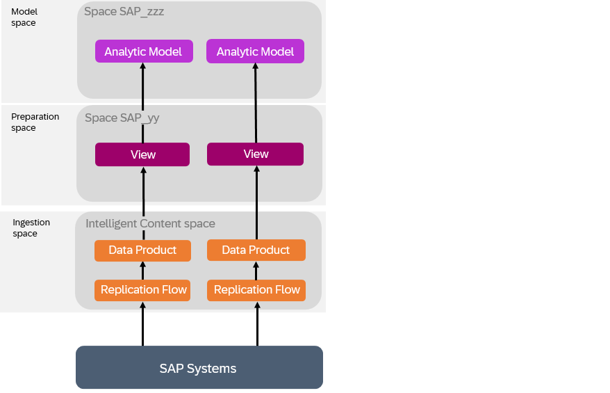
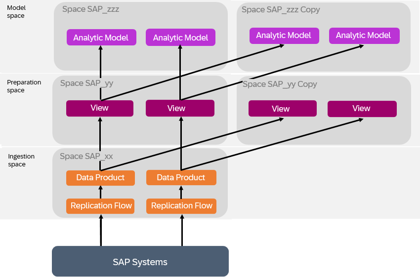
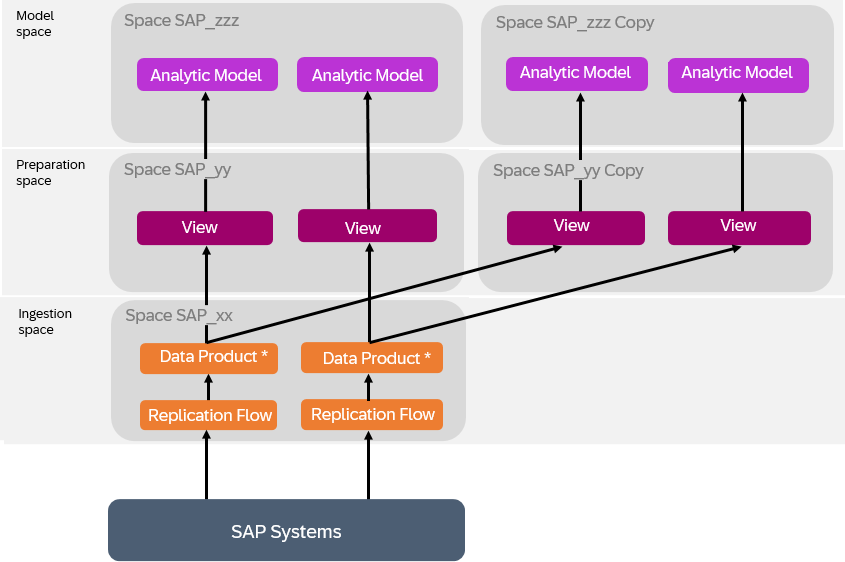

<!-- loio3c158685865d4b408938a148e828e21f -->

# Extending Intelligent Content

The data products installed via SAP Business Data Cloud as part of intelligent content do not include any extensions defined in your source system. However, you can update the data products in SAP Datasphere to include any required custom fields, and adjust the delivered views and analytic models to consume them.

<a name="loio3c158685865d4b408938a148e828e21f__section_czq_q33_hdc"/>

## Context

If your organization has extended the SAP source system with custom fields in this way, then you will need to copy the preparation and model spaces in order to modify the SAP-managed content and consume the updated data products in your intelligent content.

> ### Note:  
> You must always copy both the preparation and model spaces and complete the entire extension process, so that your copied spaces are entirely independent of the intelligent content's preparation and model spaces. A situation, for example, where objects in a copied content space depend on objects in the intelligent content preparation space, is not supported.

> ### Note:  
> If SAP updates the data products and content, these updates are not made available automatically to your copied space and, therefore, you would need to repeat this process for any updated data products.

## Procedure

1.  Identify all the relevant spaces which contain your data product or depend on it.

    In this example, two data products are consumed by views and eventually exposed via analytic models:

    

2.  Request a user with the **DW Administrator** role \(or equivalent privileges\) to copy the preparation and model spaces. This will create editable versions of all objects by removing them from the protective namespace, transforming `sap.s4.entity` technical names to `sap_s4_entity`.

    For more information, see [Copy a Space and its Contents](https://help.sap.com/viewer/9f804b8efa8043539289f42f372c4862/cloud/en-US/73068ac8e1934615b419d8c6c4095a9a.html "You can copy a space and all the Data Builder objects it contains into a new space.") :arrow_upper_right:.

    In our example, the spaces are copied and, for the moment, the preparation and model spaces are still consuming data from the ingestion space:

    

3.  Request a user with the **DW Administrator** role \(or equivalent privileges\) to add the necessary Modeler users to the new preparation and model spaces, and to authorise the new preparation space to install the data products.

    For more information, see [Authorize Spaces to Install SAP Business Data Cloud Data Products](https://help.sap.com/docs/SAP_DATASPHERE/9f804b8efa8043539289f42f372c4862/67ec785b5de842488781f20c4ab52a9f.html).

4.  A user with the *DW Modeler* role \(or equivalent privileges\) installs the data products in the copied preparation space \(for more information, see [Installing Data Products](https://help.sap.com/viewer/c8a54ee704e94e15926551293243fd1d/cloud/en-US/ea7cb802cbea47b39a441888873c3a49.html "Use the catalog Data Product collection to view data products for use in your modeling and other projects. You can see detailed metadata for each data product and if you have the appropriate permissions, install it to an SAP Datasphere space.") :arrow_upper_right:\). This updates the data products in the ingestion space to include the custom fields.
5.  The user with the *DW Modeler* role \(or equivalent privileges\) adjusts the sources of the views, and they then adjust the analytic models in the copied model space to use the views in the copied preparation space as sources.

    For more information, see [Replace a Source in a Graphical View](https://help.sap.com/viewer/c8a54ee704e94e15926551293243fd1d/cloud/en-US/51cc5a70a95e46a7aadbe49512b18ddb.html "Drag a source from the Source Browser, hover over an existing source, and click Replace. You are guided through mapping the columns from the old source to the new source.") :arrow_upper_right:.

    In our example, the analytic models in the copied model space now use views in the copied preparation space as sources:

    

    Modify the objects in the preparation and model spaces, to take into account the new extension fields.

    For more information, see [Process Source Changes in the Graphical View Editor](https://help.sap.com/docs/SAP_DATASPHERE/c8a54ee704e94e15926551293243fd1d/702350c755d24d629545de04673acb1b.html) or [Process Source Changes in the SQL View Editor](https://help.sap.com/docs/SAP_DATASPHERE/c8a54ee704e94e15926551293243fd1d/f7e43ced828940178efb3143c2956d9d.html).

6.  Ensure that the data access controls applied to the fact views are still protecting data appropriately.

    For more information, see [Applying Row-Level Security to Data Delivered through Intelligent Content](applying-row-level-security-to-data-delivered-through-intelligent-content-c83225f.md).

7.  Communicate the new models and fields to the business analyst working in SAP Analytics Cloud. See [Modifying and Sharing Intelligent Content](https://help.sap.com/docs/business-data-cloud/viewing-insight-apps/modifying-and-sharing-insight-apps) for the next steps.

