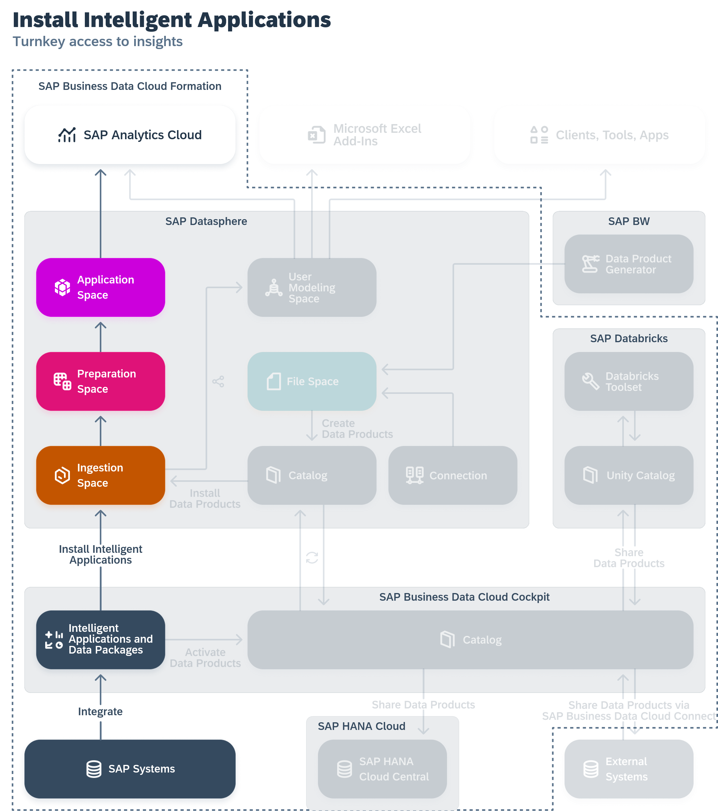

<!-- loio344999cbd4ff4d8188fb67b4ca6ea33f -->

# Installing Intelligent Applications

An SAP Business Data Cloud administrator can install intelligent applications to the SAP Datasphere and SAP Analytics Cloud tenants in the formation.

For more information, see [Installing Intelligent Applications](https://help.sap.com/docs/SAP_BUSINESS_DATA_CLOUD/f7acf8c9dad54e99b5ce5ebc633ed8e1/35b64d44efd54502a935f67ba66ffd4e.html) in the *SAP Business Data Cloud* documentation\).

When an intelligent application is installed:

-   SAP-managed spaces are created in SAP Datasphere to contain the intelligent application content \(see [Ingestion Spaces and Other SAP Business Data Cloud Spaces](ingestion-spaces-and-other-sap-business-data-cloud-spaces-8390855.md)\).
-   Replication flows, tables, views, and analytic models are created in these spaces to ingest, prepare and expose the required data to SAP Analytics Cloud.

SAP Datasphere users can work with intelligent application content in the following ways:

-   Review the installed content \(see [Reviewing Installed Intelligent Applications](reviewing-installed-intelligent-applications-6446487.md)\).
-   Upload permissions records to control access to the data \(see [Applying Row-Level Security to Data Delivered through Intelligent Applications](applying-row-level-security-to-data-delivered-through-intelligent-applications-c83225f.md)\).
-   Build on top of the delivered data products and content to extend the app \(see [Extending Intelligent Applications](extending-intelligent-applications-3c15868.md)\)

