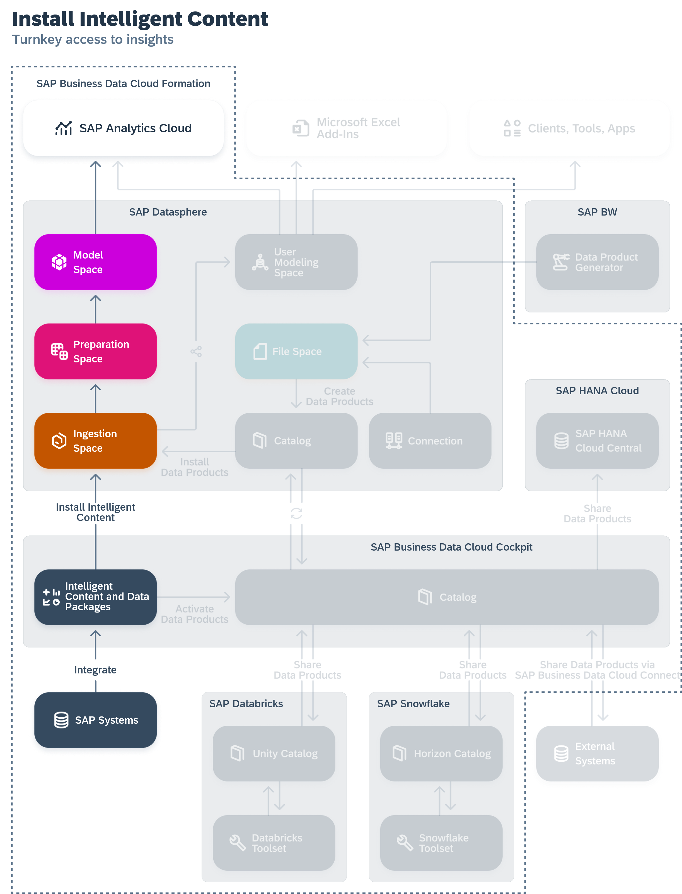

<!-- loio344999cbd4ff4d8188fb67b4ca6ea33f -->

# Installing Intelligent Content

An SAP Business Data Cloud administrator can install intelligent content to the SAP Datasphere and SAP Analytics Cloud tenants in the formation.

For more information, see [Installing Intelligent Content](https://help.sap.com/docs/SAP_BUSINESS_DATA_CLOUD/f7acf8c9dad54e99b5ce5ebc633ed8e1/35b64d44efd54502a935f67ba66ffd4e.html) in the *SAP Business Data Cloud* documentation\).

When intelligent content is installed:

-   SAP-managed spaces are created in SAP Datasphere to contain the intelligent content \(see [Ingestion Spaces and Other SAP Business Data Cloud Spaces](ingestion-spaces-and-other-sap-business-data-cloud-spaces-8390855.md)\).
-   Replication flows, tables, views, and analytic models are created in these spaces to ingest, prepare and expose the required data to SAP Analytics Cloud.

SAP Datasphere users can work with intelligent content in the following ways:

-   Review the installed content \(see [Reviewing Installed Intelligent Content](reviewing-installed-intelligent-content-6446487.md)\).
-   Upload permissions records to control access to the data \(see [Applying Row-Level Security to Data Delivered through Intelligent Content](applying-row-level-security-to-data-delivered-through-intelligent-content-c83225f.md)\).
-   Build on top of the delivered data products and content to extend it \(see [Extending Intelligent Content](extending-intelligent-content-3c15868.md)\)

