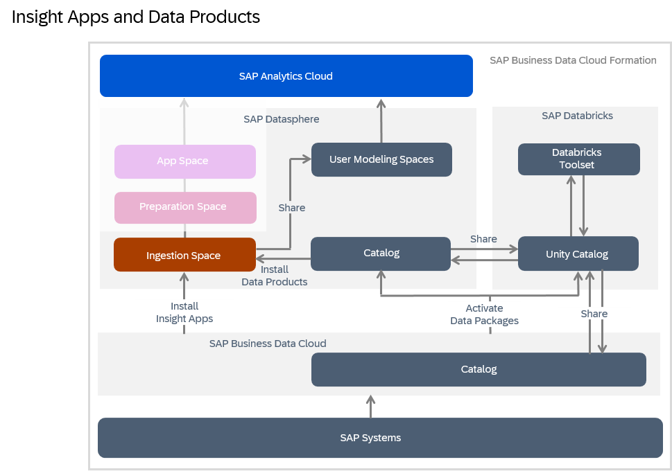
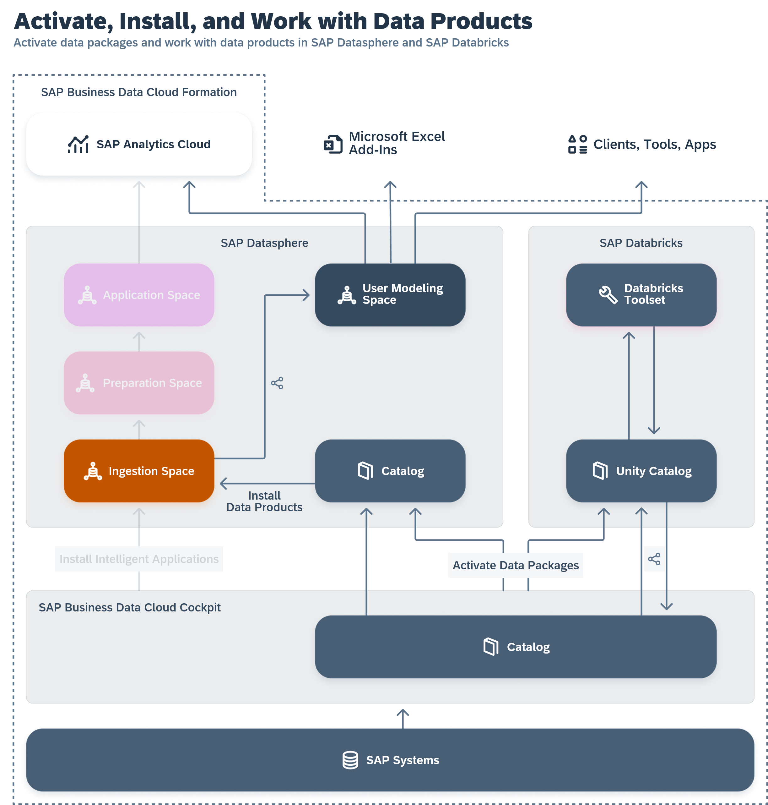

<!-- loio8f9c3725cfe84e08b3e951e7af06ce57 -->

# Integrating Data from SAP Business Data Cloud

SAP Business Data Cloud is a fully managed SaaS solution that unifies and governs all SAP data and seamlessly connects with third-party data—giving line-of-business leaders context to make even more impactful decisions.

<a name="loio8f9c3725cfe84e08b3e951e7af06ce57__section_dsp_in_bdc"/>

## SAP Datasphere in SAP Business Data Cloud

If your SAP Datasphere tenant is part of an SAP Business Data Cloud formation, then the SAP Business Data Cloud administrator can:

-   Install insight apps to the SAP Datasphere and SAP Analytics Cloud tenants in the formation.
-   Activate data packages to allow the contained data products to be installed in SAP Datasphere.

For detailed information, see the [SAP Business Data Cloud](https://help.sap.com/docs/SAP_BUSINESS_DATA_CLOUD) documentation.

<a name="loio8f9c3725cfe84e08b3e951e7af06ce57__section_insight_apps"/>

## SAP Business Data Cloud Insight Apps

An SAP Business Data Cloud administrator can install insight apps to the SAP Datasphere and SAP Analytics Cloud tenants in the formation \(see [Installing Insight Apps](https://help.sap.com/docs/SAP_BUSINESS_DATA_CLOUD/f7acf8c9dad54e99b5ce5ebc633ed8e1/35b64d44efd54502a935f67ba66ffd4e.html) in the *SAP Business Data Cloud* documentation\).

When an insight app is installed:

-   SAP-managed spaces are created in SAP Datasphere to contain the insight app content.
-   Replication flows, tables, views, and analytic models are created in these spaces to ingest, prepare and expose the required data to SAP Analytics Cloud.

SAP Datasphere users can work with insight app content in the following ways:

-   Review the installed content \(see [Reviewing Installed Insight Apps](reviewing-installed-insight-apps-6446487.md)\).
-   Upload permissions records to control access to the data \(see [Applying Row-Level Security to Data Delivered through Insight Apps](applying-row-level-security-to-data-delivered-through-insight-apps-c83225f.md)\).
-   Build on top of the delivered data products and content to extend the app \(see [Extending Insight Apps](extending-insight-apps-3c15868.md)\)

<a name="loio8f9c3725cfe84e08b3e951e7af06ce57__section_data_products"/>

## SAP Business Data Cloud Data Products

An SAP Business Data Cloud adminstrator can activate data packages to allow the contained data products to be installed in SAP Datasphere \(see [Activating Data Packages](https://help.sap.com/docs/SAP_BUSINESS_DATA_CLOUD/f7acf8c9dad54e99b5ce5ebc633ed8e1/fcf9975b49ea4adeb837e4be16116175.html) in the *SAP Business Data Cloud* documentation\).

When a data package is activated, SAP Datasphere users can work with data products in the following ways:

-   An SAP Datasphere administrator must choose the spaces to which data products from the originating SAP system can be installed \(see [Authorize Spaces to Install SAP Business Data Cloud Data Products](https://help.sap.com/viewer/935116dd7c324355803d4b85809cec97/DEV_CURRENT/en-US/67ec785b5de842488781f20c4ab52a9f.html "An SAP Datasphere administrator must choose the spaces to which SAP Business Data Cloud data products from an activated data package can be installed.") :arrow_upper_right:\).
-   SAP Datasphere modelers can install data products to their space for use in their modeling projects \(see [Evaluating and Installing Data Products](https://help.sap.com/viewer/24f836070a704022a40c15442163e5cf/DEV_CURRENT/en-US/ea7cb802cbea47b39a441888873c3a49.html "Use the catalog Data Product collection to view data products for use in your modeling and other projects. You can see detailed metadata for each data product and if you have the appropriate permissions, install it to an SAP Datasphere space.") :arrow_upper_right:\).
-   SAP Datasphere Catalog administrators can share data products to SAP Databricks \(see [Sharing Data Products to SAP Databricks](https://help.sap.com/viewer/aca3ccb4b2f84eb8b6154e8fd2812c0e/cloud/en-US/09881ade3e20468a98aa90e44f8c44ff.html "Seamlessly share data products to SAP Databricks, where users can query and enrich them using machine learning and generative AI tools. Those users will then give you authorized access to the enriched data products so that you can use them in SAP Datasphere for your models.") :arrow_upper_right:\).

<a name="loio8f9c3725cfe84e08b3e951e7af06ce57__section_sap_managed_spaces"/>

## SAP-Managed Spaces

SAP-managed spaces are automatically created to contain the data products and content installed from SAP Business Data Cloud:

-   By default, no users are granted access to these spaces, but a SAP Datasphere administrator can add users to the spaces to monitor data integration and review the content.
-   All the delivered content is SAP-managed, read-only, and cannot be modified as it is protected by a namespace \(see [Namespaces](https://help.sap.com/viewer/24f836070a704022a40c15442163e5cf/DEV_CURRENT/en-US/7094f24d272c4ae4893b726095ab969e.html "Content managed by SAP and partners and delivered through SAP Business Data Cloud is protected by namespaces. Any object whose technical name is preceded by a namespace and a dot (for example, sap.s4h.Entity) cannot be edited.") :arrow_upper_right:\).
-   No user can create any objects in SAP-managed spaces.

