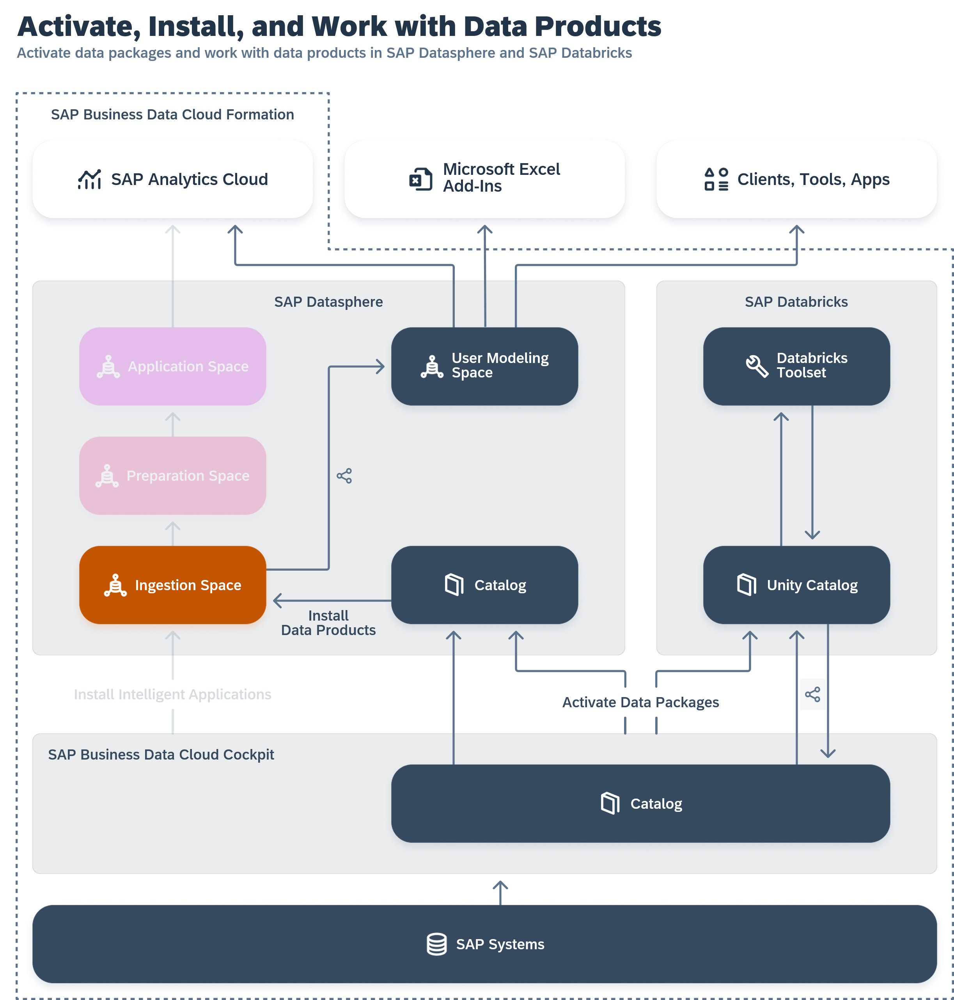

<!-- loio8f9c3725cfe84e08b3e951e7af06ce57 -->

# Integrating Data from SAP Business Data Cloud

Users with an SAP Business Data Cloud administrator role can install intelligent applications to SAP Datasphere and activate data packages to allow modelers to work with data products.

This topic contains the following sections:

-   [SAP Datasphere in SAP Business Data Cloud](integrating-data-from-sap-business-data-cloud-8f9c372.md#loio8f9c3725cfe84e08b3e951e7af06ce57__section_dsp_in_bdc)
-   [Intelligent Applications](integrating-data-from-sap-business-data-cloud-8f9c372.md#loio8f9c3725cfe84e08b3e951e7af06ce57__section_insight_apps)
-   [Data Products](integrating-data-from-sap-business-data-cloud-8f9c372.md#loio8f9c3725cfe84e08b3e951e7af06ce57__section_data_products)
-   [SAP-Managed Spaces](integrating-data-from-sap-business-data-cloud-8f9c372.md#loio8f9c3725cfe84e08b3e951e7af06ce57__section_sap_managed_spaces)

<a name="loio8f9c3725cfe84e08b3e951e7af06ce57__section_dsp_in_bdc"/>

## SAP Datasphere in SAP Business Data Cloud

SAP Business Data Cloud integrates and governs SAP and third-party data, allowing leaders to make impactful decisions. It also enables the installation of intelligent applications and data products in SAP Datasphere, providing users with access to valuable data and content.

If your SAP Datasphere tenant is part of an SAP Business Data Cloud formation, then the SAP Business Data Cloud administrator can install intelligent applications to SAP Datasphere and activate data packages to allow SAP Datasphere modelers to work with data products.

For detailed information, see the [SAP Business Data Cloud](https://help.sap.com/docs/SAP_BUSINESS_DATA_CLOUD) documentation.

<a name="loio8f9c3725cfe84e08b3e951e7af06ce57__section_insight_apps"/>

## Intelligent Applications

An SAP Business Data Cloud administrator can install intelligent applications to the SAP Datasphere and SAP Analytics Cloud tenants in the formation \(see [Installing Intelligent Applications](https://help.sap.com/docs/SAP_BUSINESS_DATA_CLOUD/f7acf8c9dad54e99b5ce5ebc633ed8e1/35b64d44efd54502a935f67ba66ffd4e.html) in the *SAP Business Data Cloud* documentation\).

When an intelligent application is installed:

-   SAP-managed spaces are created in SAP Datasphere to contain the intelligent application content.
-   Replication flows, tables, views, and analytic models are created in these spaces to ingest, prepare and expose the required data to SAP Analytics Cloud.

SAP Datasphere users can work with intelligent application content in the following ways:

-   Review the installed content \(see [Reviewing Installed Intelligent Applications](reviewing-installed-intelligent-applications-6446487.md)\).
-   Upload permissions records to control access to the data \(see [Applying Row-Level Security to Data Delivered through Intelligent Applications](applying-row-level-security-to-data-delivered-through-intelligent-applications-c83225f.md)\).
-   Build on top of the delivered data products and content to extend the app \(see [Extending Intelligent Applications](extending-intelligent-applications-3c15868.md)\)

<a name="loio8f9c3725cfe84e08b3e951e7af06ce57__section_data_products"/>

## Data Products

An SAP Business Data Cloud administrator can activate data packages to make the contained data products available for installation in SAP Datasphere \(see [Activating Data Packages](https://help.sap.com/docs/SAP_BUSINESS_DATA_CLOUD/f7acf8c9dad54e99b5ce5ebc633ed8e1/fcf9975b49ea4adeb837e4be16116175.html) in the *SAP Business Data Cloud* documentation\).

When a data package is activated, SAP Datasphere users can work with data products in the following ways:

-   An SAP Datasphere administrator must choose the spaces where data products can be installed \(see [Authorize Spaces to Install SAP Business Data Cloud Data Products](https://help.sap.com/viewer/9f804b8efa8043539289f42f372c4862/cloud/en-US/67ec785b5de842488781f20c4ab52a9f.html "An SAP Datasphere administrator must choose the spaces to which SAP Business Data Cloud data products from an activated data package can be installed.") :arrow_upper_right:\). During the installation process, they will also choose the appropriate data access method: using remote tables or replication flows \(see [Installing Data Products](https://help.sap.com/viewer/c8a54ee704e94e15926551293243fd1d/cloud/en-US/ea7cb802cbea47b39a441888873c3a49.html "Use the catalog Data Product collection to view data products for use in your modeling and other projects. You can see detailed metadata for each data product and if you have the appropriate permissions, install it to an SAP Datasphere space.") :arrow_upper_right: in the *SAP Datasphere help*\).
-   SAP Datasphere modelers can install data products to their space for use in their modeling projects \(see [Installing Data Products](https://help.sap.com/viewer/c8a54ee704e94e15926551293243fd1d/cloud/en-US/ea7cb802cbea47b39a441888873c3a49.html "Use the catalog Data Product collection to view data products for use in your modeling and other projects. You can see detailed metadata for each data product and if you have the appropriate permissions, install it to an SAP Datasphere space.") :arrow_upper_right:.
-   SAP Business Data Cloud Catalog administrators can share data products to SAP Databricks \(see [Sharing Data Products to Target Systems](https://help.sap.com/docs/business-data-cloud/governing-and-publishing-data-in-catalog/sharing-data-products-to-sap-databricks)\).

<a name="loio8f9c3725cfe84e08b3e951e7af06ce57__section_sap_managed_spaces"/>

## SAP-Managed Spaces

SAP-managed spaces are automatically created to contain the data products and content installed from SAP Business Data Cloud:

-   By default, no users are granted access to these spaces, but a SAP Datasphere administrator can add users to the spaces to monitor data integration and review the content.
-   All the delivered content is SAP-managed, read-only, and cannot be modified as it is protected by a namespace \(see [Namespaces](https://help.sap.com/viewer/c8a54ee704e94e15926551293243fd1d/cloud/en-US/7094f24d272c4ae4893b726095ab969e.html "Content managed by SAP and partners and delivered through SAP Business Data Cloud is protected by namespaces. Any object whose technical name is preceded by a namespace and a dot (for example, sap.s4h.Entity) cannot be edited.") :arrow_upper_right:\).
-   No user can create any objects in SAP-managed spaces.

