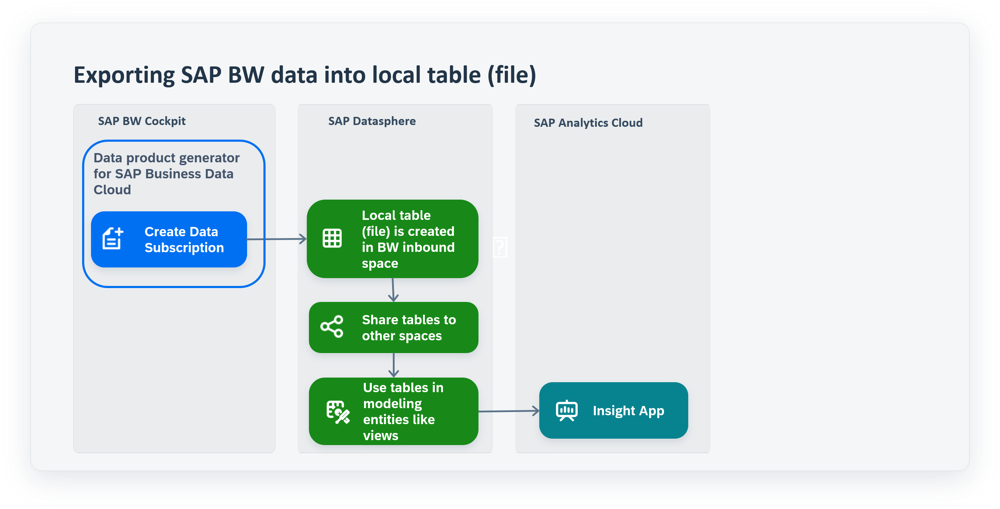

<!-- loiocca4744c85b14788babe7cb6b77c9973 -->

# Integrating Data from the Data Product Generator for SAP Business Data Cloud

SAP Business Data Cloud enables you to lift your existing SAP BW system to the private cloud and secure your investments into SAP BW.

The data product generator for SAP Business Data Cloud allows users to automate the publication of valuable BW data from SAP BW and SAP BW/4HANA systems to the object store of SAP Datasphere within the scope of SAP Business Data Cloud. These data can be leveraged as data product and incorporated in SAP Datasphere projects or shared to third-party-tools.

The data gets loaded into an SAP BW ingestion space, which is created in the configuration phase of SAP BW or SAP BW/4HANA. Objects in this space are read-only, but data management tasks \(e.g. deleting data\) are possible. To use these local tables \(file\) for further modeling, you can share them to other spaces where they can be consumed, for example in views and analytic models.

