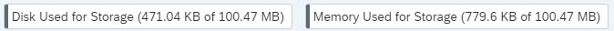
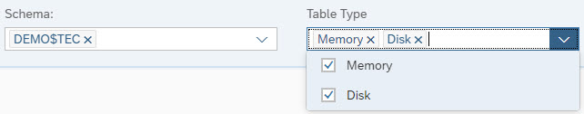
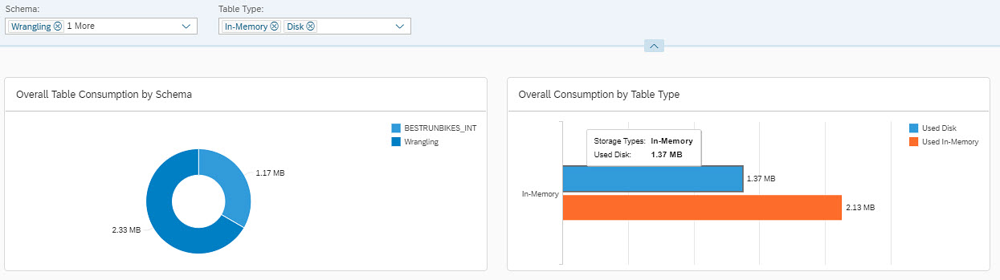
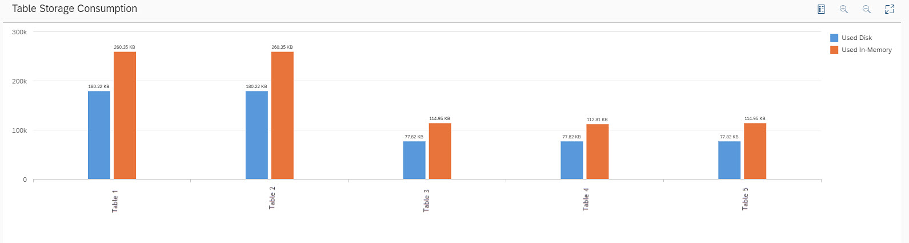
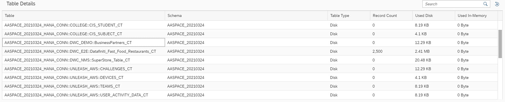

<!-- loio94fe6c13f6a340288cd50ee355566591 -->

# Monitor Your Space Storage Consumption

See the storage amount assigned to and used by your space.

<a name="loio94fe6c13f6a340288cd50ee355566591__section_hqj_whj_42c"/>

## Prerequisites

To monitor the storage consumption of your space, you must have a scoped role that grants you access to your space with the following privileges:

-   *Data Warehouse General* \(`-R------`\) - To access SAP Datasphere.
-   *Spaces* \(`-R------`\) - To open your space in the *Space Management* tool.
-   *Space Files* \(`-R------`\) - To view objects in your space.

The *DW Space Administrator* role template, for example, grants these privileges. For more information, see [Privileges and Permissions](https://help.sap.com/viewer/9f804b8efa8043539289f42f372c4862/cloud/en-US/d7350c6823a14733a7a5727bad8371aa.html "A privilege represents a task or an area in SAP Datasphere and can be assigned to a specific role. The actions that can be performed in the area are determined by the permissions assigned to a privilege.") :arrow_upper_right: and [Standard Roles Delivered with SAP Datasphere](https://help.sap.com/viewer/9f804b8efa8043539289f42f372c4862/cloud/en-US/a50a51d80d5746c9b805a2aacbb7e4ee.html "SAP Datasphere is delivered with several standard roles. A standard role includes a predefined set of privileges and permissions.") :arrow_upper_right:. 

> ### Note:  
> Relevant only for spaces with a storage type *SAP HANA Database \(Disk and In-Memory\)*, and not for *SAP HANA Data Lake Files* spaces.

<a name="loio94fe6c13f6a340288cd50ee355566591__section_nlt_thj_42c"/>

## Procedure

To open the monitoring page, select your space and click *Monitor* from the *Space Management* page or alternatively open your space and click *Monitor* on the upper-right side of your space.

> ### Note:  
> You cannot monitor a file space.

<table>
<tr>
<th valign="top">

Action

</th>
<th valign="top">

Example

</th>
</tr>
<tr>
<td valign="top">

See the amount of disk storage and memory storage used in your space.

For more information about storage capacity, see [Allocate Storage to a Space](https://help.sap.com/viewer/9f804b8efa8043539289f42f372c4862/cloud/en-US/f414c3d62bfe49b38e2cfdd7b4e7d786.html "Use the Space Storage properties to allocate disk and memory storage to the space and to choose whether it will have access to the SAP HANA data lake.") :arrow_upper_right:.

</td>
<td valign="top">

</td>
</tr>
<tr>
<td valign="top">

Filter by schema or by storage type. Filter values by adding or removing them from the drop-down menu.

The values are displayed in a doughnut and bar chart.

The hidden replica tables of SAP HANA virtual tables are stored in a separate schema named `_SYS_TABLE_REPLICA_DATA`.

For more information about replica tables, see [Replicating Data and Monitoring Remote Tables](https://help.sap.com/viewer/9f804b8efa8043539289f42f372c4862/cloud/en-US/4dd95d7bff1f48b399c8b55dbdd34b9e.html).

</td>
<td valign="top">

</td>
</tr>
<tr>
<td valign="top">

See the *Table Storage Consumption* graph that displays all the relevant tables according to your selected filter, which makes it easy to get an overview over the consumed storage.

</td>
<td valign="top">

</td>
</tr>
<tr>
<td valign="top">

See *Table Details* that provides more information such as the name, schema, storage type, record count, and the used storage of each table.

Sort your list of tables in ascending, descending order or group them together as well as search for certain values.

</td>
<td valign="top">

</td>
</tr>
</table>

