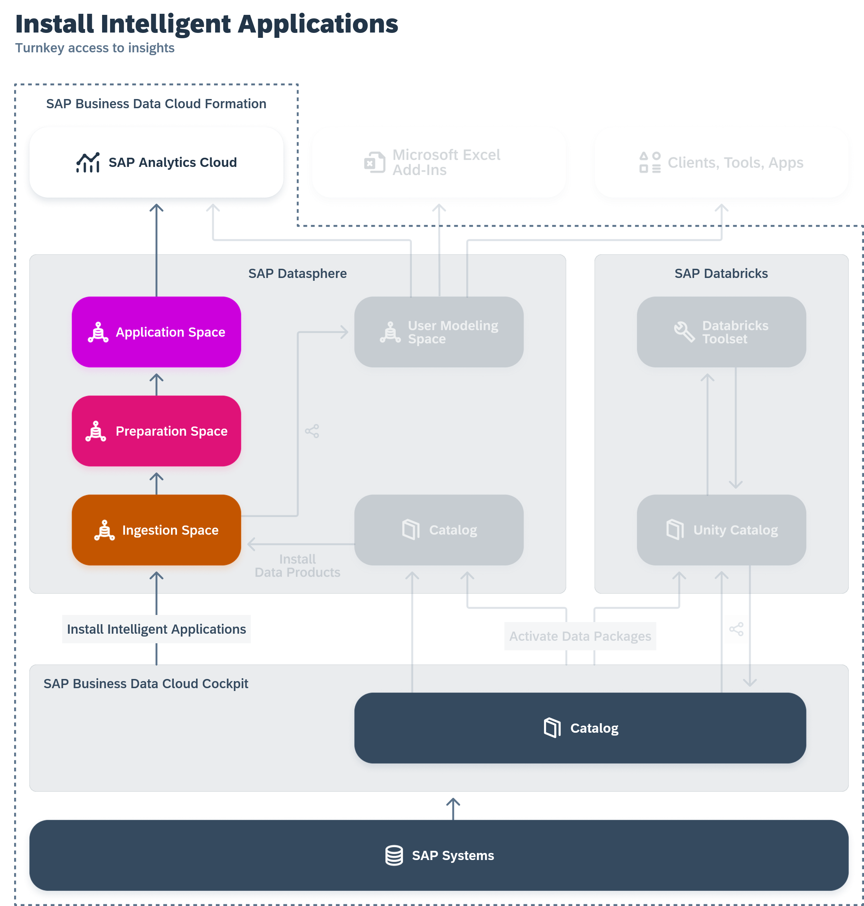

<!-- loio644648756d334daaaf35d4fc9a0feeda -->

# Reviewing Installed Intelligent Applications

When an intelligent application is installed, data is loaded from the source system into SAP Datasphere, combined and prepared for analytics, and then exposed for consumption in SAP Analytics Cloud, where business users can consume it as stories.

## Installation and Data Ingestion

Data is loaded from the source system into SAP Datasphere, where the following spaces are created:

-   Ingestion space - contains the data products as local tables, and the replication flows that load data to them.
-   Preparation space - contains views built on top of the data products to prepare them for consumption.
-   App space - contain analytic models built on top of the views to expose the data for consumption in SAP Analytics Cloud. This space has the name of the intelligent application.

> ### Note:  
> These spaces are SAP-managed. You cannot create objects in them, share objects to or from them or otherwise import or export content to or from them.

<a name="loio644648756d334daaaf35d4fc9a0feeda__section_rf1_vzd_zcc"/>

## Viewing Intelligent Application Objects

The spaces created for the intelligent application and the objects they contain are SAP-managed, and cannot be edited.

However, users who are members of the relevant spaces can view these objects in the standard editors.

<a name="loio644648756d334daaaf35d4fc9a0feeda__section_ds5_312_d2c"/>

## Running and Scheduling Intelligent Application Task Chains

If the intelligent application contains one or more task chains, then a user with access to the space and a DW Integrator role \(or equivalent privileges\) must run each task chain at least once, and should then create a schedule to run the task chain regularly in the future. For more information, see:

-   [Monitoring Task Chains](Data-Integration-Monitor/monitoring-task-chains-4142201.md)
-   [Scheduling Data Integration Tasks](Data-Integration-Monitor/scheduling-data-integration-tasks-7fa0762.md)

