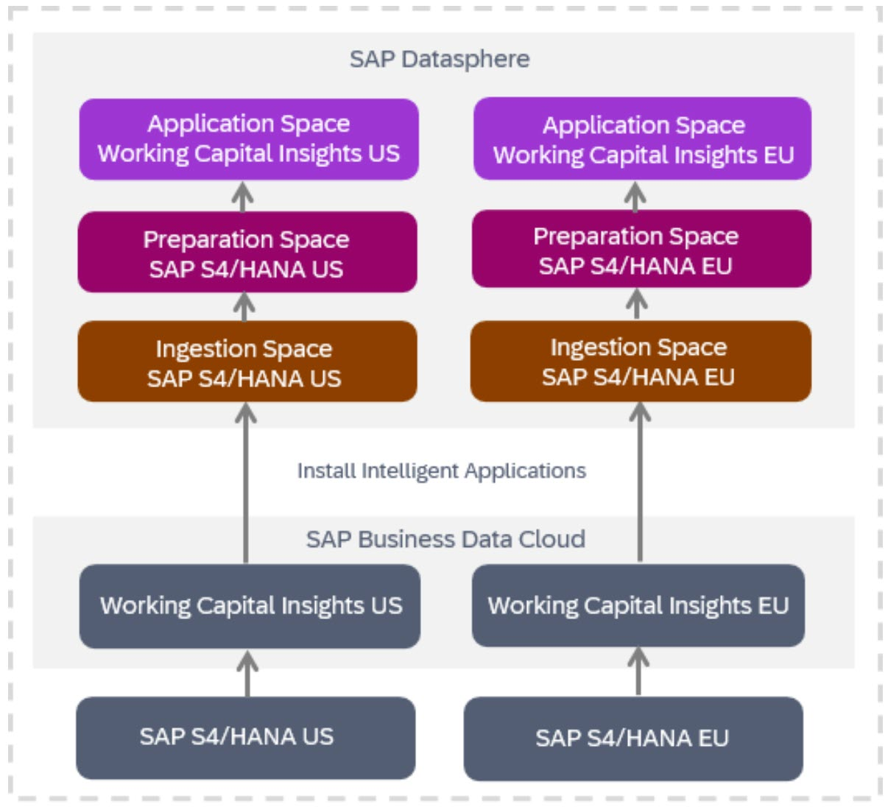
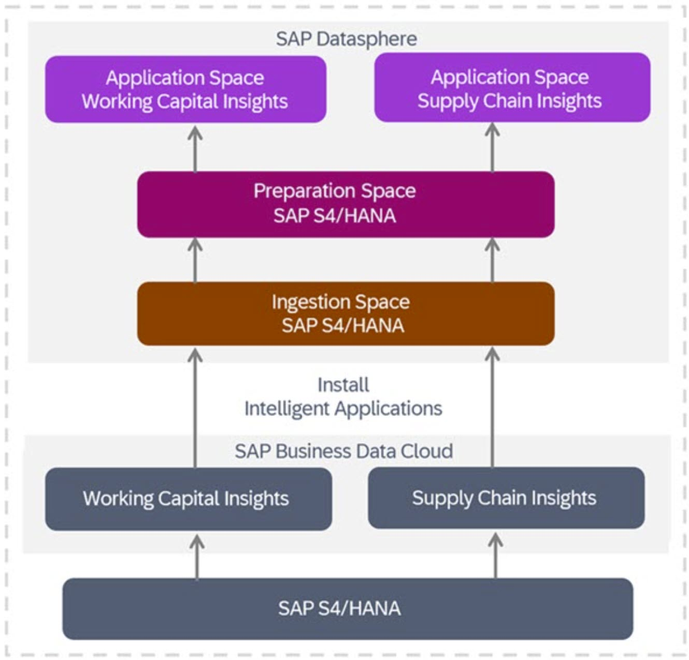

<!-- loio644648756d334daaaf35d4fc9a0feeda -->

# Reviewing Installed Intelligent Applications

When an intelligent application is installed, data is loaded from the source system into SAP Datasphere, combined and prepared for analytics, and then exposed for consumption in SAP Analytics Cloud, where business users can consume it as stories.

## Installation and Data Ingestion

Data is loaded from the source system into SAP Datasphere, where the following spaces are created:

-   Ingestion space - contains the data products as local tables, and the replication flows that load data to them.

    Ingestion spaces may contain inactive data products that are not consumed by any intelligent application nor installed in any customer-managed space. These data products do not contain data. If you want to install or share an inactive data product, you must first ask an administrator to activate its parent data package or install the intelligent application that consumes the data product.

-   Preparation space - contains views built on top of the data products to prepare them for consumption.
-   Application space - contain analytic models built on top of the views to expose the data for consumption in SAP Analytics Cloud. This space has the name of the intelligent application.

> ### Note:  
> These spaces are SAP-managed. You cannot create objects in them, share objects to or from them or otherwise import or export content to or from them.

### Example: Installing Intelligent Applications for Two or More Source Systems

You can install multiple instances of intelligent applications for different source systems, in the following cases:

-   If your organization operates multiple source system instances across different subsidiaries, business units, or geographic areas, each requiring analysis through the same intelligent application.
-   If your organization maintains separate development, test, and production environments within a single SAP Datasphere tenant, necessitating separate installations of the same intelligent content for each environment.

In this case, the three spaces are created in SAP Datasphere for each instance of the intelligent applications, while the application spaces are distinguishable by an alias that was assigned to each intance during installation. When uninstalling, the three spaces are removed.

In the following example, we have two instances of one intelligent application, installed for two source systems, resulting in separate spaces, where each application space identifies the source tenant providing the data by system alias.

### Example: Installing Different Intelligent Applications on a Single Source System

In addition, you can install different intelligent applications for the same source system. In this case, all intelligent applications use the same ingestion space. When uninstalling, the appropriate spaces are removed, but the shared ingestion space is retained until the final application is removed.

In the following example, we have two intelligent applications installed on top of the same source system, resulting in reusing of the ingestion and preparation spaces, and in creation of separate application spaces.

<a name="loio644648756d334daaaf35d4fc9a0feeda__section_rf1_vzd_zcc"/>

## Viewing Intelligent Application Objects

The spaces created for the intelligent application and the objects they contain are SAP-managed, and cannot be edited.

However, users who are members of the relevant spaces can view these objects in the standard editors.

<a name="loio644648756d334daaaf35d4fc9a0feeda__section_ds5_312_d2c"/>

## Running and Scheduling Intelligent Application Task Chains

If the intelligent application contains one or more task chains, then a user with access to the space and a DW Integrator role \(or equivalent privileges\) must run each task chain at least once, and should then create a schedule to run the task chain regularly in the future. For more information, see:

-   [Monitoring Task Chains](Data-Integration-Monitor/monitoring-task-chains-4142201.md)
-   [Scheduling Data Integration Tasks](Data-Integration-Monitor/scheduling-data-integration-tasks-7fa0762.md)

