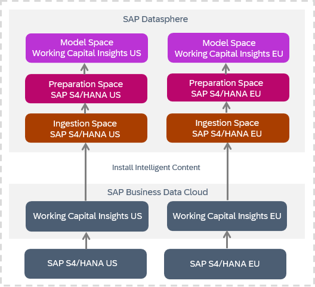
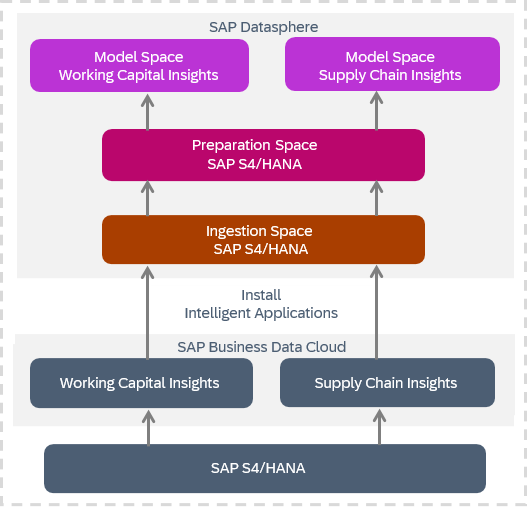
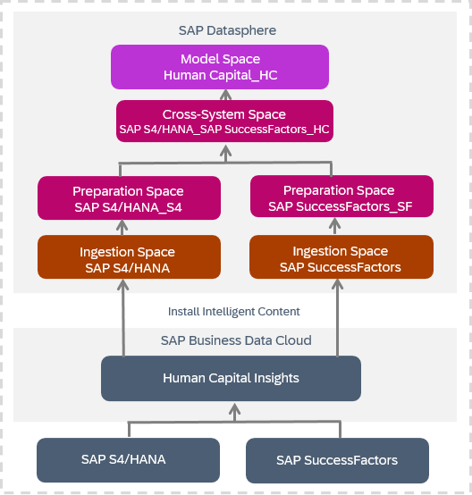

<!-- loio644648756d334daaaf35d4fc9a0feeda -->

# Reviewing Installed Intelligent Content

When intelligent content is installed, data is loaded from the source system into SAP Datasphere, combined and prepared for analytics, and then exposed for consumption in SAP Analytics Cloud, where business users can consume it as stories.

## Installation and Data Ingestion

Data is loaded from the source system into SAP Datasphere, where the following spaces are created:

-   Ingestion space - contains the data products as local tables, and the replication flows that load data to them.

    Ingestion spaces may contain inactive data products that are not consumed by any intelligent content nor installed in any customer-managed space. These data products do not contain data. If you want to install an inactive data product, you must first ask an administrator to activate its parent data package or install the intelligent content that consumes the data product.

-   Preparation space - contains views built on top of the data products to prepare them for consumption.
-   Model space - contain analytic models built on top of the views to expose the data for consumption in SAP Analytics Cloud. This space has the name of the intelligent content.

> ### Note:  
> These spaces are SAP-managed. You cannot create objects in them, share objects to or from them or otherwise import or export content to or from them.

### Example: Installing Intelligent Content for Two or More Source Systems 

You can install multiple instances of intelligent content for different source systems, in the following cases:

-   If your organization operates multiple source system instances across different subsidiaries, business units, or geographic areas, each requiring analysis through the same intelligent content.
-   If your organization maintains separate development, test, and production environments within a single SAP Datasphere tenant, necessitating separate installations of the same intelligent content for each environment.

In this case, the three spaces are created in SAP Datasphere for each instance of the intelligent content, while the model spaces are distinguishable by an alias that was assigned to each instance during installation. When uninstalling, the three spaces are removed. 

In the following example, we have two instances of one intelligent content, installed for two source systems, resulting in separate spaces, where each model space identifies the source tenant providing the data by system alias.

### Example: Installing Different Intelligent Content on a Single Source System

In addition, you can install different intelligent contents for the same source system. In this case, all intelligent content uses the same ingestion space. When uninstalling, the appropriate spaces are removed, but the shared ingestion space is retained until the final content is removed.

In the following example, we have two intelligent contents installed on top of the same source system, resulting in reusing of the ingestion and preparation spaces, and in creation of separate model spaces.

### Example: Installing Major Versions of Intelligent Content Side-by-side 

When breaking changes are introduced to intelligent content, SAP creates a new major version \(X.0.0\) of intelligent content \(for more information, see [Versioning of Data Products and Intelligent Content](https://help.sap.com/docs/business-data-cloud/administering-sap-business-data-cloud-dev/versioning-of-data-products-and-intelligent-content)\). You can install more than one major version of intelligent content side-by-side for the same source system. This allows you to test, adapt to, and migrate your workflows to the new version without breaking existing processes. Each major version operates independently: installing, updating, or uninstalling one version does not affect other versions. To identify which version you are working with, refer to the unique version identifier shown by the intelligent content’s name in SAP Business Data Cloud cockpit.

If the different major versions of the intelligent content use the same major version of the data product, then these versions use the same ingestion space. However, if the different major versions of the intelligent content use different major versions of the same data product, then separate ingestion spaces are used. The spaces are identified by version numbers.

### Example: Installing Intelligent Content Combining Data Products from Multiple Systems 

You can install intelligent content that combines data products coming from multiple source systems, such as from both SAP S/4HANA and SAP SuccessFactors. To install this intelligent content, the relevant source systems must be included in the same formation.

> ### Note:  
> Content of this type cannot combine data products coming from different instances of the same source system, such as SAP S/4HANA EU and SAP S/4HANA US.

In this case, multiple spaces are created in SAP Datasphere for the intelligent content: separate ingestion and preparation spaces for each source system, a cross-system space where data from all source systems is combined, and a model space. The spaces are distinguishable by aliases assigned to each source system, and to the unique combination of the source systems, and are assigned to the spaces automatically.

When uninstalling, the cross-system space and the model space are deleted. The source system-specific ingestion and preparation space are retained until the final content belonging to the source system is deleted.

In the following example, we have intelligent content combining data products from two multiple systems. The installation results in separate ingestion and preparation spaces, an additional cross-system space, and a model space.

<a name="loio644648756d334daaaf35d4fc9a0feeda__section_rf1_vzd_zcc"/>

## Viewing Intelligent Content Objects

The spaces created for the intelligent content and the objects they contain are SAP-managed, and cannot be edited.

However, users who are members of the relevant spaces can view these objects in the standard editors.

<a name="loio644648756d334daaaf35d4fc9a0feeda__section_ds5_312_d2c"/>

## Running and Scheduling Intelligent Content Task Chains

If the intelligent content contains one or more task chains, then a user with access to the space and a DW Integrator role \(or equivalent privileges\) must run each task chain at least once, and should then create a schedule to run the task chain regularly in the future. For more information, see:

-   [Monitoring Task Chains](Data-Integration-Monitor/monitoring-task-chains-4142201.md)
-   [Scheduling Data Integration Tasks](Data-Integration-Monitor/scheduling-data-integration-tasks-7fa0762.md)

