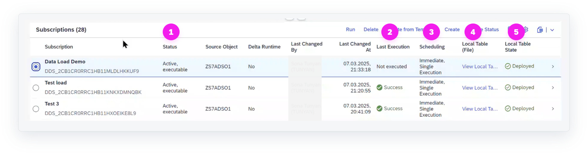

<!-- loiof541f192a6664a9f9cc9eba219348135 -->

<link rel="stylesheet" type="text/css" href="css/sap-icons.css"/>

# Settings for Data Subscriptions

You can customize the list of subscriptions.

In the list of subscriptions, you can change the view settings. When you choose :gear:, you can add additional columns, sort, and group your subscriptions.

In the column *Status* \(1\), you can check if your subscription is already active.

In the column *Last Execution* \(2\), you can see if your subscription has been successfully executed.

In the column *Scheduling* \(3\), you can see if your subscription has been scheduled via a process chain or if it was run directly \(immediate\).

In the column *Local Table \(File\)* \(4\), you can navigate to the local table \(file\) in SAP Datasphere and view its data.

In the column *Local Table State* \(5\), you can see if the local table has been created, and if it has been deployed.

