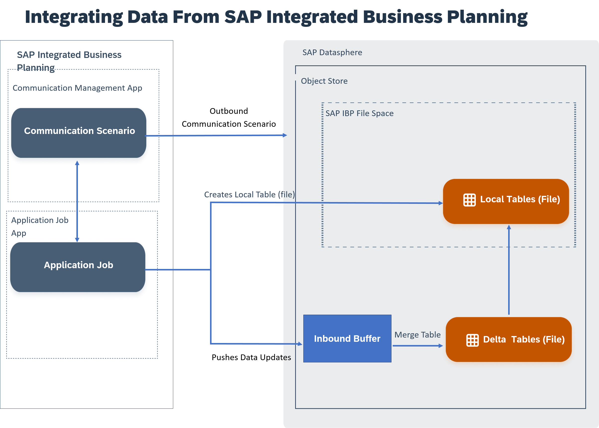

<!-- loioc42547ffb60848ca9a545cb8636d4381 -->

# Working With Local Tables \(File\) Received From SAP Integrated Business Planning

An SAP Integrated Business Planning system administrator has pushed data to SAP Datasphere as a local table \(file\), and you now want to use it for your business case.

> ### Note:  
> This feature is currently only available for early adopters in SAP Integrated Business Planning, which is a limited group of customers. To request being considered as an early adopter and having the feature activated in your system, contact SAP. Please use the SCM-IBP-INT-BDC component to log your request.

## Prerequisites

To work on local tables \(files\) received from SAP Integrated Business Planning:

-   An SAP IBP system administrator has pushed relevant data using an application job.
-   A local table \(file\) with this data has been created in the data builder of SAP Datasphere.
-   You must have a scoped role that grants you access to the file space with the privilege Data Warehouse Data Integration \(--U-E---\) – The DW Integrator role template, for example, grants this privilege. For more information, see [Privileges and Permissions](https://help.sap.com/viewer/9f804b8efa8043539289f42f372c4862/cloud/en-US/d7350c6823a14733a7a5727bad8371aa.html "A privilege represents a task or an area in SAP Datasphere and can be assigned to a specific role. The actions that can be performed in the area are determined by the permissions assigned to a privilege.") :arrow_upper_right: and [Standard Roles Delivered with SAP Datasphere](https://help.sap.com/viewer/9f804b8efa8043539289f42f372c4862/cloud/en-US/a50a51d80d5746c9b805a2aacbb7e4ee.html "SAP Datasphere is delivered with several standard roles. A standard role includes a predefined set of privileges and permissions.") :arrow_upper_right:.

## Working With Local Tables \(File\) Generated From SAP IBP

Local tables \(file\) generated from SAP IBP are visible in the *Data Builder* and data management happens from the *Local Tables \(file\)* monitor. For more information, see [Monitoring Local Tables \(File\)](Data-Integration-Monitor/monitoring-local-tables-file-6b2d007.md).

The local tables \(file\) are generated at runtime. SAP IBP will trigger the integration, and if the local table \(file\) does not exist or has the wrong structure, it will \(re\)create it in SAP Datasphere thanks to the application job, after exporting the data from SAP IBP to SAP Datasphere.

For more information, see [Integrating Data From SAP Integrated Business Planning](integrating-data-from-sap-integrated-business-planning-a0b3a6e.md).

### Restrictions While Working with Local Tables \(File\) Received From SAP IBP

As these tables are imported from another system, there are some restrictions on working with them:

-   You cannot change the properties of the local tables \(file\) generated from SAP IBP.
-   Delta capture is OFF or ON, and you can't change it. If it's OFF, it won't track the delta capture changes, but it will keep historical snapshot versions.
-   Restoring to a previous version is not possible. You can only display a previous version.
-   If partitions have been defined on the SAP IBP side at table creation, you can see them \(but you can't change them or create new ones\).

### Opening and Reviewing Read-Only Properties of a Local Table \(file\) Received From SAP IBP

To open a local table \(file\),

1.  Go to the *Data Builder* and select the relevant SAP IBP space.
2.  From the Data Builder landing page, select the local table \(file\) you want to open.
3.  From the table editor, you can review the properties. For more information, see [Creating a Local Table (File)](https://help.sap.com/viewer/c8a54ee704e94e15926551293243fd1d/cloud/en-US/d21881b121bc4703861be6ead4aea2ab.html "Create a local table (file) to store data in the object store. Load data to your local table (file) via replication flows and transform the data with transformation flows.") :arrow_upper_right:.

### Act on Your Local Table \(File\) Data

You can perform the following actions on your local table \(file\):

<table>
<tr>
<th valign="top">

Action

</th>
<th valign="top">

More Information

</th>
</tr>
<tr>
<td valign="top">

Share the local table \(file\) with another space

</td>
<td valign="top">

[Sharing Entities and Task Chains to Other Spaces](https://help.sap.com/viewer/c8a54ee704e94e15926551293243fd1d/cloud/en-US/64b318f8afd74bb78467cf56eb44294f.html "Share a table or view to another space to allow users assigned to that space to use it as a source for their objects. Share a task chain to another space to allow it to be added to and controlled by another task chain in the space that you share it to.") :arrow_upper_right:

</td>
</tr>
<tr>
<td valign="top">

Delete Data

</td>
<td valign="top">

[Deleting Local Table (File) Records](https://help.sap.com/viewer/c8a54ee704e94e15926551293243fd1d/cloud/en-US/6ec9b8a89dc64b5cac069cee81399c92.html "Delete records from a local table (File) and free up storage through housekeeping on obsolete or already processed data changes.") :arrow_upper_right: and [Delete Data From Your Local Tables \(File\)](Data-Integration-Monitor/delete-data-from-your-local-tables-file-872ad50.md)

</td>
</tr>
<tr>
<td valign="top">

Export your local table

</td>
<td valign="top">

[Exporting Objects to a CSN/JSON File](https://help.sap.com/viewer/c8a54ee704e94e15926551293243fd1d/cloud/en-US/391610123f1f4a12abb12cbf77a3294d.html "Export the definitions of your tables, views, and other objects to a CSN/JSON file, which can be imported into another space or tenant.") :arrow_upper_right:

</td>
</tr>
<tr>
<td valign="top">

Display the lineage graph

</td>
<td valign="top">

[Impact and Lineage Analysis](https://help.sap.com/viewer/c8a54ee704e94e15926551293243fd1d/cloud/en-US/9da4892cb0e4427ab80ad8d89e6676b8.html "The Impact and Lineage Analysis diagram helps you to understand the lineage or data provenance of a selected object or one or more of its columns, along with its impacts - the objects that depend on it and that will be impacted by any changes that are made to it.") :arrow_upper_right:

</td>
</tr>
<tr>
<td valign="top">

Preview your data

</td>
<td valign="top">

[Preview and Edit Local Table (File) Data](https://help.sap.com/viewer/c8a54ee704e94e15926551293243fd1d/cloud/en-US/e57e12d39535439eb078078228c6f7bf.html "You want to preview and edit local table (file) data.") :arrow_upper_right:

</td>
</tr>
<tr>
<td valign="top">

Monitor your local table \(file\)

</td>
<td valign="top">

[Monitoring Local Tables \(File\)](Data-Integration-Monitor/monitoring-local-tables-file-6b2d007.md)

</td>
</tr>
</table>

### Getting Data Updates for Your Local Table \(File\) Generated By SAP IBP

When the source data is updated, it is pushed using the application job to the inbound buffer of the SAP Datasphere object store. In order to update that data to the actual local table \(file\), merge tasks have to be scheduled manually or using a task chains in SAP Datasphere. For more information, see [Creating a Task Chain](https://help.sap.com/viewer/c8a54ee704e94e15926551293243fd1d/cloud/en-US/d1afbc2b9ee84d44a00b0b777ac243e1.html "Group multiple tasks into a task chain and run them manually once, or periodically, through a schedule.") :arrow_upper_right: and [Merge or Optimize Your Local Tables \(File\)](Data-Integration-Monitor/merge-or-optimize-your-local-tables-file-e533b15.md).

> ### Note:  
> No duplication will happen in the inbound buffer: SAP IBP will continue pushing data updates into the inbound buffer in the same table until a merge task has empty it. No matter if the data arrives in the inbound buffer in several batches at different timestamps

