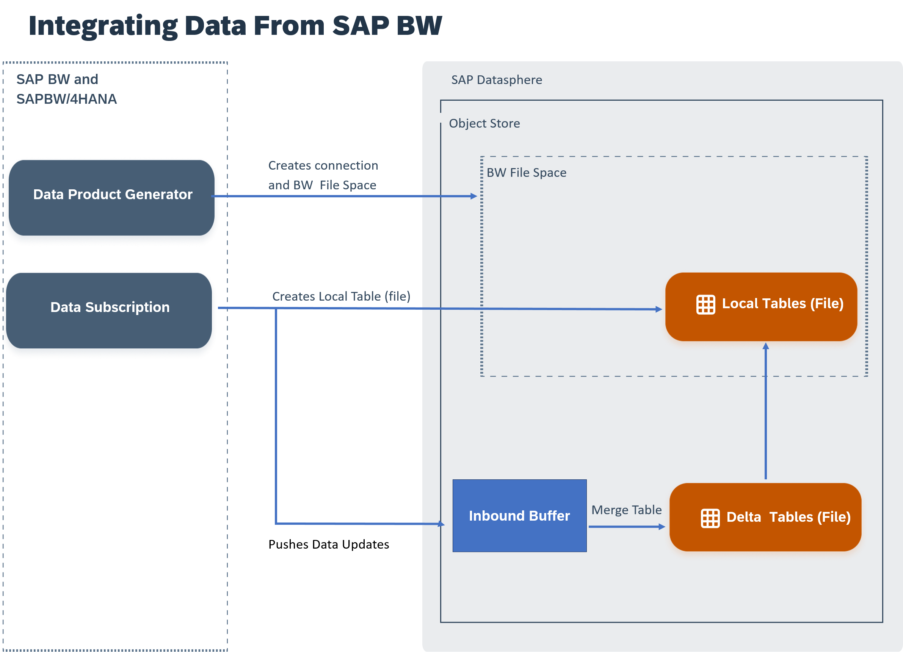

<!-- loio72a055fc7dad40079efa442ddd4b998e -->

# Working With Local Tables \(File\) Received From the Data Product Generator for SAP Business Data Cloud

An administrator in SAP BW or SAP BW/4HANA has pushed data into SAP Datasphere as a local table \(file\), and you now want to use it for your business case.

<a name="loio72a055fc7dad40079efa442ddd4b998e__section_yzr_vgc_t2c"/>

## Prerequisites

To work on local tables \(files\) received from SAP BW or SAP BW/4HANA:

-   An SAP BW system administrator has created a file space dedicated to receive BW local tables \(file\). For more information, see [Integrating Data from the Data Product Generator for SAP Business Data Cloud](integrating-data-from-the-data-product-generator-for-sap-business-data-cloud-cca4744.md)
-   An SAP BW system administrator has enabled a push of BW data from the data product generator for SAP Business Data Cloud. A local table \(file\) has been created with this data and can be used.
-   You must have a scoped role that grants you access to the BW file space with the privilege**Data Warehouse Data Integration \(--U-E---\)** – The DW Integrator role template, for example, grants this privilege.

<a name="loio72a055fc7dad40079efa442ddd4b998e__section_mdw_thc_t2c"/>

## Working With Local Tables \(File\) Generated From SAP BW

Local tables \(file\) generated from SAP BW are visible in the *Data Builder* and data management happens from the *Local Tables \(file\)* monitor:

### Restrictions While Working with Local Tables \(File\) Generated by SAP BW

As these tables are imported from another system, there are some restrictions working with them:

-   You cannot change the properties of the local tables \(file\) generated from SAP BW.
-   Delta capture is OFF or ON, and you can't change it. If it's OFF, it won't track the delta capture changes, but it will keep historical snapshot versions.
-   Restoring to a previous version is not possible. You can only display a previous version.
-   If partitions have been defined on the SAP BW side at table creation, you can see them \(but you can't change them or create new ones\).
-   *Find and Replace* is not available.

### Opening and Reviewing Read-Only Properties of a local table \(file\) Generated by SAP BW

To open a local table \(file\),

1.  Go to the *Data Builder* and select the relevant BW file space.
2.  From the *Data Builder* landing page, select the local table \(file\) you want to open.
3.  From the table editor, you can review the properties.

For more information on local tables \(file\), see [Creating a Local Table (File)](https://help.sap.com/viewer/24f836070a704022a40c15442163e5cf/DEV_CURRENT/en-US/d21881b121bc4703861be6ead4aea2ab.html "Create a local table (file) to store data in the object store. Load data to your local table (file) via replication flows and transform the data with transformation flows.") :arrow_upper_right:.

### Act on Your Local Table \(File\) Data

You can perform the following actions on your local table \(file\):

<table>
<tr>
<th valign="top">

Action

</th>
<th valign="top">

More Information

</th>
</tr>
<tr>
<td valign="top">

Share the local table \(file\) with another space

</td>
<td valign="top">

[Sharing Entities and Task Chains to Other Spaces](https://help.sap.com/viewer/24f836070a704022a40c15442163e5cf/DEV_CURRENT/en-US/64b318f8afd74bb78467cf56eb44294f.html "Share a table or view to another space to allow users assigned to that space to use it as a source for their objects. Share a task chain to another space to allow it to be added to and controlled by another task chain in the space that you share it to.") :arrow_upper_right:

</td>
</tr>
<tr>
<td valign="top">

Delete Data

</td>
<td valign="top">

[Deleting Local Table (File) Records](https://help.sap.com/viewer/24f836070a704022a40c15442163e5cf/DEV_CURRENT/en-US/6ec9b8a89dc64b5cac069cee81399c92.html "Delete records from a local table (File) and free up storage through housekeeping on obsolete or already processed data changes.") :arrow_upper_right:

</td>
</tr>
<tr>
<td valign="top">

Export your local table

</td>
<td valign="top">

[Exporting Objects to a CSN/JSON File](https://help.sap.com/viewer/24f836070a704022a40c15442163e5cf/DEV_CURRENT/en-US/391610123f1f4a12abb12cbf77a3294d.html "Export the definitions of your tables, views, and other objects to a CSN/JSON file, which can be imported into another space or tenant.") :arrow_upper_right:

</td>
</tr>
<tr>
<td valign="top">

Display the lineage graph

</td>
<td valign="top">

[Impact and Lineage Analysis](https://help.sap.com/viewer/24f836070a704022a40c15442163e5cf/DEV_CURRENT/en-US/9da4892cb0e4427ab80ad8d89e6676b8.html "The Impact and Lineage Analysis diagram helps you to understand the lineage or data provenance of a selected object or one or more of its columns, along with its impacts - the objects that depend on it and that will be impacted by any changes that are made to it.") :arrow_upper_right:

</td>
</tr>
<tr>
<td valign="top">

Preview your data

</td>
<td valign="top">

[Viewing Object Data](https://help.sap.com/viewer/24f836070a704022a40c15442163e5cf/DEV_CURRENT/en-US/b338e4aa7e7e494eb68c383720ebfd3a.html "You can, at any time, view the data contained in (or output by) your tables, views, and other Data Builder objects. When working in the graphical view editor, you can view the data output by each node in the diagram.") :arrow_upper_right:

</td>
</tr>
<tr>
<td valign="top">

Monitor your local table \(file\)

</td>
<td valign="top">

[Monitoring Local Tables \(File\)](Data-Integration-Monitor/monitoring-local-tables-file-6b2d007.md)

</td>
</tr>
</table>

### How to Get Data Updates for Your Local Table \(File\) Generated By SAP BW

When the source data is updated, an administrator in SAP BW or SAP BW/4HANA pushed it to the inbound buffer of SAP Datasphere object store. In order to update that data to the actual local table \(file\), merge tasks have to be scheduled manually or using a task chains in SAP Datasphere. For more information, see [Merge or Optimize Your Local Tables \(File\)](Data-Integration-Monitor/merge-or-optimize-your-local-tables-file-e533b15.md) and [Creating a Task Chain](https://help.sap.com/viewer/24f836070a704022a40c15442163e5cf/DEV_CURRENT/en-US/d1afbc2b9ee84d44a00b0b777ac243e1.html "Group multiple tasks into a task chain and run them manually once, or periodically, through a schedule.") :arrow_upper_right:

> ### Note:  
> No duplication will happen in the inbound buffer: SAP BW will continue pushing data updates into the inbound buffer in the same table until a merge task has empty it. No matter if the data arrives in the inbound buffer in several batches at different timestamps.

