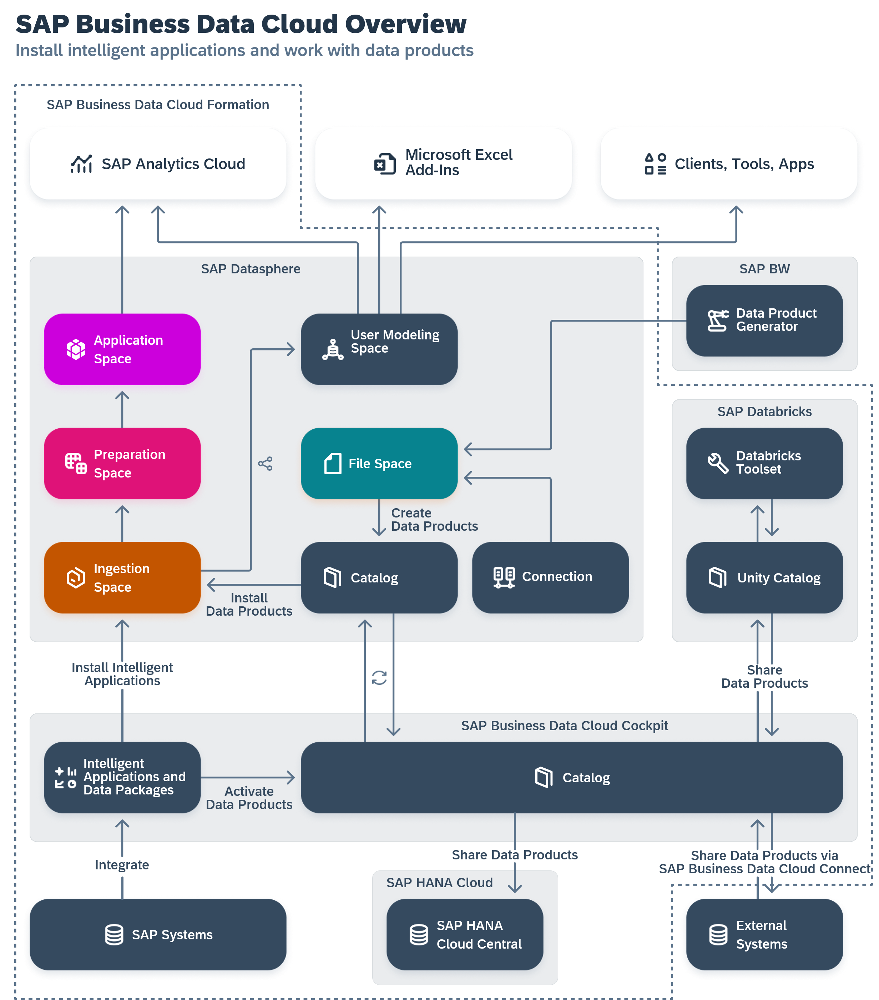

<!-- loio8f9c3725cfe84e08b3e951e7af06ce57 -->

# Working with SAP Datasphere in SAP Business Data Cloud

Users with an SAP Business Data Cloud administrator role can install intelligent applications to SAP Datasphere and activate data packages to allow modelers to work with data products.

SAP Business Data Cloud integrates and governs SAP and third-party data, allowing leaders to make impactful decisions. It also enables the installation of intelligent applications and data products in SAP Datasphere, providing users with access to valuable data and content.

If your SAP Datasphere tenant is part of an SAP Business Data Cloud formation, then the SAP Business Data Cloud administrator can install intelligent applications to SAP Datasphere and activate data packages to allow SAP Datasphere modelers to work with data products.

For more information, see:

-   [Installing Intelligent Applications](installing-intelligent-applications-344999c.md)
-   [Activating Data Packages and Installing Data Products](activating-data-packages-and-installing-data-products-6c7799a.md)
-   [Creating Data Products](creating-data-products-ebe9dc0.md)

See also, the [SAP Business Data Cloud](https://help.sap.com/docs/SAP_BUSINESS_DATA_CLOUD) documentation.

